# Popping Community

대용량 조회, 동시성, 운영 자동화를 직접 다룬 Spring Boot 커뮤니티 서비스입니다.

## 핵심 결과

- 댓글 첫 페이지 캐싱으로 인기 게시글 댓글 조회 시간을 `152ms -> 43ms`로 줄였습니다.
- 좋아요 집계와 개인화 조회를 분리해 평균 응답시간을 `10,460ms -> 167ms`, 에러율을 `15.53% -> 0%`로 개선했습니다.
- 좋아요 중복 insert 경쟁을 멱등 처리로 바꿔 동일 사용자 동시 요청 `20건`에서 예외 `0건`을 확인했습니다.
- 게시글 목록 조회를 `Page -> Slice`로 전환해 COUNT 쿼리를 `2,173건 -> 0건`으로 제거하고, 목록 조회 응답시간을 `662ms -> 34ms`로 줄였습니다.
- 캐시 스탬피드 구간을 per-key 로딩으로 제어해 evict 직후 동시 요청에서도 CTE 실행을 `1회`로 고정했습니다.
- App CPU 포화로 정체된 TPS를 HAProxy 기반 수평 확장으로 `274/s -> 527/s`, 응답시간 `867ms -> 32ms`로 개선했습니다.
- Scale Out 후 MySQL CPU 병목을 Read Replica + Sticky Primary로 완화해 응답시간 `32ms -> 10ms`, Replication Lag `104s -> 26s`로 줄였습니다.

## 프로젝트 소개

Popping Community는 게시글, 댓글, 좋아요/싫어요, 게스트 기능을 포함한 커뮤니티 백엔드입니다.  
단순 CRUD 구현보다 다음 문제를 실제로 검증하고 해결하는 데 초점을 맞췄습니다.

- 작은 서버에서 트래픽이 몰릴 때 어디서 병목이 생기는가
- 동시 요청이 들어오면 어떤 데이터 정합성 문제가 터지는가
- 구조를 바꿨을 때 응답시간, 에러율, 쿼리 수가 실제로 얼마나 개선되는가
- 배포와 모니터링까지 포함해 운영 가능한 상태를 만들 수 있는가

## 기술 스택

- `Java 21`
- `Spring Boot`
- `Spring Data JPA`
- `Spring Security`
- `MySQL 8`
- `Caffeine Cache`
- `Docker Compose`
- `GitHub Actions`
- `JMeter`
- `Prometheus`, `Grafana`

## 아키텍처

### 운영 환경 (EC2)

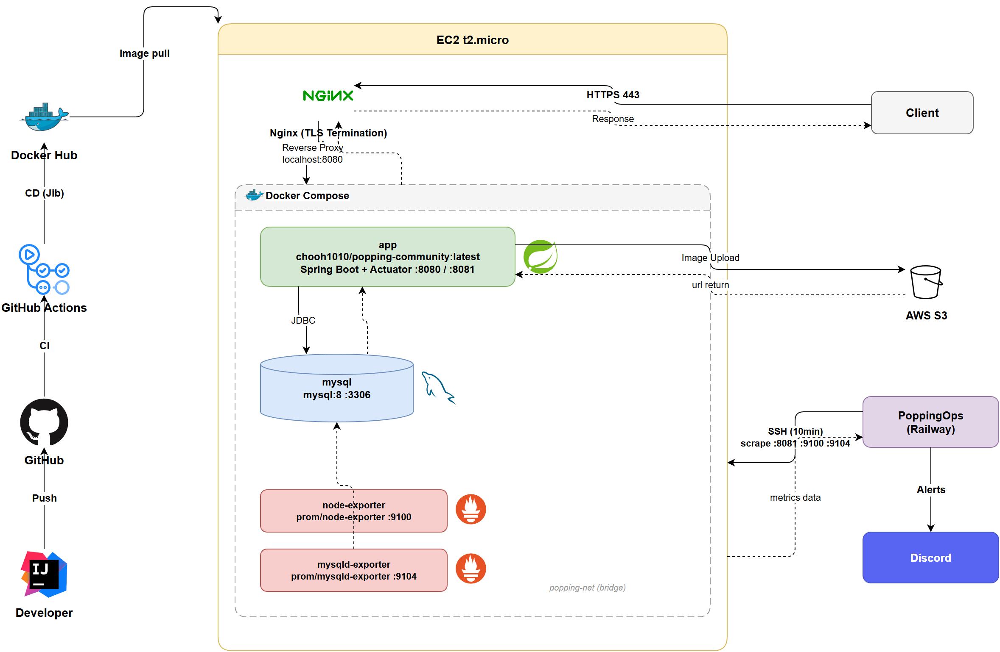

### 부하 테스트 환경 (Local Docker Compose)

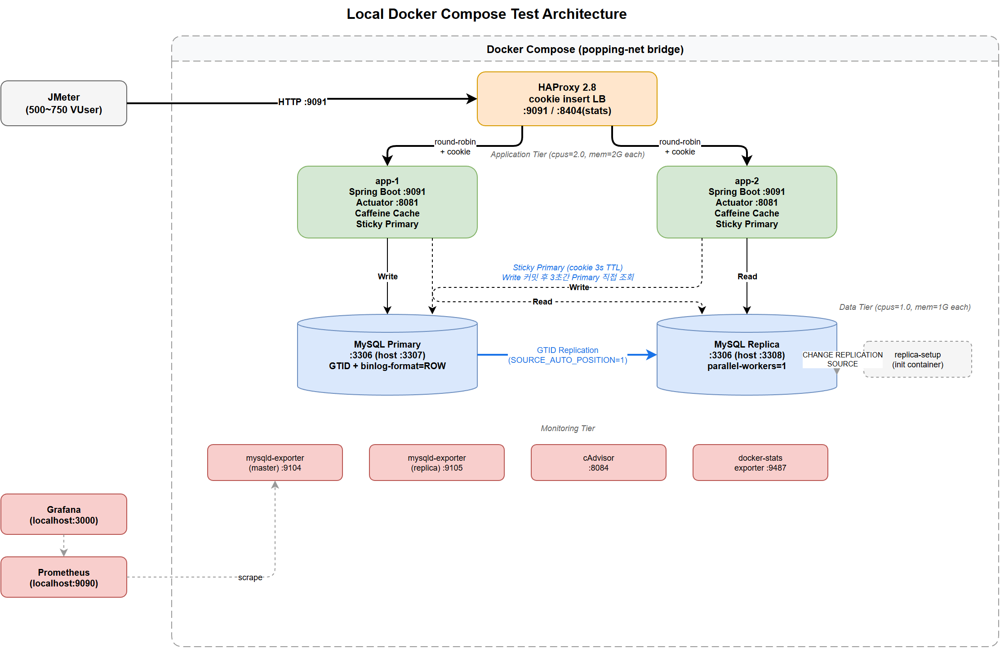

## 핵심 문제 해결

### 1. 댓글 첫 페이지 캐싱

게시글 상세 조회마다 계층형 댓글 CTE를 다시 실행하던 구조를 `Cache-Aside`로 바꿨습니다.  
캐시에는 공통 데이터만 저장하고, `likedByMe` 같은 사용자별 값은 조회 시점에 합성하도록 분리했습니다.

- 인기 게시글 댓글 조회: `152ms -> 43ms`
- 동일 댓글 트리 생성 쿼리 10분 기준: `6,642건 -> 458건`
- 캐시 무효화는 `AFTER_COMMIT` 시점으로 옮겨 커밋 전 stale write-back을 방지했습니다.

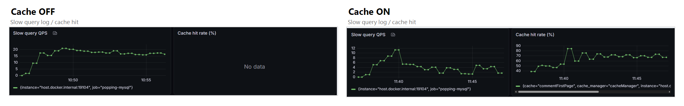

### 2. 좋아요 중복 insert 경쟁 해결

초기 구현은 `check-then-act` 구조라서 동시 요청에서 unique 제약 예외가 노출됐습니다.  
이를 `ON DUPLICATE KEY UPDATE` 기반 멱등 처리로 바꾸고, 실제 반영된 경우에만 count를 증가시키도록 수정했습니다.

- 동일 사용자 동시 요청 `20건` 테스트에서 예외 `17건 -> 0건`
- row 생성과 `like_count` 증가가 각각 1회만 반영되도록 보장

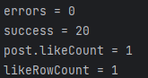

### 3. likes 풀스캔 제거와 집계 쿼리 분리

좋아요 수 집계와 개인화 조회를 likes 테이블 한 쿼리에서 함께 처리하던 구조 때문에 450만 건에서 풀스캔이 발생했습니다.  
집계는 comment 테이블의 비정규화 count를 사용하고, 개인화는 기존 unique index를 활용하는 별도 쿼리로 분리했습니다.

- 평균 응답시간: `10,460ms -> 167ms`
- 에러율: `15.53% -> 0%`
- 별도 집계 인덱스 없이 기존 UK 기반으로 해결

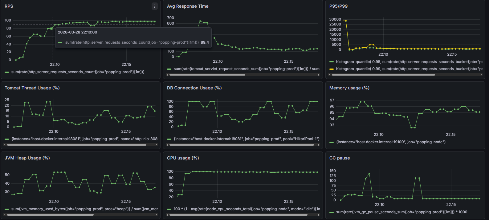

### 4. 게시글 목록 COUNT 쿼리 제거

게시글 목록 API가 `Page<T>`를 반환하면서 요청마다 `COUNT(post)`를 자동 실행하고 있었습니다.  
총 페이지 수가 꼭 필요하지 않은 화면이어서 `Slice<T>`로 바꾸고 COUNT 쿼리를 구조적으로 제거했습니다.

- COUNT 쿼리 10분 기준: `2,173건 -> 0건`
- 게시글 목록 조회 평균 응답시간: `662ms -> 34ms`
- 처리 가능한 총 요청 수: `52,096건 -> 63,596건`

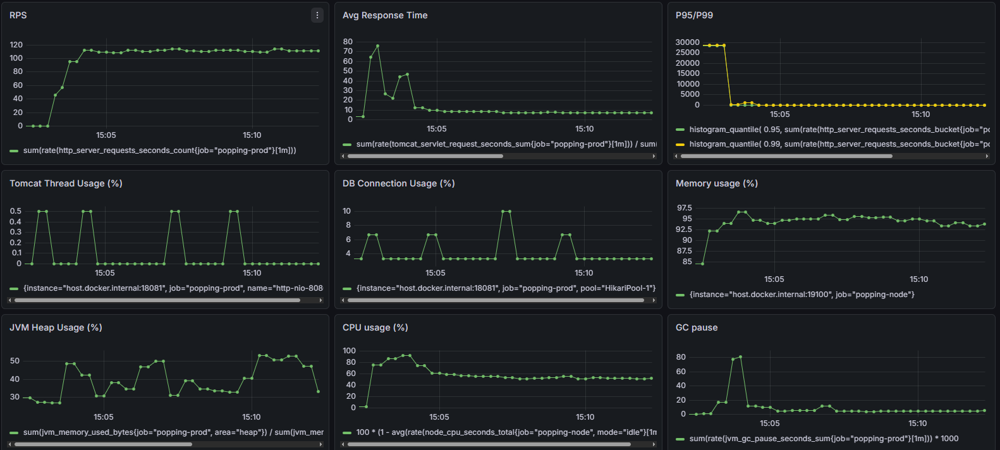

### 5. 캐시 스탬피드 방지

`cache.get -> build -> cache.put` 구조는 evict 직후 동시 요청에서 같은 CTE를 여러 번 실행했습니다.  
이를 `cache.get(key, Callable)` 기반 per-key 로딩으로 바꿔 같은 `postId`에 대한 최초 로딩을 1회로 제한했습니다.

- evict 직후 50개 동시 요청에서도 CTE 실행 `10~17회 -> 1회`
- 나머지 요청은 캐시 hit로 처리

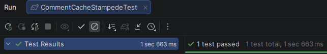

### 6. HAProxy 기반 App 수평 확장

App CPU가 200%로 포화되어 TPS가 274/s에서 정체되는 상황이었습니다.  
HAProxy `cookie insert` 기반 세션 고정으로 App을 2대로 수평 확장하고, 요청을 분산 처리했습니다.

- TPS: `274/s -> 527/s`
- 평균 응답시간: `867ms -> 32ms`
- App CPU 포화 해소, 병목이 MySQL CPU(100%)로 이동 확인

| Before (App 1대) | After (App 2대) |
| --- | --- |
| 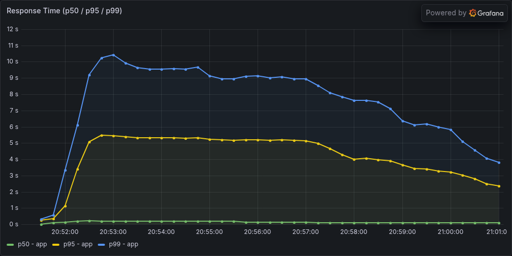 |  |

### 7. Read Replica + Sticky Primary

Scale Out 후 MySQL 단일 인스턴스가 CPU 100%로 포화되어 병목이 이동했습니다.  
읽기 트래픽이 90%를 차지하는 커뮤니티 특성에 맞춰 Read Replica로 읽기/쓰기를 분리하고, 쓰기 직후 정합성 문제를 Sticky Primary(쿠키 3초 TTL)로 해결했습니다.

- 평균 응답시간: `32ms -> 10ms`
- Replication Lag 평균: `104s -> 26s`
- Sticky Primary: `TransactionSynchronization.afterCommit` 콜백으로 커밋 성공 시에만 쿠키 발급
- 병렬 복제(`replica-parallel-workers=2`, `LOGICAL_CLOCK`)로 Lag 자체를 감소

| Before (단일 DB) | After (Replica) |
| --- | --- |
| 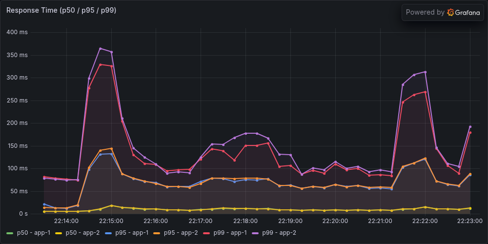 | 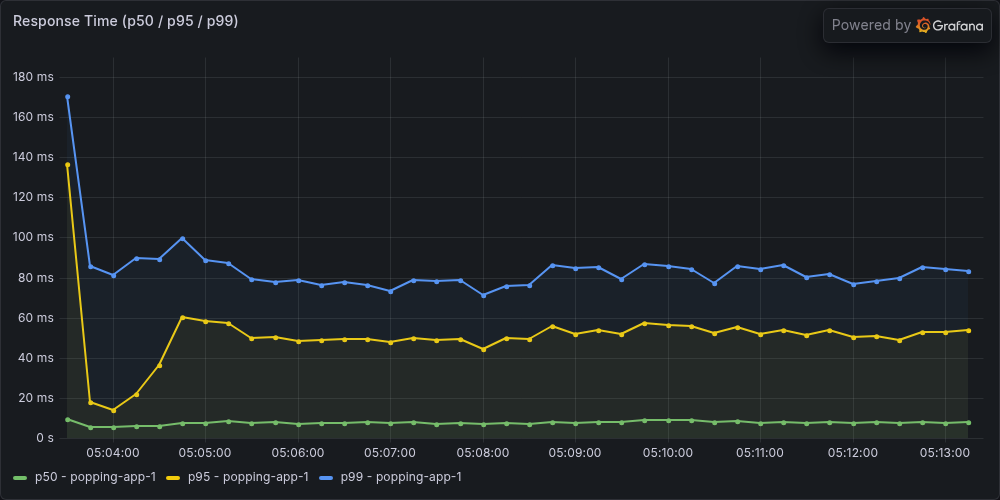 |

| Replication Lag Before | Replication Lag After |
| --- | --- |
| 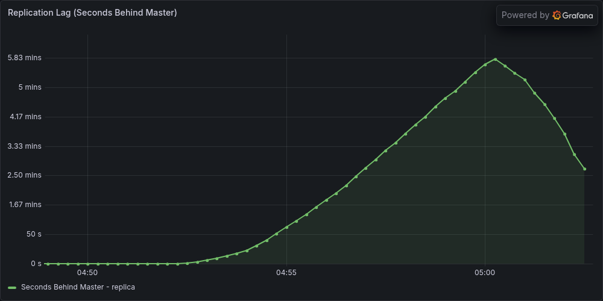 | 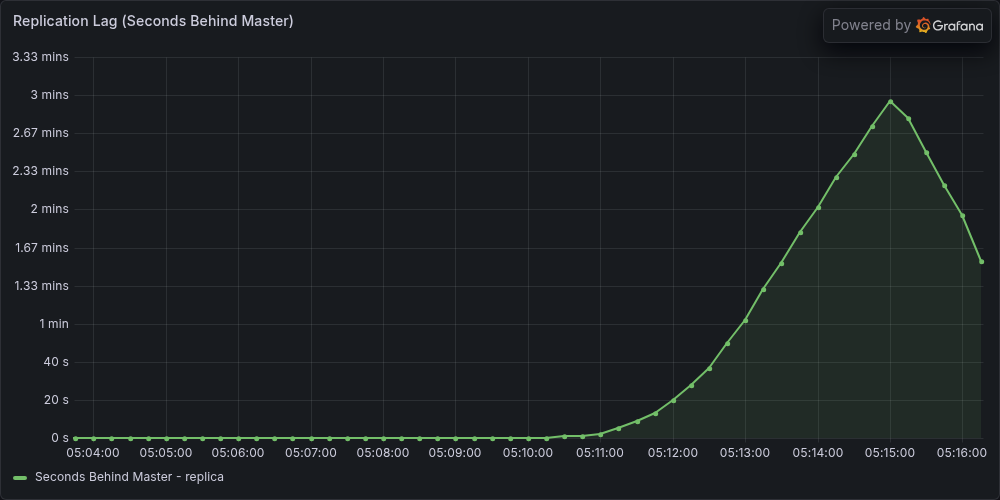 |

## 부하 테스트 환경

### 1~5번: EC2 단일 인스턴스

| 항목 | 값 |
| --- | --- |
| 서버 | `EC2 t2.micro` |
| 실행 환경 | `Spring Boot + MySQL` 동일 인스턴스 |
| DB 풀 | `HikariCP 30` |
| 부하 도구 | `Apache JMeter 5.6.3` (`100 VUser`) |
| 데이터 규모 | 게시글 `100만`, 댓글 `1,000만+`, 좋아요 `450만` |

### 6~7번: Local Docker Compose

| 항목 | 값 |
| --- | --- |
| 실행 환경 | `Docker Compose` (HAProxy + App 2대 + MySQL Primary/Replica) |
| App | `cpus=2.0`, `mem=2G` x 2대 |
| MySQL | `cpus=1.0`, `mem=1G` x 2대 (Primary + Replica) |
| DB 풀 | Write `50` / Read `80` |
| 부하 도구 | `Apache JMeter 5.6.3` (`500~750 VUser`) |
| 데이터 규모 | 게시글 `100만`, 댓글 `505만`, 좋아요 `735만` |

테스트 스크립트는 [docs/load-test](docs/load-test)에 포함되어 있습니다.

- [popping-load-test.jmx](docs/load-test/popping-load-test.jmx)
- [Like Concurrency Test.jmx](docs/load-test/Like%20Concurrency%20Test.jmx)
- [popping-stampede-test.jmx](docs/load-test/popping-stampede-test.jmx)

## 운영과 배포

- `GitHub Actions`로 빌드, 이미지 생성, 배포를 자동화했습니다.
- `Jib`를 사용해 Dockerfile 없이 컨테이너 이미지를 만들고 EC2에 배포합니다.
- `Actuator`, `node-exporter`, `mysqld-exporter`를 통해 애플리케이션, 서버, MySQL 메트릭을 수집합니다.
- 운영 모니터링과 장애 알림 자동화는 [PoppingOps](https://github.com/Popping-community/popping-openclaw-ops-agent)에서 담당합니다.

## 문서

- [부하 테스트 스크립트](docs/load-test)
- [운영 모니터링 저장소](https://github.com/Popping-community/popping-openclaw-ops-agent)
- [포트폴리오](https://chooh1010.github.io/resume/portfolio_v2.html)
