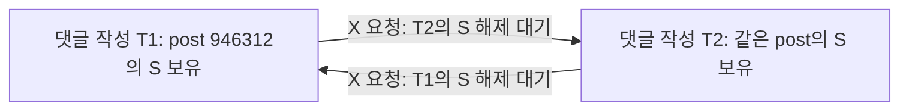

# 댓글 작성 HTTP 500 — 남아 있던 DB 기록으로 데드락을 확인하고 수정

> 최종 정리(2026-09-10): 댓글 데드락 수정 후 500 VUser를 재검증했고 A·B 각 2회가 유효했다. 5A 본 측정은 실행 중단으로 제외했으며 6B는 미실행이다. B 종료 lag 460·466초로 안정성 미달, 확정 개선율 없음. 복구·독립 검산을 마쳤고 사용자 결정으로 추가 실험 없이 종료한다. [최종 결과와 실제 Grafana 캡처](replica-adoption-fixed-20260910.md). 아래는 해당 시점의 계획·이력이다.

2026-09-09 5A 워밍업을 중단시킨 HTTP 500을 조사했다. 삭제된 앱의 예외 로그는 복구하지 못했지만, **Primary의 InnoDB에 실패 요청과 같은 시각·같은 게시글의 데드락 기록이 남아 있었다.** 기존 SQL 실행 순서를 별도 MySQL에서 재현하고, 댓글 INSERT 전에 게시글을 잠그도록 수정했다. 전체 테스트 **169개가 실패·오류·스킵 없이 통과**했다.

이는 댓글 작성의 동시성 수정과 기능 검증이다. 수정한 이미지를 배포하거나 500 VUser A/B를 새로 실행한 결과는 아니다. [기존 도입 재검증](replica-adoption-20260909.md)의 A·B 각 2회, FAILED 및 복제 안정성 미달 판정은 유지한다.

## 삭제된 앱 로그 외에 남아 있던 증거

17:41 KST에 `SHOW ENGINE INNODB STATUS`를 읽었다. 원래 DB의 ID와 기동 상태를 확인했으며 재시작·데이터 변경·부하 재실행은 하지 않았다. DB 시스템 시간대는 UTC다.

| 항목 | 확인한 값 |
|---|---|
| 실패 HTTP 요청 | 16:38:26.901 KST, 회원 댓글 작성, HTTP 500, 782ms |
| 실패 요청의 게시글 | `946312` |
| 겹쳐 실행된 성공 요청 | 같은 게시글의 회원 댓글 작성, 16:38:26.741 시작, 446ms, HTTP 200 |
| DB 최근 데드락 | 07:38:26 UTC = 16:38:26 KST |
| 트랜잭션 | `23378713`, `23378726` |
| 양쪽 실행 SQL | `UPDATE post ... WHERE id=946312` |
| 양쪽 보유 잠금 | 같은 `post.PRIMARY` 레코드의 S 잠금, gap 제외 |
| 양쪽 대기 잠금 | 같은 레코드의 X 잠금, gap 제외 |
| MySQL의 처리 | 두 번째 트랜잭션 롤백 |

DB 데드락 발생 자체는 직접 확인했다. 시각·대상·겹친 요청과 코드 경로가 모두 일치해 이 HTTP 500의 원인이라는 강한 근거가 된다. 다만 당시 앱 stack trace와 요청–DB 세션 연결 정보는 없으므로 HTTP 요청과 피해 트랜잭션을 추적 ID로 직접 연결한 것은 아니다.

앞선 보고서의 ‘원인 미확정’은 당시 보존된 JTL과 exporter 표본만으로 내린 결론이었다. exporter에서 deadlock 표본이 없었던 것을 데드락이 없었다는 뜻으로 취급하면 안 된다. 이번에는 다른 증거인 엔진의 최근 데드락 기록을 확인했다. 이 기록에는 참여 트랜잭션·실행 SQL·보유/대기 잠금·롤백 대상이 포함된다. [MySQL InnoDB 모니터](https://dev.mysql.com/doc/refman/8.4/en/innodb-standard-monitor.html).

## 원래 순서에서 생긴 잠금 변환 충돌

회원·게스트 댓글 작성은 게시글 조회 → 댓글 저장 → 게시글의 `commentCount` 증가 순서였다. 댓글 ID는 IDENTITY이므로 INSERT가 먼저 실행되고, 게시글 변경은 flush 시 UPDATE된다. 외래 키 확인은 참조 레코드에 공유 잠금을 얻을 수 있다. [MySQL SQL별 잠금 설명](https://dev.mysql.com/doc/refman/8.4/en/innodb-locks-set.html).

두 요청이 같은 게시글을 참조하는 댓글을 먼저 INSERT하면 둘 다 부모 게시글의 S 잠금을 보유할 수 있다. 이후 댓글 수를 UPDATE하려고 X 잠금을 요구하면 서로의 S 잠금 때문에 기다리는 순환이 만들어진다. 단순히 서로 다른 행을 반대 순서로 잠그는 경우뿐 아니라, 같은 행에서 S→X 잠금 변환으로도 데드락이 생길 수 있다.

실제 기록의 보유·대기 잠금은 이 형태다. 다만 최근 데드락 출력은 이전 INSERT까지의 전체 SQL 이력을 제공하지 않으므로, S 잠금이 생긴 경로는 애플리케이션 코드와 아래 재현 실험을 함께 근거로 삼는다.

## 수정한 범위

- `PostRepository.findForUpdateById()`에 `PESSIMISTIC_WRITE`를 적용했다. 게시글만 조회하고 기존 `findById`의 author·board EntityGraph는 붙이지 않는다.
- `PostService.getPostForUpdate()`는 호출자의 트랜잭션이 있어야 실행되도록 `MANDATORY`로 선언했다. 메서드 반환 직후 잠금이 풀리는 독립 트랜잭션으로 사용하지 않는다.
- 회원·게스트 댓글 작성은 이 메서드로 게시글을 먼저 잠근 다음 댓글을 INSERT한다. 같은 게시글의 다음 작성자는 부모 잠금에서 기다리며, 댓글 저장과 댓글 수 변경은 기존 하나의 트랜잭션에서 커밋된다.
- 게스트 비밀번호 해싱은 게시글 잠금을 얻기 전에 수행해 잠금을 유지하는 시간을 줄였다. 조회용 `getPost()`와 댓글 조회에는 쓰기 잠금을 추가하지 않았다.

이 변경은 댓글 작성 경로의 잠금 순서를 바꾼다. 재시도로 성공한 요청만 골라 집계하거나 DB 격리 수준·복제·내구성 설정을 변경하지 않았다. 동일 게시글 쓰기는 직렬화되므로 경쟁이 심하면 대기시간이 늘 수 있다. 모든 종류의 데드락, 댓글 삭제의 동시성, 다른 카운터의 갱신 문제까지 해결했다고 일반화하지 않는다. 실제 500 VUser 응답 성능은 새 이미지로 별도 측정해야 한다.

## 검증

기존 DB와 다른 **새 MySQL 8.4.9 컨테이너**를 만들고, loopback 임시 포트와 tmpfs 데이터 디렉터리를 사용했다. 테스트 JDBC 주소는 전용 DB `portfolio_regression`만 허용하는 초기화 검사로 제한했다. 원래 서비스와 연결된 볼륨을 사용하지 않았고, 테스트 종료 시 로그를 먼저 저장한 뒤 정확한 ID·소유 라벨이 일치하는 임시 컨테이너만 제거했다.

| 검사 | 결과 |
|---|---|
| 기존 INSERT→게시글 UPDATE 순서, 두 트랜잭션의 INSERT 뒤 barrier | MySQL **1213 / SQLSTATE 40001** 한 건 재현, 나머지 한 건 커밋 |
| 수정한 실제 서비스에 회원·게스트 혼합 20명 동시 대댓글 작성 | **20건 모두 커밋**, 부모 댓글 포함 실제 행 수·`commentCount` 모두 21 |
| 외부 트랜잭션에서 댓글 작성 후 강제 rollback | 댓글과 집계 모두 0으로 복구, 후속 쓰기 성공 |
| 트랜잭션 없이 잠금용 메서드 호출 | 예외로 차단 |
| 전체 Gradle 테스트 | **169개, 실패 0, 오류 0, 스킵 0** |
| 원래 컨테이너 상태·ID·기동 시각·CPU·메모리 비교 | 변경 없음 |

최초 전체 실행에서는 새 동시성 테스트 4개는 통과했지만, 캐시 테스트 한 곳이 이전 `getPost()` mock을 유지해 실패했다. 변경된 잠금 조회 메서드로 mock을 맞춘 뒤 전체 169개를 다시 실행해 통과했다. 처음의 실패 결과도 보존했다. 동시성 테스트는 두 번째 실행에서도 통과했다. 테스트 중 소스 hash는 불변이었다.

## 증거 위치와 다음 측정 조건

- DB 원문: `.tmp/replica-http500/readiness/20260909T084131464420Z/innodb-status.txt`
- 시각·게시글·잠금·JTL 대조: `.tmp/replica-http500/correlation.json`
- 최초 전체 검사: `.tmp/replica-http500/tests/20260909T085043-f2b835af/`
- 최종 전체 검사: `.tmp/replica-http500/tests/20260909T085235-522cf3f3/`의 `result.json`, `junit/`, `gradle.log`, `mysql.log`
- 회귀 테스트: [CommentWriteConcurrencyTest.java](../../src/test/java/com/example/popping/CommentWriteConcurrencyTest.java)

수정한 소스는 이전 A/B의 고정 이미지와 다르다. 이전 `replica-20260909-adoption-01`의 하네스·JMX·결과를 수정하거나, 새 결과를 누락된 5A·6B처럼 이어 붙이지 않는다. 후속 성능 측정에는 새 이미지·소스 hash, 별도 캠페인, 실패 응답과 앱 stdout/stderr를 정리 전에 보존하는 수집 절차가 필요하다. 이 기능 수정으로 Replica의 505·529초 lag 문제가 해결됐다고 판단하지 않는다.
