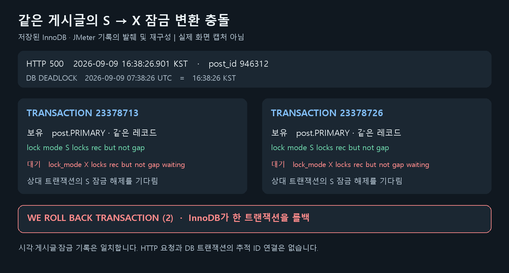
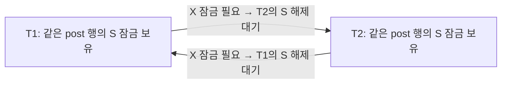
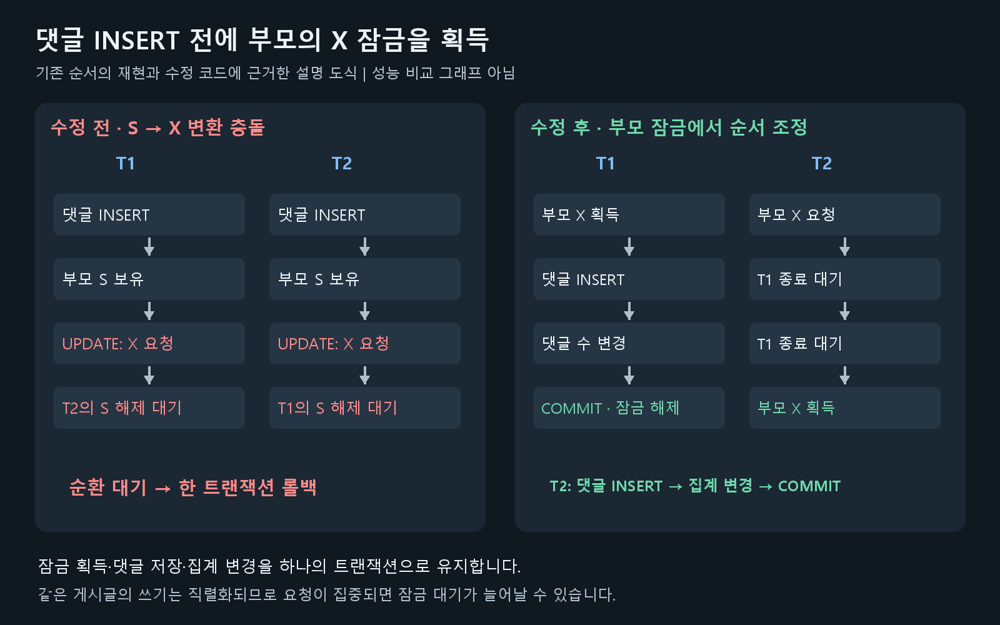
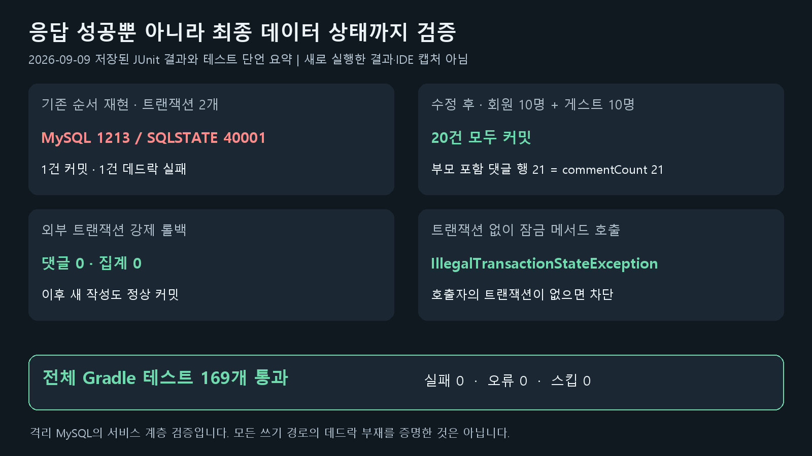

# 댓글 작성 데드락 해결 - 외래 키와 잠금 순서

## 배경

500 VUser로 단일 MySQL과 Replica 추가 구성을 비교하던 중, 회원 댓글 작성 요청에서 HTTP 500이 한 건 발생했습니다. 앞선 네 번의 본 측정은 요청 오류 없이 끝났지만, 다섯 번째 회차의 워밍업에서 실패가 나와 사전에 정한 기준대로 실험을 중단했습니다.

당시 워밍업의 부모 HTTP 요청은 296,866건이었고, 실패한 요청은 다음과 같았습니다. 여기서 부모 요청은 리다이렉트로 추가된 자식 샘플을 제외한 JMeter 집계 단위입니다.

| 항목 | 확인한 값 |
|---|---|
| 발생 시각 | 2026-09-09 16:38:26.901 KST |
| API | `POST /boards/{slug}/{postId}/comments/member` |
| 대상 게시글 | `946312` |
| 응답 | HTTP 500, 782ms |
| 실험 구성 | App 2대 + HAProxy + 단일 Primary, Replica 중지 |

이번 문제는 Replica에 읽기가 늦게 반영되는 현상과는 별개였습니다. 실패는 Replica가 꺼진 A 구성의 댓글 쓰기에서 발생했습니다. 먼저 요청이 실패한 이유를 확인하고, 수정 후에도 같은 문제가 재현되는지 검증하기로 했습니다.

---

## 원인 조사

### 앱 로그가 없어 처음에는 예외 종류를 확인하지 못했습니다

처음 남아 있던 자료는 JMeter의 요청 시각, URL, 응답 코드, 경과시간이었습니다. 응답 본문은 저장하지 않았고, 실험 앱 컨테이너도 로그를 따로 보존하기 전에 정리한 상태였습니다. 따라서 HTTP 500을 일으킨 서버 예외를 앱 stack trace로 확인할 수 없었습니다.

인접한 시점의 DB 잠금 대기 지표만으로 특정 요청의 원인을 설명할 수도 없었습니다. exporter에 데드락 표본이 보이지 않는다고 해서 실제 데드락이 없었다고 결론 내리지 않고, 원래 Primary에 남아 있는 엔진 기록을 확인했습니다.

```sql
SHOW ENGINE INNODB STATUS;
```

`LATEST DETECTED DEADLOCK`에는 최근 데드락에 참여한 트랜잭션, 실행 중이던 SQL, 보유한 잠금과 기다리는 잠금, 롤백된 트랜잭션이 나옵니다. 모든 과거 데드락을 보관하는 목록은 아니므로 발생 시각부터 대조했습니다. [MySQL InnoDB 모니터 문서](https://dev.mysql.com/doc/refman/8.4/en/innodb-standard-monitor.html).

### 실패 요청과 같은 시각·같은 게시글의 데드락이 남아 있었습니다

DB 기록의 시각은 UTC였습니다. `07:38:26 UTC`를 한국 시간으로 바꾸면 실패 요청이 발생한 `16:38:26 KST`와 일치했습니다. 두 트랜잭션 모두 `post.id=946312`를 UPDATE하려고 기다리고 있었습니다.

아래는 실제 기록에서 트랜잭션 번호와 잠금 정보를 발췌한 내용입니다. SQL의 게시글 본문·사용자 정보와 물리 레코드 덤프는 생략했습니다.

```text
LATEST DETECTED DEADLOCK
2026-09-09 07:38:26

TRANSACTION 23378713
HOLDS THE LOCK(S):
  index PRIMARY of table `popping`.`post`
  lock mode S locks rec but not gap
WAITING FOR THIS LOCK TO BE GRANTED:
  index PRIMARY of table `popping`.`post`
  lock_mode X locks rec but not gap waiting

TRANSACTION 23378726
HOLDS THE LOCK(S):
  index PRIMARY of table `popping`.`post`
  lock mode S locks rec but not gap
WAITING FOR THIS LOCK TO BE GRANTED:
  index PRIMARY of table `popping`.`post`
  lock_mode X locks rec but not gap waiting

WE ROLL BACK TRANSACTION (2)
```



*저장된 실제 기록을 발췌해 재구성한 그림입니다. 원문 전체나 화면 캡처가 아니며, 시각·대상 게시글·보유 및 대기 잠금을 비교했습니다.*

JMeter에는 같은 게시글에 거의 동시에 들어간 성공 요청도 있었습니다.

| 요청 | 시작 시각 KST | 경과시간 | 응답 |
|---|---|---:|---|
| 회원 댓글 작성 1 | 16:38:26.741 | 446ms | 200 |
| 회원 댓글 작성 2 | 16:38:26.901 | 782ms | 500 |

두 요청의 실행 구간이 겹치고, DB 기록의 시각·게시글·수정 경로도 일치했습니다. **DB에서 데드락이 발생했다는 사실은 확인했고, 해당 HTTP 500의 원인이라는 강한 근거를 확보했습니다.** 다만 당시 앱 stack trace와 요청–DB 세션 추적 정보는 없으므로 실패한 HTTP 요청을 롤백된 트랜잭션 번호와 직접 연결한 것은 아닙니다.

---

## 문제 원인: 댓글 INSERT가 부모 게시글에도 잠금을 걸었습니다

### 기존 코드의 실행 순서

댓글을 작성하면 댓글 행을 저장하고, 게시글에 저장된 `commentCount`도 증가시켰습니다. 기존 회원·게스트 작성 경로의 공통 흐름을 줄이면 다음과 같습니다.

```java
// Simplified flow before the fix.
Post post = postService.getPost(postId);
Comment comment = Comment.createMemberComment(content, user, post, parent);

commentRepository.save(comment);
post.increaseCommentCount();
```

Java 코드만 보면 새 댓글 하나를 INSERT하고 기존 게시글의 숫자를 바꾸는 작업입니다. 하지만 실제로 어떤 SQL이 먼저 나가고 그 SQL이 어느 행을 잠그는지가 중요했습니다.

이 프로젝트의 댓글 ID는 `GenerationType.IDENTITY`입니다. 기존 작성 경로에서는 댓글 ID를 얻기 위한 INSERT가 먼저 실행되고, 게시글의 `commentCount` 변경은 변경 감지에 의해 flush 시 UPDATE됩니다. `post.increaseCommentCount()`는 Java 객체의 값을 바꾸는 메서드이지, 그 자리에서 UPDATE SQL을 직접 실행하는 메서드가 아닙니다.

### 외래 키 확인으로 얻는 공유 잠금

`comment.post_id`는 `post.id`를 참조합니다. InnoDB는 외래 키 제약을 확인할 때 검사하는 레코드에 공유 잠금을 설정합니다. 따라서 댓글을 INSERT하는 과정에서도 부모 게시글의 레코드에 S 잠금을 얻을 수 있습니다. [MySQL SQL별 잠금 설명](https://dev.mysql.com/doc/refman/8.4/en/innodb-locks-set.html).

이번 문제에 관련된 두 잠금은 다음과 같습니다.

| 잠금 | 이번 경로에서 필요한 이유 | 다른 트랜잭션과의 관계 |
|---|---|---|
| S, 공유 잠금 | 댓글 INSERT의 외래 키 확인 | 같은 행의 다른 S 잠금과 함께 보유 가능 |
| X, 배타 잠금 | 부모 게시글의 댓글 수 UPDATE | 같은 행의 다른 트랜잭션 S·X 잠금과 충돌 |

두 트랜잭션이 서로 다른 댓글을 INSERT하더라도 같은 게시글을 참조하면, 둘 다 그 게시글의 S 잠금을 보유한 상태까지 진행할 수 있습니다. 그다음 댓글 수를 갱신하려고 X 잠금을 요청하는 순간 서로를 기다리게 됩니다.

### 같은 행에서도 S→X 변환으로 순환 대기가 생겼습니다

| 순서 | 트랜잭션 T1 | 트랜잭션 T2 |
|---|---|---|
| 1 | 댓글 INSERT, 부모 게시글 S 잠금 획득 | |
| 2 | S 잠금 유지 | 다른 댓글 INSERT, 같은 게시글 S 잠금 획득 |
| 3 | 게시글 UPDATE를 위해 X 요청, T2의 S 해제 대기 | S 잠금 유지 |
| 4 | T2를 기다림 | 게시글 UPDATE를 위해 X 요청, T1의 S 해제 대기 |
| 5 | 한 트랜잭션이 롤백돼야 진행 가능 | 한 트랜잭션이 롤백돼야 진행 가능 |



서로 다른 두 행을 반대 순서로 잠글 때만 데드락이 발생하는 것은 아니었습니다. 이번에는 **같은 행에 공유 잠금을 얻은 두 트랜잭션이 모두 배타 잠금으로 전환하려고 하면서** 순환 대기가 생겼습니다.

최근 데드락 출력에는 이전 INSERT까지의 전체 SQL 이력이 나오지 않습니다. 따라서 S 잠금의 유입 경로는 엔진 기록만으로 단정하지 않고, 코드의 저장 순서와 별도 MySQL 재현 결과를 함께 확인했습니다.

---

## 해결 방법 비교

이번 수정에서 지키려는 조건은 두 가지였습니다. 댓글 저장과 `commentCount` 변경은 한 트랜잭션에서 함께 성공하거나 실패해야 하고, App이 두 대여도 같은 게시글의 동시 작성을 조정할 수 있어야 했습니다.

아래는 수정 후 원인과 구현을 기준으로 정리한 대안 비교입니다. 실제 적용·검증한 방식은 부모 게시글의 `PESSIMISTIC_WRITE` 잠금을 먼저 얻는 방법이며, 나머지는 별도 구현이나 성능 실험을 하지 않은 설계 검토입니다.

### 접근 1: 데드락 발생 시 트랜잭션 재시도

데드락으로 롤백된 댓글 작성 트랜잭션을 다시 실행하는 방법입니다. 일시적인 충돌이라면 다음 시도에서는 성공할 수 있고, MySQL도 애플리케이션이 데드락에 따른 재시도를 준비하도록 안내합니다. [MySQL 데드락 처리 문서](https://dev.mysql.com/doc/refman/8.4/en/innodb-deadlocks-handling.html).

다만 두 요청이 부모의 S 잠금을 얻은 뒤 X 잠금으로 전환하는 순서는 그대로 남습니다. 같은 게시글에 요청이 몰리면 재시도에서도 충돌할 수 있고, 시도 횟수와 대기시간만큼 응답이 늦어질 수 있습니다. 적용한다면 실패한 트랜잭션 안에서 SQL만 반복하지 않고, 새 트랜잭션으로 전체 작업을 재실행하면서 횟수 제한과 backoff를 둬야 합니다. 알림 등 트랜잭션 밖의 부수 효과가 중복되지 않는지도 확인해야 합니다.

이번에는 재시도를 추가하지 않고 재현된 잠금 순서부터 수정했습니다. 재시도는 순서 개선 후에도 남을 수 있는 다른 데드락에 대한 보완책으로 검토할 수 있습니다.

### 접근 2: 댓글 수를 먼저 원자적으로 UPDATE

`SELECT FOR UPDATE` 대신 부모 게시글의 댓글 수를 먼저 UPDATE해도 X 잠금을 먼저 얻는 순서를 만들 수 있습니다. 다음은 같은 트랜잭션 안에서 실행하는 대안의 개념 SQL입니다.

```sql
UPDATE post
SET comment_count = comment_count + 1
WHERE id = ?;

INSERT INTO comment (...) VALUES (...);
```

댓글 INSERT가 실패하면 앞선 카운터 증가도 함께 롤백합니다. 핵심은 `+ 1`이라는 연산보다 **부모 UPDATE를 댓글 INSERT 전에 실행한다는 점**입니다. INSERT 뒤에 원자적 UPDATE를 실행하면 부모 S 잠금을 먼저 얻는 조건이 남으므로 이번 데드락을 피하는 근거가 되지 않습니다. [MySQL SQL별 잠금 설명](https://dev.mysql.com/doc/refman/8.4/en/innodb-locks-set.html).

이 방식은 유효한 대안입니다. 다만 현재 코드는 조회한 `Post` 엔티티에서 댓글 수를 변경하는 흐름입니다. 별도 UPDATE 쿼리를 사용하면 영속성 컨텍스트의 `commentCount`와 DB 값이 달라질 수 있어, 이후 변경 감지가 이전 값을 덮어쓰지 않도록 조회·갱신 경로를 함께 정리해야 합니다. Spring Data JPA도 수정 쿼리 실행 후 영속성 컨텍스트에 오래된 엔티티가 남을 수 있음을 설명합니다. [Spring Data JPA 수정 쿼리 문서](https://docs.spring.io/spring-data/jpa/reference/jpa/query-methods.html#jpa.modifying-queries).

Java 코드에서 `increaseCommentCount()`를 `save()` 앞으로 옮기는 것만으로는 이 순서를 만들었다고 볼 수 없습니다. 변경 감지 UPDATE가 실제로 언제 실행되는지까지 보장해야 합니다. 원자적 UPDATE 선행과 잠금 조회 선행 모두 같은 게시글의 쓰기를 직렬화하므로, 어느 쪽이 더 빠른지는 이 글의 실험으로 판단할 수 없습니다.

### 접근 3: 낙관적 잠금으로 갱신 충돌 감지

`Post`에 `@Version`을 추가하면, 읽어 온 버전과 UPDATE 시점의 버전이 다를 때 갱신 충돌을 감지할 수 있습니다. 오래된 값을 바탕으로 댓글 수를 덮어쓰는 문제에는 검토할 만한 방식입니다.

하지만 이번 문제는 버전 검사를 하기 전 댓글 INSERT에서 부모 S 잠금을 얻고, 이후 UPDATE에서 X 잠금을 요청하는 경로입니다. 버전 조건을 붙여도 DB UPDATE에 필요한 잠금은 없어지지 않습니다. 따라서 `@Version` 추가만으로 이번 S→X 순환 대기가 제거된다고 판단할 수 없고, 충돌 후 재시도 정책도 필요합니다.

### 접근 4: 댓글 수 갱신을 비동기로 분리

댓글을 저장하는 트랜잭션에서는 부모의 댓글 수를 바꾸지 않고, 커밋 이후 별도 작업에서 집계하는 방법입니다. 댓글 작성 경로에서 부모 UPDATE를 분리하므로 이번 잠금 변환이 일어나는 구조를 바꿀 수 있습니다.

대신 댓글이 저장된 시점과 화면의 댓글 수가 일치하지 않는 구간을 받아들여야 합니다. 댓글 저장 후 이벤트 발행이 실패하는 경우, 같은 이벤트가 중복 처리되는 경우, 집계가 누락됐을 때 복구하는 방법도 필요합니다. 현재의 댓글·집계 동시 커밋을 유지하려는 수정 범위보다 큰 설계 변경입니다.

### 접근 5: 외래 키 제거

`comment.post_id`의 외래 키를 제거하면 이번에 확인한 부모 S 잠금의 유입 경로를 없앨 수 있습니다. 하지만 존재하지 않는 게시글을 참조하는 댓글이나 게시글 삭제와 댓글 작성의 경쟁을 애플리케이션에서 책임져야 합니다.

이번에는 외래 키를 유지한 상태에서 잠금 순서를 바꿔 문제를 재현·검증할 수 있었습니다. 이 문제를 해결하기 위해 참조 무결성 보장을 옮길 필요는 없었습니다.

### 선택: 부모 게시글의 X 잠금을 먼저 획득

적용한 방식은 기존 게시글 조회를 잠금용 조회로 분리하고, 댓글 INSERT 전에 `PESSIMISTIC_WRITE`로 부모를 잠그는 것입니다. 기존 엔티티 변경 감지와 댓글·집계의 트랜잭션 경계를 유지하면서, 이번 데드락이 발생한 SQL 순서를 직접 바꿀 수 있습니다. 두 App 모두 같은 Primary를 사용하므로 프로세스별 락이나 별도 분산 락 없이 DB 레코드 잠금으로 조정됩니다.

| 방법 | 이번 S→X 충돌에 대한 접근 | 함께 감수하거나 관리할 것 |
|---|---|---|
| 트랜잭션 재시도 | 충돌 후 전체 작업 재실행 | 재충돌, 추가 지연, 부수 효과 중복 |
| 원자적 UPDATE 선행 | 부모 X 잠금을 먼저 획득 | JPA 엔티티와 DB 값의 동기화, SQL 순서 보장 |
| 낙관적 잠금 | 버전으로 갱신 충돌 감지 | 이번 잠금 변환 경로는 남을 수 있음, 재시도 |
| 비동기 집계 | 댓글 작성에서 부모 UPDATE 분리 | 집계 지연, 이벤트 유실·중복, 복구 |
| 외래 키 제거 | 부모 S 잠금의 해당 유입 경로 제거 | 애플리케이션의 참조 무결성 책임 |
| **부모 X 잠금 선점 — 적용** | **댓글 INSERT 전에 대기하도록 순서 변경** | **같은 게시글의 작성 직렬화와 잠금 대기** |

이 선택에도 비용은 있습니다. 같은 게시글에 댓글 작성이 몰리면 앞선 트랜잭션이 끝날 때까지 기다립니다. 그래서 게스트 비밀번호 해싱은 부모 잠금 전에 처리했고, 일반 조회에는 쓰기 잠금을 추가하지 않았습니다. 이번 선택의 근거는 대안보다 빠르다는 측정 결과가 아니라, 기존 정합성 조건을 유지하면서 확인된 실패 원인을 좁은 범위에서 수정할 수 있다는 점입니다.

---

## 해결 과정

### 1. 기존 순서가 실패하는 조건부터 재현했습니다

원래 부하 테스트 DB를 다시 사용하지 않고, 별도 MySQL 8.4.9 컨테이너에서 재현했습니다. 임시 loopback 포트와 tmpfs를 사용했고, 테스트는 전용 `portfolio_regression` DB 주소에서만 실행되도록 제한했습니다.

두 트랜잭션이 댓글 INSERT를 끝낸 뒤에만 다음 단계로 진행하도록 `CyclicBarrier`를 넣었습니다. 단순히 동시에 시작하는 것보다, 두 요청이 모두 부모의 S 잠금을 얻은 상태를 만들기 위한 장치입니다. 아래는 실제 회귀 테스트에서 잠금 순서와 관련된 부분을 발췌·축약한 코드입니다.

```java
CyclicBarrier inserted = new CyclicBarrier(2);

new TransactionTemplate(transactionManager).executeWithoutResult(status -> {
    Post post = postRepository.findById(postId).orElseThrow();
    User user = users.findById(userId).orElseThrow();

    commentRepository.saveAndFlush(
            Comment.createMemberComment("baseline", user, post, null)
    );

    await(inserted);
    post.increaseCommentCount();
});
```

이 작업을 두 스레드에서 실행하자 한 트랜잭션은 커밋했고, 다른 하나는 **MySQL 오류 1213 / SQLSTATE 40001**로 실패했습니다. 테스트에서는 단순히 예외가 발생했는지만 확인하지 않고 원인 예외의 오류 코드와 SQLSTATE를 검사했습니다. 완료 후 댓글 행 수와 게시글의 댓글 수도 각각 1인지 확인했습니다.

### 2. 댓글 INSERT 전에 부모 게시글의 X 잠금을 얻도록 바꿨습니다

게시글 조회에 쓰기 잠금을 적용하는 전용 메서드를 추가했습니다.

```java
// PostRepository
@Lock(LockModeType.PESSIMISTIC_WRITE)
@Query("SELECT p FROM Post p WHERE p.id = :postId")
Optional<Post> findForUpdateById(@Param("postId") Long postId);
```

기존 조회용 `findById()`에는 `author`, `board`를 함께 가져오는 EntityGraph가 있습니다. 그 조회를 그대로 바꾸지 않고, 댓글 작성에서 부모를 잠그는 목적의 메서드를 분리했습니다. 일반 게시글·댓글 조회에는 새 쓰기 잠금을 추가하지 않았습니다.

변경 후 잠금의 핵심 순서는 다음과 같습니다. SQL은 차이를 설명하기 위한 축약 형태이며 실제 SQL 전체를 복사한 것은 아닙니다.

```sql
-- Before: the foreign-key check takes the parent shared lock first.
INSERT INTO comment (...) VALUES (...);
UPDATE post SET ... WHERE id = ?;

-- After: acquire the parent write lock before inserting the child.
SELECT ... FROM post WHERE id = ? FOR UPDATE;
INSERT INTO comment (...) VALUES (...);
UPDATE post SET ... WHERE id = ?;
```

이제 T1이 게시글의 X 잠금을 먼저 얻으면, 같은 게시글에 댓글을 쓰는 T2는 최초 잠금 조회에서 기다립니다. T2가 댓글을 INSERT해 부모의 S 잠금을 보유한 상태로 진입하기 전에 대기하도록 순서를 바꾼 것입니다. T1이 커밋한 뒤 T2가 잠금을 얻고 다음 댓글을 저장합니다.

```text
T1: 부모 X 획득 → 댓글 INSERT → 댓글 수 변경 → COMMIT
T2: 부모 X 대기 ───────────────────────────→ 부모 X 획득 → 작성
```



*기존 순서의 재현과 수정 코드에 근거한 설명 도식입니다. 수정 후에는 두 번째 작성자가 부모 잠금에서 기다리며, 같은 게시글의 쓰기는 직렬화됩니다.*

애플리케이션 인스턴스가 두 대여도 같은 Primary의 레코드 잠금으로 조정됩니다. 이번 수정은 댓글 작성 경로가 공통으로 참조하는 부모 게시글을 먼저 잠그는 방식입니다.

### 3. 부모 잠금을 댓글 작성 트랜잭션 끝까지 유지했습니다

잠금 조회만 별도 트랜잭션에서 실행하고 바로 끝내면, 이후 댓글 INSERT와 게시글 UPDATE를 보호할 수 없습니다. `PostService`의 잠금용 메서드에는 `MANDATORY`를 적용했습니다.

```java
// PostService — error-message detail omitted.
@Transactional(propagation = Propagation.MANDATORY)
public Post getPostForUpdate(Long postId) {
    return postRepository.findForUpdateById(postId)
            .orElseThrow(() -> new CustomAppException(ErrorType.POST_NOT_FOUND));
}
```

`MANDATORY`는 기존 트랜잭션에 참여하고, 트랜잭션 없이 호출되면 예외를 발생시킵니다. 이 호출에서는 `@Transactional`이 적용된 `CommentService`의 작성 트랜잭션에 참여하므로, 부모 잠금 획득·댓글 저장·댓글 수 변경을 한 트랜잭션으로 묶습니다. `MANDATORY` 자체가 읽기 전용 여부까지 검사하는 것은 아닙니다. [Spring 트랜잭션 전파 옵션](https://docs.spring.io/spring-framework/docs/current/javadoc-api/org/springframework/transaction/annotation/Propagation.html#MANDATORY).

회원 댓글 작성에서 달라진 부분은 첫 게시글 조회입니다. 아래는 캐시 무효화 등을 생략한 현재 코드의 핵심 흐름입니다.

```java
// Inside CommentService's transaction.
Post post = postService.getPostForUpdate(postId);
Comment parent = getParentComment(parentId);
User user = userService.getLoginUserById(principal.getUserId());

Comment comment = Comment.createMemberComment(dto.content(), user, post, parent);
comment = commentRepository.save(comment);

post.increaseCommentCount();
```

단순히 `increaseCommentCount()` 호출을 `save()` 앞으로 옮기는 것으로 SQL의 잠금 순서를 보장하려고 하지 않았습니다. 잠금이 필요한 시점에 명시적인 잠금 조회를 실행하도록 바꿨습니다.

### 4. 게스트 비밀번호 해싱은 잠금 전에 처리했습니다

게스트 댓글도 같은 부모 잠금 경로를 사용하도록 수정했습니다. 다만 비밀번호 해싱은 잠금을 얻기 전에 실행합니다.

```java
String hashedPassword = guestPasswordEncoder.encode(dto.guestPassword());

Post post = postService.getPostForUpdate(postId);
Comment parent = getParentComment(parentId);

Comment comment = Comment.createGuestComment(
        dto.content(), dto.guestNickname(), hashedPassword, post, parent
);
comment = commentRepository.save(comment);
post.increaseCommentCount();
```

해싱이 끝날 때까지 같은 게시글의 다른 작성자가 잠금에서 기다릴 필요는 없기 때문입니다. 해싱을 트랜잭션 밖으로 옮긴 것은 아니고, **부모 레코드 잠금을 획득하기 전으로 배치한 것**입니다.

---

## 테스트 결과

### 수정 전 재현과 수정 후 동시 작성을 함께 확인했습니다

새 테스트는 `CommentWriteConcurrencyTest`에 작성했습니다. 2026-09-09에 실행한 결과를 기준으로 정리했습니다.

| 검증 | 결과 |
|---|---|
| 기존 INSERT→게시글 UPDATE 순서를 2개 트랜잭션에서 실행 | 한 건 커밋, 한 건 MySQL 1213 / SQLSTATE 40001 발생 |
| 수정된 실제 서비스에 회원 10명·게스트 10명 동시 대댓글 작성 | 20건 모두 커밋, 대댓글 20행 확인 |
| 댓글 수 일치 | 기존 부모 댓글 1개를 포함해 실제 댓글 행 수와 `commentCount` 모두 21 |
| 외부 트랜잭션에서 댓글 작성 후 강제 롤백 | 댓글과 집계 모두 0으로 복구, 이후 새 작성 성공 |
| 트랜잭션 없이 `getPostForUpdate()` 호출 | `IllegalTransactionStateException`으로 차단 |
| 전체 Gradle 테스트 | **169개 통과, 실패 0·오류 0·스킵 0** |



*2026-09-09 저장된 JUnit XML과 회귀 테스트의 단언을 요약했습니다. 전체 169개 통과를 다시 집계했으며, 이번 문서 편집에서 테스트를 새로 실행하지 않았습니다.*

20개 동시 요청 테스트는 Repository만 직접 호출한 것이 아니라, 수정된 `CommentService`의 회원·게스트 작성 메서드를 사용했습니다. 성공 응답 개수뿐 아니라 실제 저장된 행 수와 게시글 집계가 일치하는지도 확인했습니다.

최초 전체 테스트에서는 새 동시성 테스트 4개가 모두 통과했지만, 캐시 테스트 한 곳이 이전 `getPost()` mock을 사용해 실패했습니다. 변경된 `getPostForUpdate()` 호출에 맞춰 mock을 수정한 뒤 전체 테스트를 다시 실행했고 169개가 통과했습니다. 첫 실패 결과도 삭제하지 않고 보존했습니다.

테스트가 끝난 뒤에는 임시 MySQL 로그를 저장하고 해당 테스트 컨테이너만 정리했습니다. 원래 서비스의 컨테이너 ID·기동 시각·상태·CPU·메모리가 바뀌지 않은 것도 확인했습니다.

### 수정 후 500 VUser 재검증에서는 완료 구간의 오류가 없었습니다

회귀 테스트 이후에는 수정된 소스를 새 이미지로 빌드해 별도 부하 캠페인을 실행했습니다. 같은 이미지로 단일 DB A와 Replica 추가 B를 비교했고, 완료한 네 본 측정은 전체 HTTP 오류 0건이었습니다.

| 구분 | 확인한 결과 |
|---|---|
| 완료된 본 측정 | 1A·2B·3B·4A, 각 900초 |
| 전체 HTTP 오류 | 네 본 측정 모두 0건 |
| 완료된 14개 단계의 보존 로그·실패 XML | 데드락 관련 로그 검색 일치 0건, 실패 샘플 0건 |
| 다섯 번째 5A 본 측정 | 9월 10일 01:11경 실행 중단, 불완전한 원본으로 보존·제외 |
| 최종 비교 범위 | A·B 각 2회, 사전 각 3회 기준 미달 |


*수정 후 1A 본측정, 2026-09-09 20:23:04.730~20:38:04.730 KST의 실제 Grafana 캡처입니다. App 두 대의 서버 측 p50·p95·p99 응답 추이를 보여줍니다. 이 패널만으로 데드락 부재나 오류 0건을 판정하지 않았으며, HTTP 오류 0건은 해당 구간의 JMeter 원시 결과와 보존 로그로 별도 확인했습니다. 수정 전후 성능 비교 그래프가 아닙니다.*

14개 단계는 1A~4A의 smoke·워밍업·본 측정 12개와 5A의 smoke·워밍업 2개입니다. 중단된 5A 본 측정은 완결된 로그·실패 응답 검증 범위에 포함하지 않았습니다.

야간 실행이 중단된 구체적인 원인은 확인하지 못했습니다. 이후 DB 재시작도 있었으므로 시작 전과 복구 후의 InnoDB 누적 카운터를 단순 차감해 “실험 전체 데드락 0건”이라고 결론 내리지 않았습니다. 확인한 사실은 **기존 순서의 데드락을 재현했고, 수정 후 동시 작성 테스트가 통과했으며, 완료된 부하 구간에서 같은 오류가 관측되지 않았다**는 것입니다.

Replica의 복제 지연은 별도 문제로 남았습니다. 완료된 B 두 회의 종료 지연은 460초·466초였고 안정성 기준을 통과하지 못했습니다. 댓글 데드락 수정이 복제 지연까지 해결했다는 뜻은 아닙니다. 부하 결과와 Grafana 캡처는 [수정 후 최종 보고서](C:/popping-community/popping-server/docs/load-test/replica-adoption-fixed-20260910.md)에 정리했습니다.

---

## 로그 수집 과정도 수정했습니다

이번 조사에서는 앱 로그가 사라져 HTTP 요청과 DB 트랜잭션을 직접 연결하지 못했습니다. 코드 수정 후 재검증부터는 실험 컨테이너를 정리하기 전에 오류 근거를 남기도록 수집 순서를 바꿨습니다.

- 각 단계에서 앱 stdout·stderr를 계속 저장하고, 종료 시 해당 구간을 다시 저장했습니다.
- 컨테이너를 중지한 뒤 삭제하기 전에 최종 로그를 저장했습니다.
- JMeter CSV와 별도로 실패 샘플의 응답 본문을 XML에 저장했습니다. 요청 본문과 헤더는 수집 대상에서 제외했습니다.
- 시작 전과 오류 시 InnoDB 상태·잠금 관련 카운터를 저장해 이전 데드락과 새 오류를 구분할 근거를 남겼습니다.

실험 중단이나 로그 수집 실패도 기록합니다. 정상적으로 끝난 구간의 로그가 있다는 이유로 중단된 구간까지 검증됐다고 처리하지 않았습니다.

---

## 정리

댓글 INSERT는 새 댓글 행에만 영향을 주는 작업이 아니었습니다. 외래 키 확인 과정에서 부모 게시글의 공유 잠금을 얻고, 같은 트랜잭션에서 댓글 수를 갱신하려다 배타 잠금으로 전환하면서 충돌할 수 있었습니다. 엔진의 보유·대기 잠금과 실제 코드의 SQL 실행 순서를 함께 확인한 뒤, 부모를 먼저 잠그는 방식으로 해당 경로를 수정했습니다.

대신 같은 게시글의 댓글 작성은 직렬화됩니다. 인기 게시글에 쓰기가 집중되면 잠금 대기시간이 늘어날 수 있으며, 이번 결과로 처리량 개선을 주장하지 않았습니다. 댓글 삭제나 다른 카운터 변경 경로까지 같은 검증을 수행한 것도 아닙니다.

이 작업에서 남긴 결과는 **S→X 잠금 변환 데드락의 재현, 부모 잠금 선점으로 순서를 바꾼 수정, 실제 서비스 동시 작성·집계·롤백 검증, 오류 근거를 보존하는 절차의 개선**입니다. 실패가 사라진 것만 확인하는 데 그치지 않고, 무엇이 실패 조건이었고 수정 후 어디까지 확인했는지를 기록했습니다.

## 구현과 검증 기록

- [데드락 원인·수정 당시 보고서](C:/popping-community/popping-server/docs/load-test/comment-deadlock-20260909.md)
- [PostRepository 잠금 조회](C:/popping-community/popping-server/src/main/java/com/example/popping/repository/PostRepository.java)
- [PostService 트랜잭션 경계](C:/popping-community/popping-server/src/main/java/com/example/popping/service/PostService.java)
- [CommentService 회원·게스트 작성](C:/popping-community/popping-server/src/main/java/com/example/popping/service/CommentService.java)
- [CommentWriteConcurrencyTest 회귀 테스트](C:/popping-community/popping-server/src/test/java/com/example/popping/CommentWriteConcurrencyTest.java)
- [HTTP 시각·게시글과 DB 기록 대조](C:/popping-community/popping-server/.tmp/replica-http500/correlation.json)
- [169개 테스트 결과](C:/popping-community/popping-server/.tmp/replica-http500/tests/20260909T085235-522cf3f3/result.json)
- [수정 후 완료 로그·중단 원본 감사](C:/popping-community/popping-server/.tmp/replica-adoption-fixed-output/log-audit/20260910T001021453069Z/audit.json)
