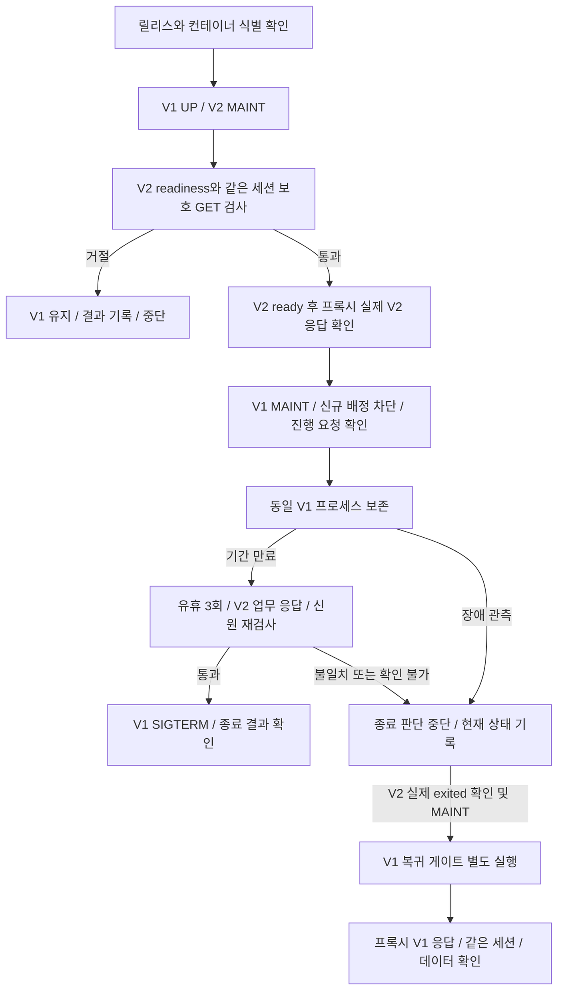

# Popping 로컬 배포 검증 실행서 — 2026-09-23

이 문서는 후보 준비 → 투입 → 이전 앱 보존 → 종료 또는 복귀의 **검증된 로컬 절차**와 중단 기준을 연결한다. 완성된 운영 배포 CLI나 운영 배포 성공 기록이 아니다. 현재 CI와의 차이는 [구성 대조](deployment-integration-audit-20260923.md)에 있다.

## 1. 실행 대상과 사전 조건

- 대상은 별도 DB/Redis와 loopback 포트를 사용하는 `popping-drain-check-*` 격리 프로젝트다. 기존 `popping-server` 컨테이너·DB·CI에는 이 실험을 적용하지 않는다. 도구의 프로젝트 제약을 삭제해서 우회하지 않는다.
- 동일 프로젝트/포트를 다루는 호출자는 하나다. 다른 배포, 복귀, 만료 타이머를 병행하지 않는다. 현재 도구에는 다중 제어기 잠금과 중단 후 자동 재개가 없다.
- V1/V2의 정확한 로컬 image ID, 실행 container ID, Compose project/service label, StartedAt, 업무 포트 연결을 기록한다. 태그·서비스 이름만 같다고 동일 이미지/프로세스로 인정하지 않는다.
- 이미지가 실제로 다른지, 어느 소스/빌드 산출물에서 왔는지 확인한다. 기존 실험은 보호 페이지 marker만 다른 실제 이미지다. 기능과 DB 스키마가 같아 migration 역호환은 증명하지 않는다.
- 기존 V1에서 로그인한 동일 SESSION으로 후보를 검사한다. 익명 보호 GET은 거절돼야 한다. 쿠키는 임시 파일에만 저장하고 로그·Git·블로그에 포함하지 않는다.
- 기능 검증은 낮은 부하만 대상으로 한다. 실제 배포 부하를 감당한다는 판단에는 현 구성의 단일 앱 용량·워밍업·DB/Redis 및 메모리 여유를 별도 검증해야 한다. 과거 Scale Out 수치를 대신 사용하지 않는다.
- WebSocket·스케줄러·메모리 누적 데이터는 아래 HTTP 세션/큐 검사로 모두 검증되지 않는다. 실제 서비스는 이 기능을 사용하므로 운영 연결의 별도 조건이다.

후속 [조회수 인계 경쟁 수정](view-count-transfer-20260923.md)은 정상 실행 중 동시 증가·flush 유실을 해결하고 당시 전체 회귀179건을 확인했다. 추가 [Spring 종료 순서 검증](view-count-shutdown-20260923.md)은 실제 Boot 스케줄러가 기한 내 작업 완료를 기다리며 기한 초과 시 종료를 진행할 수 있음을 확인했다. JDBC/DB 장애 내구성·전체 앱 SIGTERM이나 과거 배포 실험 이미지에 이 수정이 포함됨을 증명하지는 않는다.

## 2. 상태 전이와 책임



단계마다 실패하면 다음 단계로 자동 진행하지 않는다. `readyz=200`은 JVM 워밍업 완료나 전체 기능 정상의 동의어가 아니다.

| 단계 | 입력/책임 | 완료 기준 | 실패 시 행동 |
|---|---|---|---|
| 0. 식별 | caller가 이미지·컨테이너·주소·포트·프로젝트 확인 | 기대한 V1/V2가 정확한 슬롯에 있음 | 프록시 변경 전 중단 |
| 1. 후보 검사 | [admit_candidate.py](../../scripts/deployment/admit_candidate.py), V1 UP·V2 MAINT | readiness 200/UP와 보호 GET200/marker 연속3회, ready 후 HAProxy UP/L7OK | V1에 손대지 않음. MAINT 복구 불명확이면 상태 불명으로 중단 |
| 2. 실제 투입 확인 | caller가 프록시를 통한 응답 검사 | 기대 V2 응답·로그인 세션 확인, 실제 후보 배정 증거 | 이전 앱을 보존한 채 중단·현재 상태 조사 |
| 3. 이전 앱 격리 | caller가 V1 MAINT로 전환 | MAINT 확인, stot 증가 없음, scur/qcur=0 연속3회, 진행 쓰기 결과 대조 | 종료하지 않음. 상태를 무조건 ready로 되돌리지 않음 |
| 4. 보존 | [retain_previous.py](../../scripts/deployment/retain_previous.py)의 `RetainedPair`와 `retain()` | 동일 두 프로세스·이미지·주소 유지, V1 MAINT와 V2 건강 관측 | 함수 반환 후 원인 확인. 자체 자동 복귀 없음 |
| 5a. 만료 종료 | 동일 보존 함수 | 만료 후 유휴3회, V2 보호 GET, 최종 신원/상태/기한 확인 후 V1 SIGTERM | 확인 불가면 종료하지 않음. TERM 이후 오류는 결과 불명으로 구분 |
| 5b. 장애 복귀 | caller가 정확한 V2 exited와 슬롯 MAINT 확인 후 [recover_server.py](../../scripts/deployment/recover_server.py) | 복귀할 V1 MAINT, 정확한 두 이미지/프로세스, readiness·SESSION·V1 marker, ready 후 프록시 확인 | 실행 중인 V2를 단순 health 실패만으로 종료 상태라고 간주하지 않음 |
| 6. 복귀 후 확인 | caller의 별도 프록시/DB 검사 | V1 버전·같은 세션·V2 완료 데이터 조회·V1 새 쓰기 확인 | 쓰기 자동 재전송으로 실패를 숨기지 않음 |

**도구 책임은 같지 않다.** admission CLI는 컨테이너/이미지 인자를 받지 않는다. loopback URL과 marker를 확인할 뿐 URL과 기대 이미지의 연결은 caller 책임이다. `OwnedContainer`를 쓰는 drain/recover/retention의 소유권 검사까지 admission 자체가 한다고 설명하지 않는다.

**보존과 즉시 종료는 다른 경로다.** [quiesce_server.py](../../scripts/deployment/quiesce_server.py)는 V1이 UP인 상태에서 MAINT로 전환하고 검사가 끝나면 SIGTERM까지 보낸다. 이를 보존 전에 호출하면 이전 프로세스를 남길 수 없다. 보존 경로의 park 단계는 현재 [fixture의 `Trial.park()`](../../_workspace/deploy-safety/2026-09-23/recovery-compare-v1/rig.py)가 수행한다. 별도의 운영용 park CLI는 아직 없다. `retain()`도 CLI가 아닌 import용 함수다.

## 3. 결과 해석과 중단 후 행동

| 결과 | 의미 | 다음 판단 |
|---|---|---|
| admitted=true | 후보 투입 게이트 통과 | 프록시 실제 후보 응답을 별도 확인 |
| admitted=false | 거절 | 결과의 상태 복구 기록을 읽고 V1 확인 |
| admitted=null | 후보 MAINT 복구 확인 불가 | 다른 변경 중단, 프록시 실제 상태 확인 |
| stopped=false / stop_invoked=false | 종료 callback 미호출 | 이전 프로세스·프록시 상태를 확인한 뒤 유지/복귀 결정 |
| stopped=false / stop_invoked=true | TERM 후 기한 내 exited 미확인 | 실제 상태 관측. SIGKILL로 자동 승격하지 않음 |
| stopped=null / stop_invoked=true | 종료 callback 이후 결과 불명 | 같은 종료 명령을 무조건 재시도하지 않음 |
| stopped=true | exited 확인 | exit code·OOM·요청/데이터 결과로 정상 종료 여부 판단 |
| recovered=true | 복귀 게이트 통과 | 프록시 V1 버전/세션/데이터 별도 확인 |
| recovered=false 또는 null | 복귀 거절 또는 상태 불명 | reason·ready_attempted·MAINT 확인 결과에 따라 수동 조사 |

HTTP health만 실패하고 V2 프로세스는 실행 중이라면 현재 복귀 도구의 전제가 아니다. 재시작 정책 때문에 같은 컨테이너가 재기동돼 StartedAt이 바뀌어도 기존 식별 검증은 거절해야 한다. 원인을 확인하지 않고 V2를 강제 종료해 전제에 맞추지 않는다.

동일 ID·변경된 StartedAt 거절은 현재 구현과 fake inspect 단위 테스트로 확인했다. 기존 Docker 교체 실험은 새 ID를 만들었으므로 실제 restart 실험으로 취급하지 않는다. admission은 정확한 L7OK만, drain/retention은 검사 진행 중의 `* L7OK`도 허용한다. 따라서 admission timeout에서는 업무 검사 실패와 프록시 상태 관측 타이밍을 결과 원문에서 구분한다.

명령의 종료 코드만으로 위 판정을 대신하지 않는다. 결과 파일이 없거나 읽을 수 없으면 `false`라고 추정하지 말고 원인을 조사한다. 호출자 중단이나 통신 실패가 있으면 실제 프록시·프로세스 상태를 다시 확인하기 전까지 다음 변경을 멈춘다.

복귀할 이전 앱을 이미 종료했다면 정확한 이전 이미지로 **새 프로세스를 만드는 cold 경로**가 필요하다. 새 ID/StartedAt과 업무 포트·주소를 기록하고, 제외된 슬롯 주소를 갱신한 뒤 복귀 게이트를 쓴다. 이 과정은 이전 프로세스 유지와 구분한다. 주소를 바꿨더라도 실제 IP 변경을 유도/관측하지 않았으면 DNS 복구 검증으로 표현하지 않는다.

최종 V2 검사와 V1 SIGTERM은 원자적이지 않다. 그 사이의 장애를 막았다고 주장하지 않는다. hold와 drain timeout은 단계별 관측 기한이며 전체 작업의 엄격한 종료 시각도 아니다.

## 4. 지금 재현 가능한 경로

원래 네 시나리오는 [retention fixture](../../_workspace/deploy-safety/2026-09-23/retention-v1/rig.py)에 보존했다. 새 재실행 진입점은 [소유권 guard가 연결된 adapter](../../_workspace/deploy-safety/2026-09-23/guarded-retention-v1/rig.py)다. 기존 결과 폴더에서 다시 실행하면 덮어쓰기를 거절한다. 새 결과는 **같은 날짜 부모 디렉터리 아래 새 폴더**로 버전을 만든다. 새 adapter는 실행마다 별도 프로젝트 이름을 만들지만 호스트 포트는 동일하므로 병렬 실행하지 않는다.

기존 retention → comparison → release → gate helper의 import와 sys.path 설정을 재사용한다. 따라서 helper 디렉터리 전체와 scripts/deployment가 있어야 하며, 아래 파일만 외부로 복사한 standalone 프로그램이 아니다.

아래는 **새 폴더에서 격리 실험을 재실행할 때**의 예시다. 이 복제 명령 자체는 구문 검사만 했다. 원본 guarded-retention-v1에서 정상 만료1건을 실행한 결과는 검수 반영 기록에 있으며, 이후 samples 저장 수정은 adapter 단위 테스트로 확인했다.

```powershell
# Repository root. Docker 실행 가능, Python/bcrypt와 기존 helper 파일 필요.
# 19706,19790,19791,19792,19781,19782,19799가 비어 있어야 한다.
python -m unittest discover -s scripts/deployment -p 'test_*.py'
if ($LASTEXITCODE -ne 0) { throw 'Deployment unit tests failed; do not run fixtures.' }

$retentionReplay = '_workspace/deploy-safety/2026-09-23/retention-replay-' + (Get-Date -Format 'yyyyMMdd-HHmmss')
New-Item -ItemType Directory -Path $retentionReplay -ErrorAction Stop | Out-Null
Copy-Item -LiteralPath '_workspace/deploy-safety/2026-09-23/guarded-retention-v1/rig.py' -Destination $retentionReplay -ErrorAction Stop
python (Join-Path $retentionReplay 'rig.py') --case normal-expiry
if ($LASTEXITCODE -ne 0) { throw 'Scenario failed: preserve the result and inspect cleanup.' }
# scenario.json / cleanup.json / campaign.json을 대조한다.
# --case all은 원래4가지 장애조건 전체의 별도 재실행이며 필요할 때만 선택한다.
```

추가 전제: `_workspace/deploy-safety/2026-09-22/release-v1/images.json`의 V1/V2 로컬 이미지가 있어야 한다. Docker image ID는 registry에서 그대로 pull할 주소가 아니다. 이미지가 없으면 먼저 원래 빌드 산출물/이미지를 확인해야 한다. 새로운 실행 이름을 사용해도 포트가 겹치므로 이전 실행과 병행하지 않는다.

단일 caller 조건을 확보하지 못하면 실행하지 않는다. 원래 fixture의 setup 충돌 시 cleanup 시도와 오류 마스킹은 역사 기록으로 남기고, 새 adapter는 생성 시도·Compose 파일·관측 ID·소유 라벨 검사로 정리한다. 추적 실패 또는 미관측 ID가 있으면 정리를 거절하고 원래 오류와 cleanup 오류를 따로 기록한다. 이것은 동시 생성/변경을 원자적으로 막는 잠금이 아니다. 기존 컨테이너가 잘못 삭제된 사고를 관측한 것은 아니다.

기본 예시는 정상 만료1건이다. `--case all`은 V2 실제 SIGKILL 두 건과 fixture의 V1 재생성도 포함하므로 범위를 구분한다. 새 adapter는 실행 시작 시 원래 컨테이너 ID 집합을 기록하고 보존 여부를 검사한다. 다른 컨테이너가 늘었다고 원래의10개 조건에 맞추려고 지우지 않는다. 네 시나리오의 세부 목적 대조는 과거 analyze.py를 참고하되, 새 정상1건 결과를4건 완료로 읽지 않는다.

현재 `campaign.json`·각 `scenario.json`·`cleanup.json`·로그·manifest를 함께 남긴다. 실패 시 완료 표본으로 교체하지 않는다. 정리 실패면 기록된 프로젝트/정확 ID부터 확인하고 전역 `prune`, 이름 추정 종료, DB 볼륨 삭제를 하지 않는다.

## 5. 이미 확보한 증거와 주장 범위

| 근거 | 검증한 내용 | 확대할 수 없는 주장 |
|---|---|---|
| [admission](deployment-admission-20260922.md) | readiness/marker 실패 거절과 후보 투입 | 운영에서 모든 의존성·JVM 준비 완료 |
| [drain](deployment-drain-20260922.md) | 실제 DB 행 잠금 POST의 완료 후 종료 | 진행 요청 도중 SIGTERM 수신 시 Spring 종료 보장, WebSocket/분리 작업 완료 |
| [release](deployment-release-20260922.md) | 실제 서로 다른 이미지/JAR와 응답 연결 | 기능·스키마 migration 역호환 |
| [rollback](deployment-rollback-20260922.md) | 새 앱 장애 후 이전 이미지 재생성·세션/데이터 | 무중단, 의도적 marker 지연 포함 값을 일반 RTO로 사용 |
| [복귀 비교](deployment-recovery-compare-20260923.md) | 각3회 로컬 유지/재생성, 시간·자원 비용 | 운영 RTO·개선율·장기 인프라 비용 |
| [retention](deployment-retention-20260923.md) | 정상 종료1회, 세 거절 시나리오의 종료0회 | 최종 검사 후 장애 경쟁 제거, 운영 TTL3초 |
| [조회수 JDBC 종료](view-count-jdbc-shutdown-20260923.md) | 실제 행 잠금 UPDATE 중 SIGTERM: 기한 내 DB1, Spring timeout DB0/exit143, Docker SIGKILL DB0/exit137 | exit143·HTTP 종료 완료를 저장 완료로 간주, 운영 종료 예산·무손실 보장 |

## 6. 검수 후 반영한 범위

Claude 검수 후 [기존 이미지/포트 검사의 admission 앞 재사용](../../scripts/deployment/verified_fixture.py)으로 축소했다. 새 adapter가 검증한 서버·URL·admin 포트와 실제 admission 인자도 대조한다. 이 사전 검사는 이후 투입까지 상태가 변하지 않는다는 원자적 보장이나 소스·빌드 출처 증명은 아니다. commit/dirty/artifact/registry digest manifest는 이번 범위에서 보류했다. [검수 반영 기록](../../_workspace/deploy-safety/2026-09-23/claude-review-v1/decision.md)과 [구성 대조](deployment-integration-audit-20260923.md)에 구현·미확인 범위를 분리했다.
