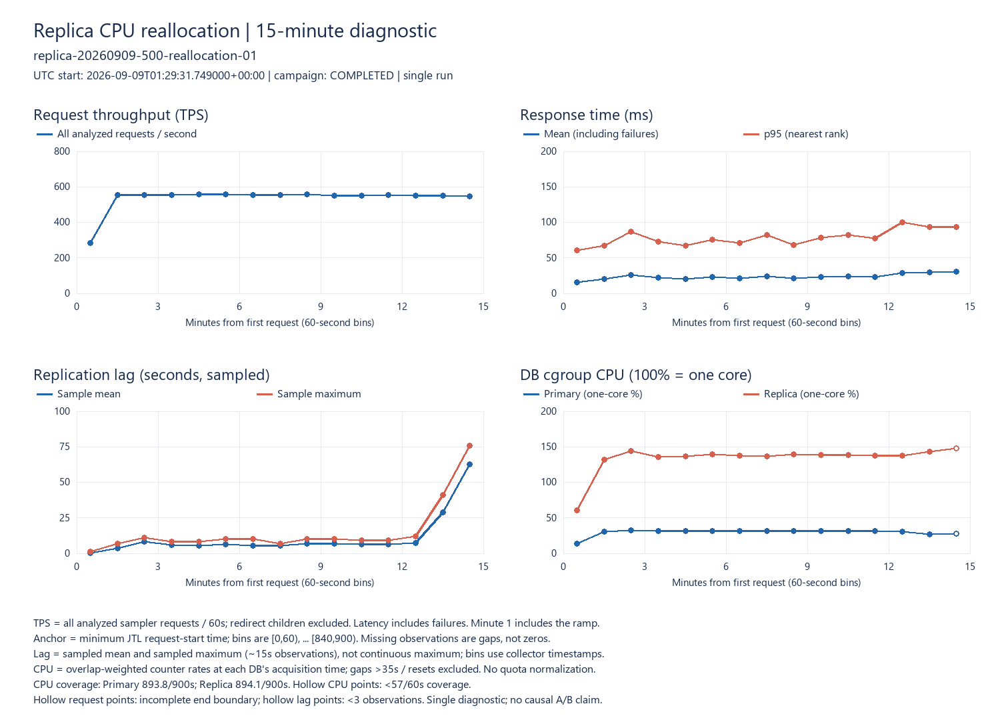
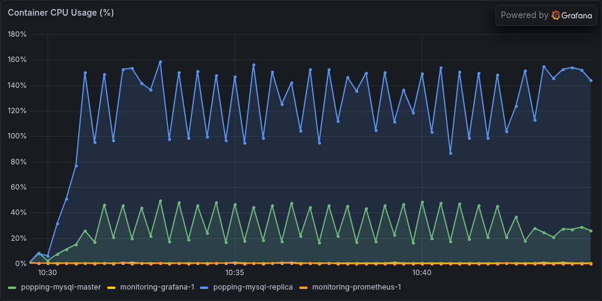
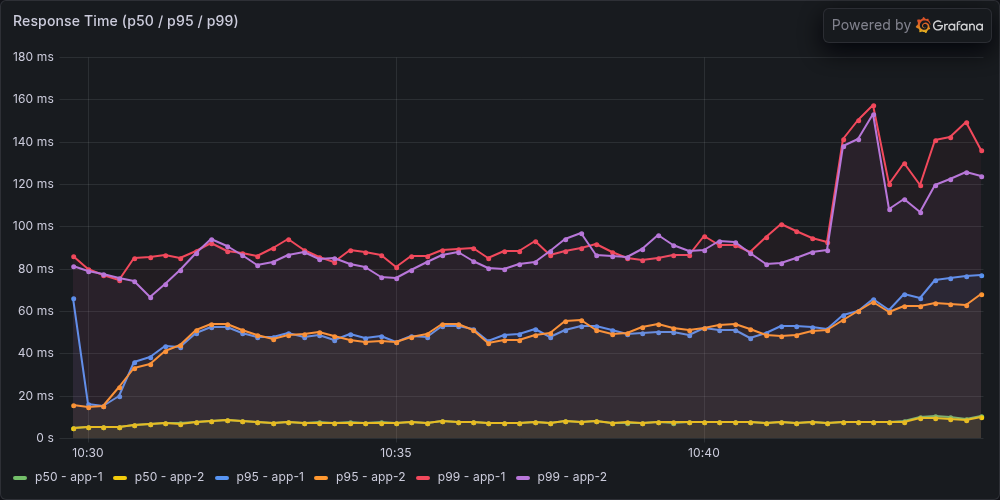
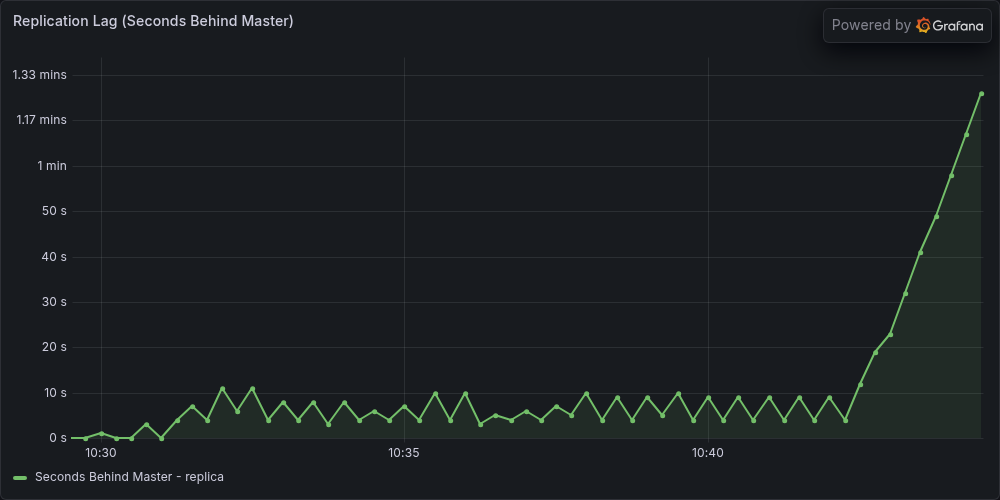

# 500 VUser·DB CPU 0.5/1.5 재배분 진단

**500 VUser에서 Primary 0.5 CPU / Replica 1.5 CPU로 재배분해도 복제 지연 누적을 해결하지 못했다.** 마지막 120초 처리량은 548.842 TPS, 평균 응답시간은 29.712ms였지만, 마지막 5분 복제 지연은 4~76초로 증가해 사전 안정 기준을 통과하지 못했다. Replica는 tail의 실제 CPU 관측 구간에서 1.5 CPU 한도의 약 98.16%를 사용했다.

캠페인 `replica-20260909-500-reallocation-01`은 **2026-09-09 10:13:25~10:47:36 KST**, 종료 코드 0으로 완료했다. 10:49 KST 별도 최종 복구 검증도 통과했다. 별도 하네스 `.tmp/replica-500-reallocation/`를 사용했고 이전 캠페인과 사용자 소스는 보존했다. 진행 중인 실험은 없다.

워밍업 600초는 오류 0·JIT 통과·TPS STEADY로 완료했다. 이후 GTID 확인 단계 1.08초, 유휴 안정화 152.87초를 거쳐 본 측정에 들어갔다. 1.08초는 워밍업 마지막 요청부터의 전체 회복 시간이 아니라 하네스의 GTID 확인 단계 시간이다.

## 결과

본 측정은 첫 요청 기준 **10:29:31~10:44:31 KST**, 900초다. 분석 대상 parent 요청은 481,789건, 제외한 redirect child는 4,436건이다. 요청 오류·invalid row·redirect child 오류 모두 0이며, coverage·JIT·TPS STEADY를 통과했다. JIT tail 증가율은 App1 1.405%, App2 0.286%다.

| 지표 | 결과 | 집계 범위 |
|---|---:|---|
| TPS | 548.842 | 마지막120초 |
| 평균 / p95 / p99 | 29.712 / 93 / 165 ms | 마지막120초 |
| 복제 lag 최소~최대 | 0~76초 | 본 측정 전체의 관측 표본 |
| 복제 lag 최소~최대 / p95 / 종료 | 4~76 / 67 / 76초 | 마지막5분 |
| lag 회귀 기울기 | +13.541초/분 | 마지막5분 |
| 첫·끝1분 lag 평균차 | +56초 | 마지막5분 내부 |
| 복제 판정 | **UNSTABLE** | 기존 다섯 lag 기준 모두 미통과 |
| 부하 종료 후 GTID 확인 단계 | 137.74초 | 하네스 catch-up 단계 |

GTID 시간은 마지막 요청 종료부터의 전체 회복 시간이 아니다. 요청 기록·분석·스냅샷 처리 후 시작한 확인 단계이며 약15초 간격으로 검사한다. TPS STEADY는 응답시간이나 복제 안정성의 보장이 아니다.

[Standalone SVG](../images/readme/replica-500-reallocation/replica-20260909-500-reallocation-01-timeline.svg). 그림의 lag는 각1분의 관측 평균·최댓값이며 연속적인 최대 지연이 아니다. 첫1분은 ramp 구간이다. CPU는 구간 경계에 걸친 counter delta를 겹치는 시간으로 가중한 값이며 빈 원은 해당 분의 관측 coverage 부족을 뜻한다.

### 실제 Grafana 캡처

아래 세 이미지는 실험 당시 Prometheus에 수집된 원래 시계열을 **2026-09-09 10:29:31~10:44:31 KST**의 고정 범위로 조회하고 Grafana renderer로 캡처했다. 500 VUser·Primary 0.5 CPU / Replica 1.5 CPU 조건이며, 기존 블로그와 같은 다크 테마의 1000×500 단일 패널로 맞췄다. 추가 부하 테스트는 수행하지 않았다.

CPU 패널은 docker-stats 표본이며 100%는 1코어다. 아래 표의 직접 cgroup tail 차분 집계와 범위·수집 방식이 다르다.

HTTP 패널은 App1·App2 각각의 Spring 서버 히스토그램에 1분 rate를 적용해 구한 p50·p95·p99 추정값이다. 원래 패널의 쿼리를 그대로 사용해 URI별 제외 조건은 없다. 위 JMeter 표는 클라이언트 parent 요청의 마지막 120초 집계이므로 측정 경계와 계산 방식이 다르다.

Lag 패널은 exporter가 수집한 복제 지연 표본이다. 아래 CPU·worker 표와 마찬가지로 각 표의 관측 구간을 기준으로 읽으며, 패널의 전체 900초 표시와 마지막 5분의 안정 판정을 구분한다.

### CPU와 요청 구성

| Tail 자원 | Primary | Replica |
|---|---:|---:|
| CPU 한도 | 0.5 | 1.5 |
| CPU 평균, 100%=1코어 | 27.09% | 147.24% |
| CPU 한도 대비 평균 | 54.18% | 98.16% |
| throttling 발생 period 비율 | 5.42% | 87.35% |
| 실제 counter 관측 시간 | 105.105초 | 105.156초 |

위 표는 요청 tail `[780,900)` 안의 완전한 관측 간격만 사용했다. 실제 상대 시각은 Primary 788.730~893.836초, Replica 788.925~894.081초다. 따라서 120초 전체의 직접 관측값으로 부르지 않는다. 그림의 경계 가중 평균과 계산 범위가 다르다. Throttling period 비율은 요청 지연 비율이나 CPU 손실 시간 비율이 아니다.

| HTTP 라벨 그룹 | 전체900초 요청/s | 마지막120초 요청/s | Tail 평균 / p95 |
|---|---:|---:|---:|
| GET | 493.614 | 507.550 | 26.152 / 82 ms |
| 게시글·댓글·좋아요 변경 POST | 41.534 | 41.292 | 73.465 / 178 ms |
| 로그인 POST | 0.172 | 0 | tail 표본 없음 |

모든 그룹은 요청 시작 시각으로 묶은 완료된 parent sampler 결과다. HTTP 라벨 분류이며 DB SELECT·쓰기·커밋 건수와 같지 않다. GET도 조회수 변경 등을 유발할 수 있다. 완료 요청 수가 고정되는 실험이 아니므로, 500 VUser를 과거보다 일정한 쓰기 유입량이라고 가정하지 않는다. 이번에는 변경 POST가 tail에도 약41.3건/s 기록됐고 복제 지연은 계속 증가했다.

### 복제 worker와 로그 대기

마지막5분의20표본에서 실제 첫~끝 관측 간격은 **284.251초**다. Worker와 coordinator의 스레드 ID가 유지됐고 counter reset·표본 공백은 없었다. 원본에서 독립 재계산한 값도 일치했다.

| 계측 항목 | Worker1 | Worker2 | Coordinator |
|---|---:|---:|---:|
| 선행 커밋 차례 대기 | 0.744초 | 2.055초 | 0 |
| handler commit 상태 | 226.611초 | 208.028초 | 8.831초 |
| 의존 트랜잭션 완료 대기 | 0 | 0 | 113.207초 |
| Binlog group commit ticket 대기 | 0 | 0 | 0 |
| Binlog file wait | 110.019초 | 84.028초 | 수집 대상 아님 |
| InnoDB data file wait | 9.201초 | 6.875초 | 수집 대상 아님 |

보존된 Replica 전체 file 이벤트 표본에서 binlog sync는 822개, 평균11.165ms/p95 42.654ms였다. Binlog write는832개, 평균0.158ms였다. Redo sync는1,475개, 평균5.366ms/p95 16.331ms였다. 순환 버퍼 표본이므로 전수 또는 불편 추정 분포로 취급하지 않는다.

같은284.251초 공유 가상 장치 `sde`의 busy는91.88%, 평균 queue depth7.067, read/write await2.566/3.056ms, flush await2.023ms였다. 양 DB와 다른 작업을 포함한 가상 장치 관측이며 물리 SSD의 단독 병목을 입증하지 않는다.

**이번에 확인한 것은 Replica의 CPU quota 제약과 상당한 커밋·로그 대기가 함께 존재한다는 점이다.** 명시적인 선행 커밋 차례 대기는 상대적으로 작았지만 이 값만으로 commit-order나 group commit의 모든 영향을 배제하지 않는다. Worker를 더 늘리거나 내구성을 낮추면 해결된다는 인과 결론도 내리지 않는다.

## 복구·검증

- 원래22개 컨테이너의 ID·실행 상태·CPU·메모리·restart policy 일치. Primary/Replica 각각1 CPU/1 GiB 복구. 임시 컨테이너 및 owner label 잔존 없음.
- stage4개와 consumer4개 원래 NO 상태로 복구. worker2·preserve ON·내구성1/1 유지.
- 원래 앱8081/8082 health UP, 복제 ON/오류0·GTID 포함 검사 통과.
- 양 DB row count 일치: post1,265,181 / comment5,264,372 / likes7,354,622. 전체 내용 checksum이나 측정 중 read-your-writes 검증은 아니다.
- 본 측정 내부 표본의 최소 물리 여유2.838 GiB, 커밋 여유4.775 GiB. 연속적인 최솟값을 뜻하지 않는다.
- 입력27개 hash 불변, 이전 하네스25개 파일 hash 보존. 실패·복구 관련 테스트8개, 별도 HTTP/CPU 요약기의 합성 데이터 테스트5개 통과. JTL 전체·tail·그림 집계 교차 확인 및 lag/stage/file counter 독립 재계산 일치.

원본은 하네스의 `campaigns/replica-20260909-500-reallocation-01/` 및 `runs/replica-20260909-500-reallocation-01-100-*`다. `final-verification.json`, `input-integrity-audit.json`, `commit-analysis.json`, `sync-analysis.json`을 보존했다. 별도 요약과 독립 감사는 `.tmp/replica-500-analysis/reports/`에 있다.

## 이번 분석의 결론과 포트폴리오 범위

총 DB CPU 한도2를 유지한0.5/1.5 재배분은 500 VUser의 복제 안정성을 확보하지 못했다. 이 조건에 대한 진단은 완료했으며, 500명 병목 해결을 완료했다고 쓰지는 않는다. Replica 일반이 효과 없다는 결론도 아니다.

현재 연결된 저장장치는 하나여서 물리 저장소 분리 비교를 수행할 조건이 없다. CPU quota와 저장소·커밋 경로의 독립 효과를 더 구분하려면 별도 조건의 인과 비교가 필요하다. 이번에는 worker·내구성·저장 경로를 추가 변경하지 않았다. [저장소 분리 가능성 조사](replica-storage-feasibility-20260909.md).

포트폴리오에는 App 수평 확장 후 DB로 이동한 병목, 읽기 라우팅으로 줄어든 Primary 부담, Replica 읽기·복제 적용의 자원 경합, 처리량과 최신성을 별도로 평가한 과정을 적을 수 있다. [JVM 워밍업·Replica 분석을 연결한 초안](../portfolio/popping-jvm-replica-story-20260909.md).

## 보존한 사전 계획

| 항목 | 조건 |
|---|---|
| 구성 | B 단회: App 2대, 읽기 Replica / 쓰기 Primary |
| App | 각 2 CPU / 2 GiB, 고정 이미지, 실제 JVM 최대 힙 240 MiB |
| 세션·연결 풀 | Redis 세션 OFF, JSESSIONID·SERVERID 앱 sticky, 앱별 write/read pool 20/30 |
| Sticky Primary | ON, 3초. 기능 ON/OFF 효과나 측정 중 read-your-writes를 검증한 실험은 아님 |
| DB | Primary 0.5 CPU / Replica 1.5 CPU, 각 1 GiB, 총 CPU 한도 2 |
| 부하 | 500 VUser, 그룹별 300/150/5/5/40, 기존 타이머·fixture·요청 구성 |
| 워밍업 | 600초 1회, JIT 판정 실패 시 중단·복구, 자동 재시도 없음 |
| 본 측정 | GTID catch-up 및 유휴 안정화 후 900초 1회 |
| 복제 | worker 2, preserve_commit_order ON, log_bin/log_replica_updates ON |
| 내구성 | sync_binlog=1, innodb_flush_log_at_trx_commit=1 유지 |
| 계측 | cgroup CPU·throttling, 요청 라벨별 완료량, lag, worker/coordinator stage, 로그 파일 이벤트, 공유 diskstats |
| 데이터 | 쓰기 누적, 초기화·삭제 없음 |
| 복구 | 임시 컨테이너 제거 → DB CPU 원복 → 계측 원복 → 원래 서비스 복구 → 직접 검증 |

사전 확인에서 기존 소스와 고정 이미지의 일치, fixture/JMX hash, DB 원래 각 1 CPU/1 GiB, 복제 ON·오류0·GTID catch-up을 확인했다. 워밍업/본 측정 JMX의 500개 스레드·60초 ramp·600/900초 duration을 확인했다. 현재 IntelliJ와 다른 부하 프로세스는 관측되지 않았다. 시작 준비 시 물리 여유 약 7.41 GiB, 커밋 여유 약 7.24 GiB이며 실행 중 물리 1 GiB/커밋 2 GiB 중단 기준을 유지한다.

계측 부분 실패와 워밍업 JIT 실패 시 복구를 포함하는 기존 단위 테스트 8개가 새 하네스에서 통과했다. 별도 읽기 전용 readiness는 `readiness/20260909T005345405964Z/`에 보존했다.

## 판정과 종료 조건

응답 성능은 본 측정 마지막 120초 `[780,900)`, 복제 안정 판정은 마지막 5분 `[600,900)`을 사용한다. 요청 오류·관측 coverage·JIT·TPS STEADY와 복제 판정을 분리해 보고한다.

복제 기준은 기존과 같다: lag p95≤2초, 최대≤5초, 종료≤2초, 기울기 절댓값≤0.2초/분, 첫·끝 1분 평균차 절댓값≤1초. 최소18표본, 표본 간격·경계 coverage, 복제 스레드 health가 필요하다. 이는 진단 기준이며 제품 freshness SLO나 read-your-writes 보장이 아니다.

- 유효한 UNSTABLE이면 현재 재배분으로 500 VUser의 복제 안정성을 확보하지 못했다고 결론 낸다. 이를 이유로 worker·내구성 변경이나 무제한 반복을 이어가지 않는다.
- 유효한 STABLE이면 단회 통과로 기록한다. 재현된 해결책으로 주장하려면 확인 실행이 필요하다.
- JIT·환경·계측이 실패하면 구성 자체의 실패와 구분한다.

500 VUser는 완료 요청 수를 고정하지 않는다. Primary를 줄여 쓰기 처리량이 떨어지면 lag만 줄 수 있으므로, 전체 TPS·응답시간과 읽기/쓰기 라벨별 완료량을 함께 확인한다. 과거 1/1 CPU 결과 및 400 VUser와는 조건이 달라 재배분의 개선율을 계산하지 않는다.

## 해석 범위

Stage와 내부 file wait는 중첩된다. Handler commit 상태를 순수 fsync 시간으로 간주하지 않는다. 공유 가상 장치의 busy/queue가 물리 SSD 포화나 단독 원인을 입증하지 않는다. 순환 이벤트 버퍼는 전체 이벤트의 불완전한 표본이다.

이전 [500 VUser 안정화 진단](replica-stabilized-20260908.md)의 A/B는 양쪽 모두 Primary·Replica 2대를 두고 복제를 켠 상태에서 읽기 경로를 비교한 진단이다. A의 앱 read/write는 모두 Primary로, B의 read pool은 Replica로 연결했다. DB 1대에서 2대로 늘린 Replica 도입 효과를 다시 검증한 비교는 아니다.

이 안정화 진단과 [400 VUser 커밋 계측](replica-commit-probe-20260909.md)은 역사적 비교 자료다. 동일 시점·동일 계측의 대조군이 아니므로 이번 결과와 바로 나눈 개선율을 재배분의 인과 효과로 제시하지 않는다.
