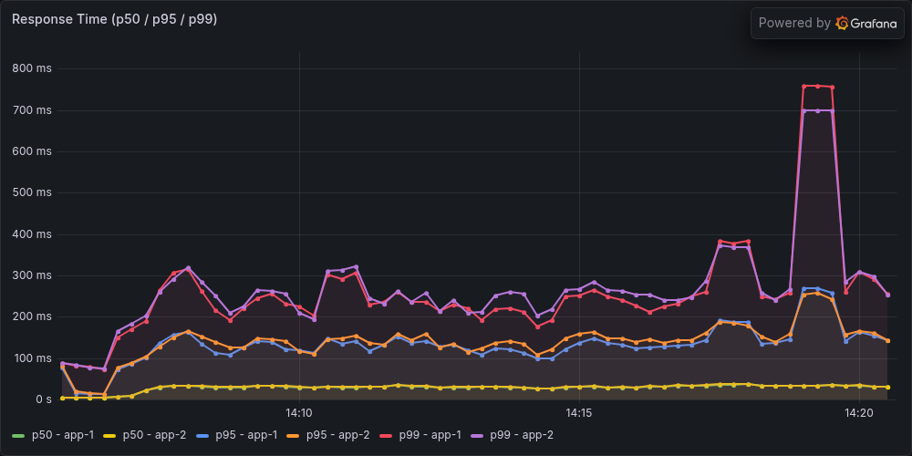
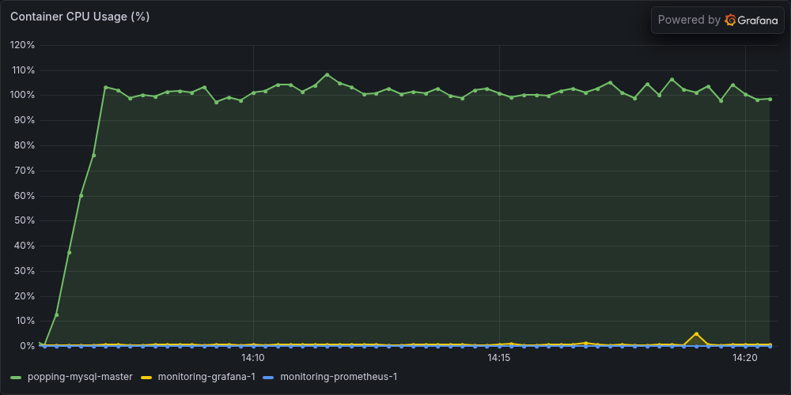
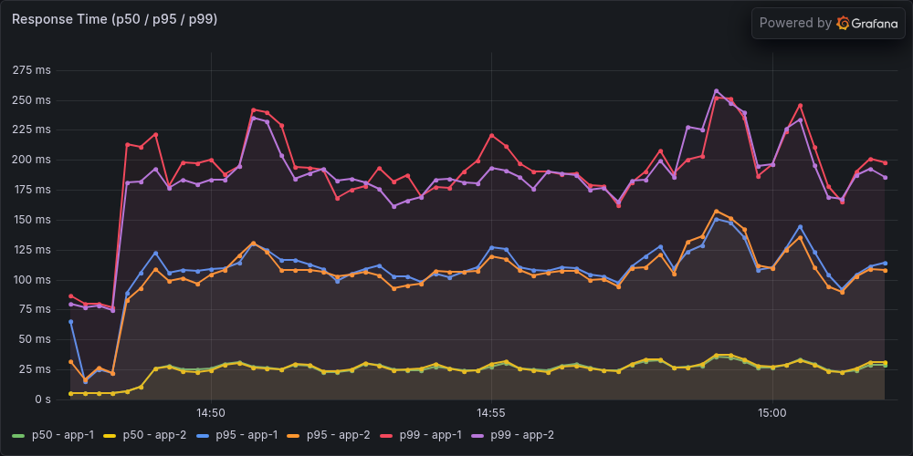
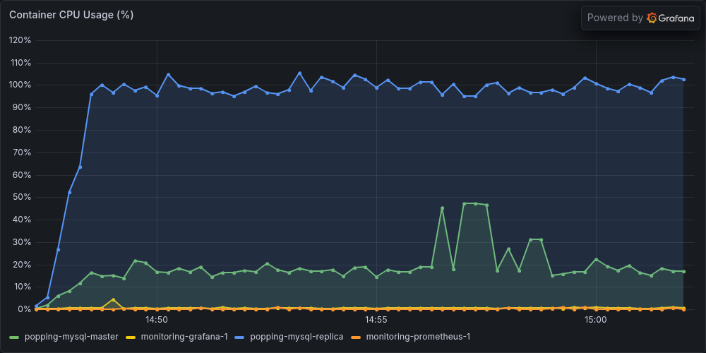
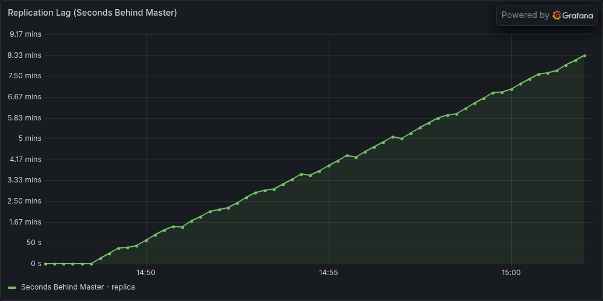

# Replica 도입 재검증 — 단일 DB와 2대 구성의 부분 결과

> 최종 정리(2026-09-10): 댓글 데드락 수정 후 500 VUser를 재검증했고 A·B 각 2회가 유효했다. 5A 본 측정은 실행 중단으로 제외했으며 6B는 미실행이다. B 종료 lag 460·466초로 안정성 미달, 확정 개선율 없음. 복구·독립 검산을 마쳤고 사용자 결정으로 추가 실험 없이 종료한다. [최종 결과와 실제 Grafana 캡처](replica-adoption-fixed-20260910.md). 아래는 해당 시점의 계획·이력이다.

> 후속 확인(2026-09-09 17시대): Primary에 보존된 InnoDB 기록에서 실패 요청과 같은 시각·같은 게시글의 S→X 잠금 변환 데드락을 확인했다. 별도 MySQL에서 기존 순서를 재현하고 댓글 작성의 부모 잠금을 먼저 얻도록 수정했으며, 전체 테스트 169개가 통과했다. 아래는 당시 캠페인 기록이며 원래 앱 stack trace는 여전히 없다. [후속 원인 분석과 수정 검증](comment-deadlock-20260909.md). 기존 A/B 결과와 미완료 판정은 유지한다.

**500 VUser에서 단일 Primary와 Replica 추가 구성을 비교했지만, 5A 워밍업에서 HTTP 500이 발생해 사전 기준대로 중단했다.** 유효 본 측정은 A·B 각 2회로, 계획한 각 3회에 미달했다. 완료한 네 실행을 보존하며 확정적인 도입 개선율은 제시하지 않는다. B의 종료 lag는 각각 505초·529초였다.

캠페인 `replica-20260909-adoption-01`은 campaign 기록 기준 **2026-09-09 13:47:45.632 KST**에 시작했고, **16:50:56 KST에 원복 검증을 마쳤다.** 최종 상태는 `FAILED`, `comparison_eligible=false`다. 네 본 측정의 독립 재계산은 일치했으며, 이는 비교 실험 전체의 성공을 뜻하지 않는다.

## 조건과 완료 범위

| 항목 | A: 단일 DB | B: Replica 추가 |
|---|---|---|
| DB 구성 | Primary 1 CPU / 1 GiB, Replica 컨테이너 중지 | Primary·Replica 각 1 CPU / 1 GiB |
| DB 총자원 | 1 CPU / 1 GiB | 2 CPU / 2 GiB |
| 앱 읽기·쓰기 | read/write 풀 모두 Primary | read pool은 Replica, write pool은 Primary |
| 복제 lag | **N/A**, Replica 미실행 | exporter 표본과 복제 health로 평가 |
| 유효 본 측정 | 1A·4A, 2회 | 2B·3B, 2회 |

공통 조건은 앱 2대 각 2 CPU / 2 GiB, 실제 최대 힙 240 MiB, HAProxy, 앱별 write/read pool 20/30, 500 VUser(300/150/5/5/40)·ramp 60초다. Sticky Primary는 ON·3초, Redis 세션은 OFF다. `JSESSIONID`·`SERVERID`의 앱 인스턴스 sticky와 DB 읽기 대상을 정하는 Sticky Primary는 다르다.

계획은 **ABBAAB**, 슬롯별 600초 워밍업 1회·안정화·900초 본 측정 1회, 자동 재시도 0회였다. Replica worker 2개·커밋 순서 유지, `sync_binlog=1`, `innodb_flush_log_at_trx_commit=1`을 유지했다. 슬롯 사이에는 앱을 제거하고 복제를 따라잡게 했으며 데이터는 초기화하지 않고 누적했다.

이번에는 **DB 1대에서 Replica를 추가하는 전체 구성 변화**를 비교했다. B에 DB CPU·메모리, 복제 작업, 읽기 라우팅이 함께 추가되므로 같은 총자원에서의 효율 비교가 아니다. [9월 8일 A/B](replica-stabilized-20260908.md)는 양쪽 모두 DB 2대·복제 ON인 읽기 경로 진단으로, 이번 실험과 다르다.

## 완료한 네 본 측정

HTTP 성능은 각 900초의 마지막 120초 `[780,900)`다. JMeter parent 요청을 집계하고 redirect child는 제외했다. p95·p99는 nearest-rank다. 네 본 측정은 각각 전체 오류 0, coverage·JIT·TPS STEADY를 통과했다.

| 슬롯 | 측정 시간, KST | 전체 parent | Tail TPS | Tail 평균 | p95 / p99 |
|---|---|---:|---:|---:|---:|
| 1A | 14:05:39.599~14:20:39.599 | 465,805 | 527.375 | 66.005ms | 198 / 485ms |
| 2B | 14:47:14.075~15:02:14.075 | 469,038 | 539.083 | 48.786ms | 132 / 221ms |
| 3B | 15:30:04.936~15:45:04.936 | 465,149 | 527.525 | 64.116ms | 183 / 293ms |
| 4A | 16:10:31.934~16:25:31.934 | 469,301 | 529.425 | 57.276ms | 169 / 281ms |

A TPS는 527.375~529.425, B는 527.525~539.083 범위다. 각 2회만 완료했고 B 내부 응답시간 변동도 남아 있다. 각 3회 기준을 채우지 못했으므로 부분 결과로 최종 개선율을 확정하지 않는다.

### 읽기·쓰기 요청량

| 슬롯 | Tail GET/s | Tail 변경 POST/s | 변경 POST 평균 / p95 |
|---|---:|---:|---:|
| 1A | 488.200 | 39.175 | 136.979 / 401ms |
| 2B | 495.417 | 43.667 | 29.106 / 103ms |
| 3B | 484.475 | 43.050 | 32.257 / 117ms |
| 4A | 489.558 | 39.867 | 117.291 / 313ms |

로그인 POST는 tail에 없었다. 변경 POST는 게시글·댓글·좋아요 HTTP 라벨 분류로, DB 쓰기·커밋 건수와 같지 않다. GET도 조회수 변경을 유발할 수 있다. 같은 500 VUser라도 요청·쓰기 도착률은 고정되지 않는다. 라벨별 count·TPS·평균·p95·p99는 독립 감사 JSON에 보존했다.

### DB 자원과 SELECT

| 슬롯·DB | CPU, 100%=1코어 | Throttled period | read / write MiB/s | CPU·IO 관측 간격 | SELECT/s |
|---|---:|---:|---:|---:|---:|
| 1A Primary | 99.63% | 98.57% | 3.497 / 7.357 | 104.723초 | 995.984 |
| 2B Primary | 29.03% | 0.09% | 0.021 / 12.719 | 105.832초 | 59.344 |
| 2B Replica | 100.01% | 99.81% | 3.461 / 5.213 | 105.671초 | 966.555 |
| 3B Primary | 28.42% | 0% | 0.009 / 11.767 | 105.027초 | 59.445 |
| 3B Replica | 99.96% | 99.81% | 3.347 / 4.065 | 105.175초 | 957.764 |
| 4A Primary | 100.04% | 99.62% | 3.761 / 9.706 | 105.603초 | 1004.930 |

CPU·IO는 tail 안에 양 끝점이 모두 포함된 cgroup 누적 counter 차분을 실제 관측 간격으로 나눈 값이다. 120초 전체를 직접 관측한 평균이 아니며, throttled period 비율은 요청 지연 비율이 아니다. 짧은 관측 구간의 CPU 평균이 100%를 약간 넘은 것을 지속적인 한도 초과 능력으로 해석하지 않는다.

SELECT/s는 `mysql_global_status_commands_total{command="select"}` 차분이다. Prometheus instant-vector 시각 기준의 실제 104.886~105.875초를 사용했다. cgroup과 관측 시각이 다르며 HTTP GET 수와도 다르다. 해당 counter reset·coverage 검사는 모두 통과했다.

### 복제 지연

| 슬롯 | 전체 900초 lag | Tail lag | 마지막 5분 min~max / p95 / 종료 | 기울기 | 판정 |
|---|---:|---:|---:|---:|---|
| 1A·4A | N/A | N/A | N/A | N/A | Replica 중지 |
| 2B | 0~505초 | 443~505초 | 326~505 / 500 / 505초 | +37.644초/분 | UNSTABLE |
| 3B | 0~529초 | 461~529초 | 356~529 / 521 / 529초 | +37.464초/분 | UNSTABLE |

전체 범위는 각 60개, tail은 8개, 마지막 5분은 20개 관측 표본이다. 연속적인 최댓값을 의미하지 않는다. 마지막 5분의 p95≤2초·최대≤5초·종료≤2초·기울기 절댓값≤0.2초/분·첫끝 1분 평균차 절댓값≤1초 기준을 B 두 실행 모두 통과하지 못했다. A는 Replica가 없으므로 lag를 0으로 기록하지 않았다. A의 Replica cgroup·Prometheus 표본 부재도 독립 확인했다.

## 기존 Grafana 단일 패널 캡처

기존 대시보드와 실험 당시 Prometheus 시계열을 사용한 다크 테마 1000×500 단일 패널이다. A는 **1A**, B는 **2B**로, 각 조건의 완료한 두 실행 중 tail TPS 중앙값과 거리가 가장 가까운 실행을 선택했다. 동률이면 파일명 순서다. **각 2회 부분 결과의 대표 화면**이며 각 3회 비교를 완료했다는 뜻은 아니다.

### A: 1A, 단일 Primary

**2026-09-09 14:05:39.599~14:20:39.599 KST**, 500 VUser, Primary 1 CPU / 1 GiB, Replica 중지.

A의 lag는 N/A이므로 lag 캡처를 만들지 않았다.

### B: 2B, Primary·Replica

**2026-09-09 14:47:14.075~15:02:14.075 KST**, 500 VUser, Primary·Replica 각 1 CPU / 1 GiB.

HTTP 패널은 서버 히스토그램에 1분 rate를 적용한 App별 p50·p95·p99 추정값이다. 기존 쿼리에는 actuator 요청이 포함될 수 있어 클라이언트 JMeter parent의 tail 집계와 관측 대상·계산 방식이 다르다. A/B 응답시간 패널의 세로축 범위도 서로 다르므로 선의 높이만으로 크기를 비교하지 않는다.

CPU 패널은 docker-stats 시계열이며 위 cgroup 차분 표와 다르다. 기존 컨테이너 필터를 유지했으므로 임시 측정 앱의 CPU 시계열은 이 패널에 표시되지 않는다. B의 lag 패널에서 **약 8.42분은 505초**에 해당한다. 캡처 manifest에 원래 dashboard UID·panel ID·시간 범위·파일 hash를 보존했다.

## 중단 사유와 다음 작업

5A 워밍업 parent 296,866건 중 1건이 HTTP 500이었다. 라벨은 `POST /boards/slug/postId/comments/member (Hot)`, 요청 시작은 **16:38:26.901 KST**(`1788939506901`), 경과시간은 782ms다. 사전 오류 중단 기준에 따라 **5A 본 측정과 6B는 실행하지 않았다.** 성공 실행을 더 채우는 재시도도 하지 않았다.

JTL에 응답 본문이 없고, 하네스가 실험 앱 stdout을 저장하기 전에 컨테이너를 제거해 서버 stack trace도 남아 있지 않다. 현재 증거로 예외 종류나 원인을 확정할 수 없다. DB deadlock·행 잠금 같은 원인도 이 HTTP 500 한 건에 곧바로 연결하지 않는다.

다음 작업은 오류 발생 시 응답·앱 로그를 보존하도록 관측 절차를 보완하고 원인을 확인하는 것이다. 이 보고서 작성에서는 기존 코드·동결 하네스를 수정하지 않았고 새 부하도 실행하지 않았다. 추가 부하 측정은 별도 요청 이후에 진행한다.

## 원복과 증거

- 16:50:56 KST 검증 통과: 원래 25개 컨테이너 상태·자원 일치, 복구 차이·오류 없음. 앱 2대 health UP, 복제 ON·오류 0·GTID catch-up 확인.
- 양 DB 행 수 일치: post 1,279,586 / comment 5,278,751 / likes 7,354,643. 전체 내용 checksum이나 부하 중 read-your-writes 검증은 아니다.
- 입력 불변. 원복 후 독립 감사에서 완료 슬롯 4개만 읽었고 source hash 13개 불변, 불일치 0건을 확인했다. 감사기 모의 테스트 13개 통과.
- 이어서 **17:00:58 KST에 별도 실제 상태 검증**을 완료했다. `passed=true`, `issues=[]`, 범위는 `restoration_and_integrity_only`다. 25개 컨테이너 inventory 일치, 임시 컨테이너 잔존 없음, 앱 health·복제 health·행 수 일치, 입력 20개와 복사 전 원본 하네스 16개의 hash 보존을 확인했다. 실패한 비교의 성능 유효성을 승인한 검증은 아니다. [독립 원복·무결성 검증 기록](../../.tmp/replica-adoption-output/verification/20260909T080058935643Z/verification.json).
- 캠페인: `.tmp/replica-adoption/campaigns/replica-20260909-adoption-01/campaign.json`
- 독립 감사: `.tmp/replica-adoption-analysis/reports/replica-20260909-adoption-01-independent-audit.json`
- 캡처 manifest: `.tmp/replica-adoption-output/captures/capture-manifest.json`

현재 결론은 **단일 DB 대비 Replica 추가 비교를 시도했으나 반복 기준을 채우기 전에 중단됐고, 완료한 B 두 실행에서는 CPU 포화와 lag 누적을 관측했다**는 것이다. [오전 CPU 0.5/1.5 재배분](replica-500-reallocation-20260909.md)과 조건·시점이 다르므로 수치를 합쳐 개선율을 계산하지 않는다.
