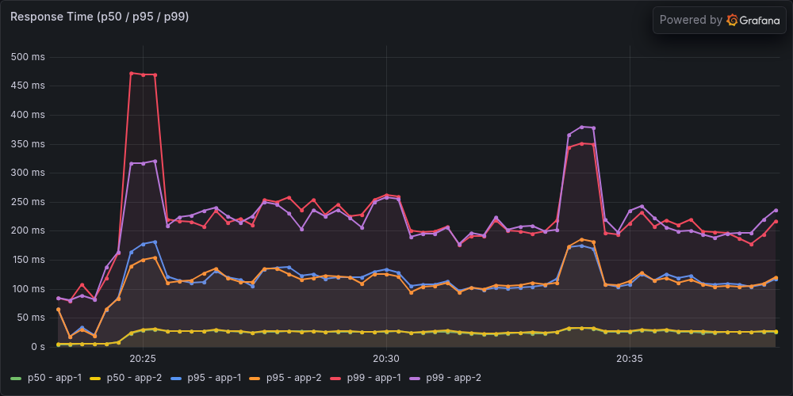
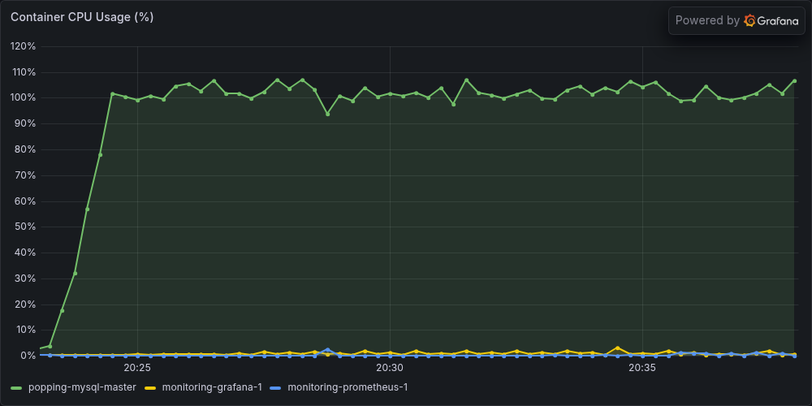
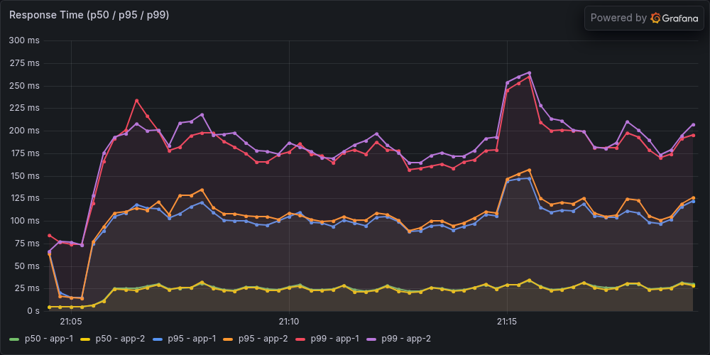
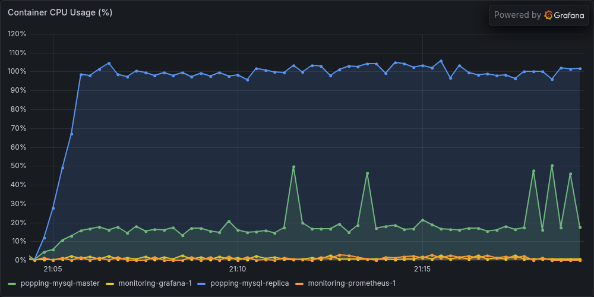
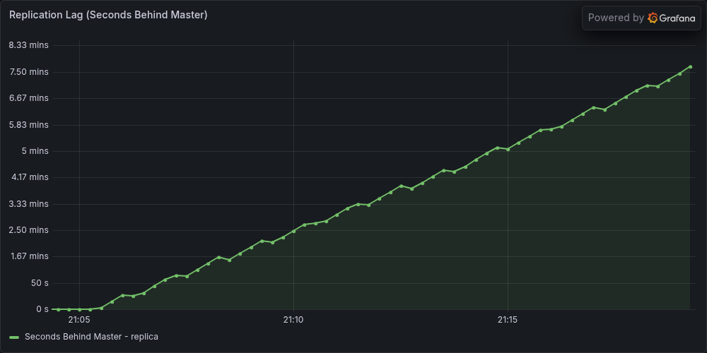

# 댓글 데드락 수정 후 Replica 재검증 — 부분 결과로 실험 종료

> 이후 기록: 9월 10일 낮에 같은 조건으로 새 캠페인을 실행했다. A·B 각 2회 뒤 5A 워밍업 JIT 기준 초과로 중단됐고, B 마지막 lag는 543·571초였다. [낮 재실험과 초기 원본 비교](replica-adoption-rerun-20260910.md). 아래는 전날 캠페인만의 종료 기록이다.

**500 VUser에서 읽기 분산은 작동했지만 Replica의 복제 안정성 기준은 통과하지 못했다.** 수정 후 유효 본 측정은 A·B 각 2회이고, B의 마지막 lag는 460초·466초였다. 각 3회라는 사전 반복 기준에 미달해 도입 개선율은 확정하지 않는다. 2026-09-10 사용자와 같은 조건의 추가 실험을 하지 않고 현재 증거를 정리해 마무리하기로 했다.

캠페인 `replica-20260909-adoption-fixed-01`은 9월 9일 20:04:00 KST에 시작했다. 9월 10일 01:11경 5A 본 측정 중 실행이 끊겼으며 구체적인 외부 중단 원인은 미확정이다. 이후 Docker 재시작이 관측됐다. 복구는 **2026-09-10 09:08:36 KST**에 검증을 마쳤다. 최종 캠페인 상태는 `FAILED`, `comparison_eligible=false`다. 복구 완료를 실험 성공으로 바꾸지 않았다.

## 비교 조건

| 항목 | A: 단일 DB | B: Replica 추가 |
|---|---|---|
| DB | Primary 1 CPU / 1 GiB, Replica OFF | Primary·Replica 각 1 CPU / 1 GiB |
| 총 DB 자원 | 1 CPU / 1 GiB | 2 CPU / 2 GiB |
| read/write 풀 | 모두 Primary | read는 Replica, write는 Primary; Sticky 적용 읽기는 Primary 가능 |
| 복제 지연 | N/A | 별도 안정성 판정 |
| 유효 측정 | 1A·4A, 2회 | 2B·3B, 2회 |

공통 조건은 App 2대 각 2 CPU / 2 GiB·실제 최대 힙 240 MiB, HAProxy, 앱별 Write 20 / Read 30, 500 VUser(300/150/5/5/40)·ramp 60초다. Sticky Primary ON 3초, Redis 세션 OFF, Replica worker 2개·commit order 유지, 내구성 `sync_binlog=1`·`innodb_flush_log_at_trx_commit=1`을 유지했다.

각 슬롯은 smoke → 워밍업 600초 1회 → GTID·유휴 안정화 → 본 측정 900초 1회다. 계획 ABBAAB 중 1A·2B·3B·4A만 완료했다. 5A는 불완전하므로 제외하고 6B는 실행하지 않았다. 데이터는 누적하며 초기화하지 않았다. 슬롯 사이 자정 예약 작업 회피 대기가 있었고 캐시·데이터·시간 순서의 영향은 남는다.

새 이미지는 `sha256:cb215e007e159b821a47a46d39214e721926288ed8828147444b08d2f8d769e9`, 소스 fingerprint 접두어는 `75ae84d62f47`이다. [사전 계획](replica-adoption-fixed-20260909-plan.md)과 [댓글 데드락 수정](comment-deadlock-20260909.md)을 참조한다. DB 자원·복제·라우팅이 함께 추가되는 구성 비교이며, 과거 라우팅 진단이나 수정 전 결과와 합쳐 반복수를 만들지 않는다.

## 완료한 네 본 측정

아래 값은 JMeter parent 요청의 마지막 120초 `[780,900)`이며 redirect child는 제외했다. p95·p99는 nearest-rank다. 네 실행의 전체 오류·invalid row는 모두 0이고 coverage·JIT·TPS STEADY를 통과했다. 원시 JTL·계측 파일을 독립 재계산해 저장된 값과 일치함을 확인했다. JIT 채택 판정은 실행 시 하네스 기록이며 독립 감사가 JVM을 재측정한 것은 아니다.

| 슬롯 | 측정 시간 KST, 900초 | 전체 parent | Tail TPS | 평균 ms | p95 / p99 ms |
|---|---|---:|---:|---:|---:|
| 1A | 09/09 20:23:04.730~09/09 20:38:04.730 | 469,782 | 536.075 | 47.552 | 132 / 235 |
| 2B | 09/09 21:04:22.149~09/09 21:19:22.149 | 469,614 | 535.575 | 46.851 | 126 / 208 |
| 3B | 09/09 21:46:37.175~09/09 22:01:37.175 | 467,871 | 534.800 | 52.456 | 152 / 249 |
| 4A | 09/10 00:17:05.790~09/10 00:32:05.790 | 470,197 | 538.558 | 49.074 | 143 / 249 |

A의 평균은 47.552~49.074ms, B는 46.851~52.456ms로 범위가 겹친다. TPS도 A 536.075~538.558, B 534.800~535.575 수준이다. 각 2회 부분 결과에 확정 개선율을 붙이지 않으며, 수정 전 캠페인과의 차이를 데드락 수정의 성능 효과로 단정하지 않는다.

### DB 자원과 읽기 이동

| 슬롯·DB | CPU, 100%=1코어 | Throttled period | 관측 간격 | SELECT/s |
|---|---:|---:|---:|---:|
| 1A Primary | 99.89% | 99.91% | 105.387초 | 1029.036 |
| 2B Primary | 27.34% | 0.00% | 104.700초 | 60.075 |
| 2B Replica | 100.07% | 99.81% | 104.391초 | 974.454 |
| 3B Primary | 27.17% | 0.00% | 104.521초 | 60.045 |
| 3B Replica | 100.02% | 100.00% | 104.581초 | 975.122 |
| 4A Primary | 99.93% | 99.33% | 104.897초 | 1022.778 |

CPU는 tail 내부에 양 끝점이 포함된 cgroup 누적 counter 차분을 실제 관측 간격으로 나눈 값이다. 120초 전체 평균이 아니며, 짧은 구간의 100% 소폭 초과는 지속적인 quota 초과 능력을 뜻하지 않는다. Throttled period는 요청 지연 비율이 아니다. SELECT는 Prometheus instant-vector 시각을 사용한 서버 counter 차분으로 HTTP GET 수와 다르다. 전체 IO·라벨별 HTTP·읽기/변경 POST 집계는 독립 감사 JSON에 보존했다.

읽기 이동으로 B의 Primary CPU는 약 27%로 줄었고 SELECT는 Replica로 이동했다. Replica는 약 100% CPU를 사용하며 변경 적용이 계속 밀렸다. 이번 결과는 CPU 한도와 lag 누적을 함께 관측한 근거다. 이전 worker·커밋·로그 계측과 함께 병목 가설을 세울 수 있지만, 이 실험만으로 CPU와 저장소 기여도를 인과적으로 분리하지는 못한다.

### 복제 안정성

| 슬롯 | 마지막 5분 min~max | p95 | 마지막 | 기울기 | 첫·끝 1분 평균차 | 판정 |
|---|---:|---:|---:|---:|---:|---|
| 2B | 296~460초 | 447초 | 460초 | +34.031초/분 | +135.75초 | UNSTABLE |
| 3B | 299~466초 | 460초 | 466초 | +35.047초/분 | +140.00초 | UNSTABLE |

각 B 전체 900초에는 60개 lag 표본이 있고 범위는 각각 0~460초, 0~466초다. 위 마지막 5분은 각 20표본이다. p95≤2초, 최대≤5초, 마지막≤2초, 기울기 절댓값≤0.2초/분, 첫·끝 1분 평균차 절댓값≤1초의 다섯 기준을 모두 통과하지 못했다. 이는 진단 기준이며 제품의 freshness SLO는 아니다. A는 Replica OFF이므로 lag 0초가 아닌 N/A다. HTTP 오류 0과 TPS STEADY를 복제 최신성 보장으로 해석하지 않는다.

## 실제 Grafana 캡처

기존 대시보드를 변경하지 않고 당시 Prometheus 시계열을 공식 renderer로 캡처했다. 다크 테마 1000×500 단일 패널이며, 각 구성의 완료된 두 실행에서 tail TPS 중앙값과 가장 가까운 실행을 고르고 동률이면 파일명 순서로 선택했다. 대표는 1A·2B다. A의 lag 그림은 만들지 않았다.

### 1A: 09/09 20:23:04.730~09/09 20:38:04.730 KST

### 2B: 09/09 21:04:22.149~09/09 21:19:22.149 KST

HTTP 패널은 앱별 서버 히스토그램의 1분 rate 백분위 추정이고 actuator 제외 조건이 없어 위 JMeter tail 표와 관측 대상·계산 범위가 다르다. 응답시간 축은 A 약 500ms, B 약 300ms로 다르다. CPU 패널은 docker-stats 표본이며 위 cgroup 차분과 수집 방식이 다르고 임시 측정 앱 CPU 시리즈는 포함되지 않는다. B lag 축은 분 단위로 표시되며 460초는 약 7.67분이다. 캡처의 시간 범위·원본 run hash·panel ID는 manifest에 보존했다.

## 중단·데드락 증거의 범위

5A 본 측정은 00:56:58 KST에 시작했고 JMeter 마지막 로그는 01:11:01경이다. 콘솔 마지막 집계는 13분 55초·436,283건·오류 0 이후 `errorlevel=1073807364`였으며 JTL 마지막 행은 잘려 있었다. 900초 완료·마지막 JIT·coverage 확인이 없으므로 5A를 성공으로 채택하지 않는다. 콘솔의 오류 0도 마지막 집계까지의 정보다. 구체적인 중단 트리거를 데드락·OOM·사용자 종료 등으로 확정하지 않는다.

완료된 **14개 pass**(1A~4A의 smoke·warmup·measure 12개, 5A smoke·warmup 2개)의 앱 로그 manifest와 실패 XML을 검증했다. 실패 XML 샘플은 0개이며 `deadlock`, `SQLState: 40001`, `SQL Error: 1213` 로그 검색 일치는 0건이다. 컨테이너 정리 직전 로그 snapshot 15개도 hash를 검증했다. 중단된 5A는 완결된 pass 로그·XML 검증 대상에서 제외하고 모든 원본 파일 hash를 보존했다.

이전 데드락의 재현과 수정 후 동시성·전체 **169개 테스트 통과**는 별도 근거다. 완료 구간에서 같은 오류가 관측되지 않은 사실은 기록하되 모든 데드락 해결로 일반화하지 않는다. Docker/DB 재시작이 있었으므로 현재 InnoDB 누적 counter를 어제 baseline에서 차감하지 않았다. 재시작 후 엔진 기록은 별도 snapshot으로만 보존하며 야간 전체 데드락 0건의 증거로 사용하지 않는다.

## 원복·무결성 확인

- 원래 전체 25개 컨테이너 ID·상태·CPU·메모리·이미지·restart policy 비교와 앱 8081/8082 health UP 확인을 통과했다. 남은 실험용 3개 컨테이너는 ID·소유 label 확인과 로그 저장 후 정리했다.
- 복제 ON·오류 0·GTID 포함 검사 통과. Primary/Replica 행 수는 post **1,296,100**, comment **5,295,237**, likes **7,354,653**으로 일치했다. 전체 checksum이나 부하 중 read-your-writes 검증은 아니다.
- 입력 29개와 기존 하네스 보존 검사를 통과했고, 5A 원본을 수정하지 않았다. 감사기 13개·원복 검증기 16개 테스트가 통과했다.
- 별도 실제 상태 검증 `passed=true`, `issues=[]`, 범위 `restoration_and_integrity_only`. 캡처 후 모니터링 3개를 원래 중지 상태로 복구했고 전체 inventory 차이는 없었다.
- 복구 전 campaign·summary·journal을 백업한 뒤 campaign을 FAILED, 5A를 INTERRUPTED/eligible=false로 표시했다. 이전 summary와 실행 원본은 그대로 보존했다. 새 부하·데이터 초기화·소스 변경·커밋·푸시는 수행하지 않았다.

## 마무리 판단

이번 실험은 현재 구성의 500명 복제 안정성 한계를 확인한 상태로 종료한다. 동일 조건 반복을 더 채우기보다 확보한 부분 결과와 실패 원본을 남긴다. 향후 정확한 개선율이 필요하면 새 캠페인으로 반복 기준을 충족해야 하며, 병목 원인을 더 좁히려면 내구성을 유지하면서 저장소·자원 등 가설에 대응하는 조건 하나를 바꾼 별도 비교가 필요하다. 자동 재실행 계획은 없다.

포트폴리오에는 **JVM 상태를 고려한 측정 절차, 댓글 잠금 변환 데드락 재현·수정, 처리량과 복제 최신성을 분리한 한계 평가**를 성과로 정리한다. 500명 병목 해결이나 Replica 성능 개선율은 확정 성과로 제시하지 않는다.

## 근거

- [독립 원시 결과 감사](../../.tmp/replica-adoption-fixed-analysis/reports/replica-20260909-adoption-fixed-01-independent-audit.json)
- [독립 원복 검증](../../.tmp/replica-adoption-fixed-output/verification/20260910T000955516542Z/verification.json)
- [완료 로그·중단 원본 감사](../../.tmp/replica-adoption-fixed-output/log-audit/20260910T001021453069Z/audit.json)
- [복구·백업 증거](../../.tmp/replica-adoption-fixed-output/recovery/20260910T000752272345Z/recovery.json)
- [Grafana 캡처 manifest](../../.tmp/replica-adoption-fixed-output/captures/capture-manifest.json)
- [수정 전 도입 비교](replica-adoption-20260909.md), [500명 CPU 재배분](replica-500-reallocation-20260909.md)
