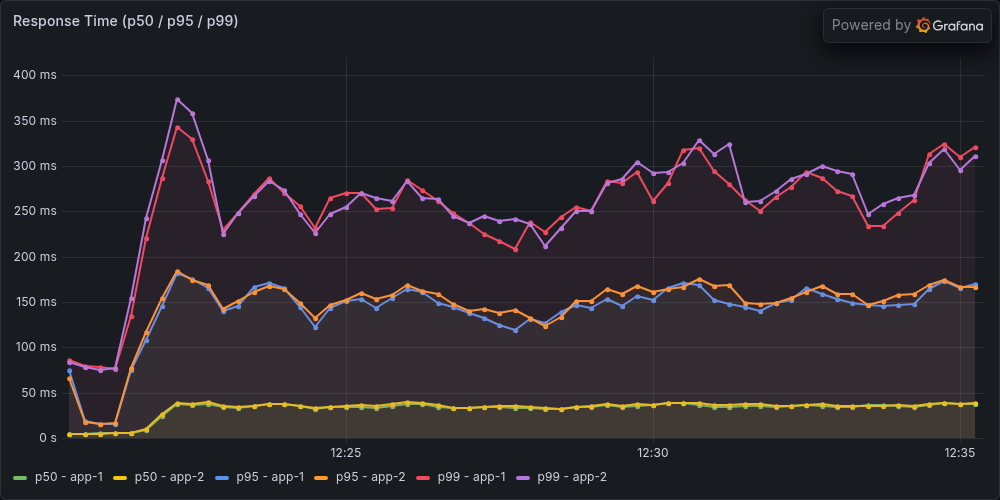
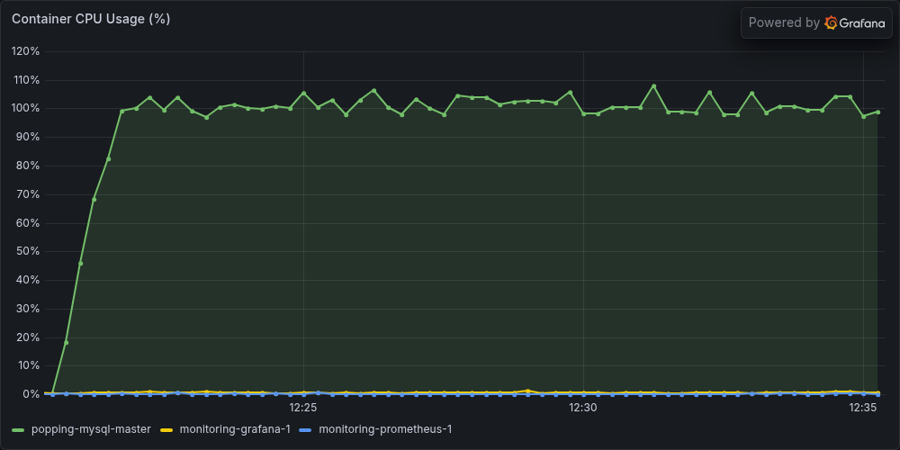
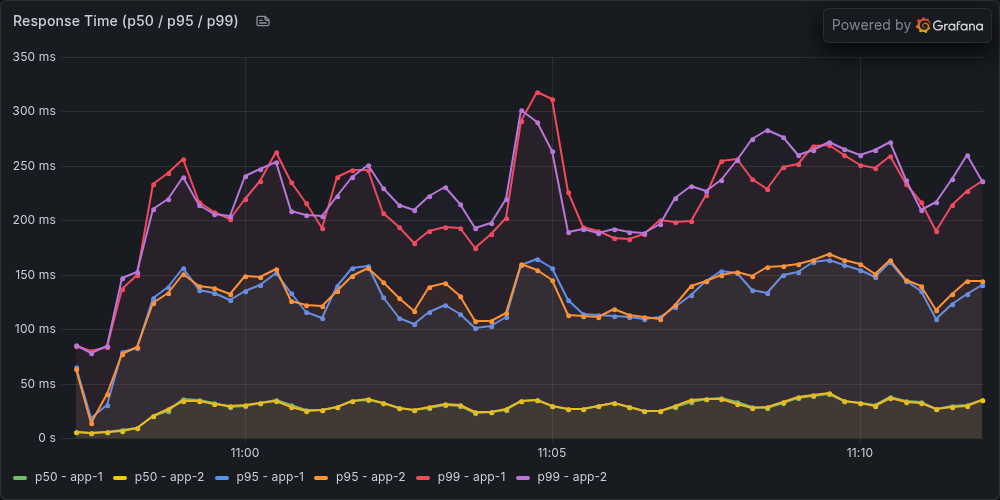
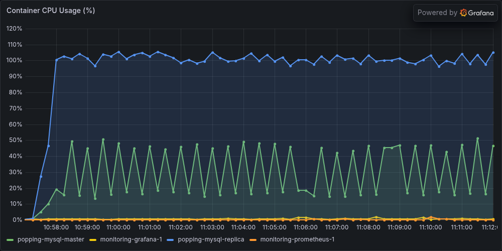
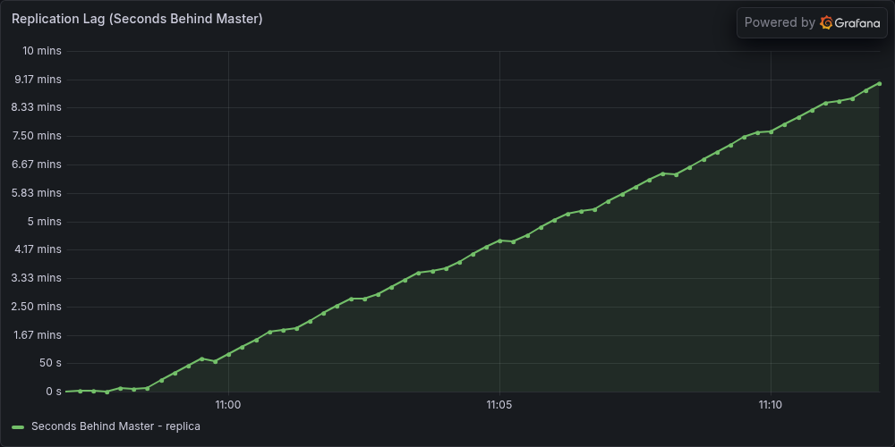

# Replica 도입 재실험 — 초기 기록과 현재 측정의 비교

> 최신 완료: 고정 20분 워밍업 캠페인에서 A·B 각 3회 유효 본측정과 원복을 완료했다. TPS 536.700→531.683/s, 평균 53.573→57.244ms이며 B 복제 지연은 모두 불안정했다. [최종 보고서](replica-warm20-20260910.md). 아래 내용은 당시 계획 또는 이전 결과로 보존한다.

**이번 부분 결과에서는 초기 기록의 평균 응답시간 42→11ms 개선이 재현되지 않았다.** 완료한 A·B 각 2회의 평균 응답시간 중앙값은 55.362→55.506ms, TPS 중앙값은 532.004→532.683이었다. B의 복제 지연은 두 번 모두 계속 증가해 마지막 관측값이 543초·571초였다.

다만 계획한 각 3회를 채우지 못했다. 다섯 번째 5A 워밍업의 JIT 증가율이 사전 기준 2%를 넘어서 캠페인은 `FAILED`로 종료됐다. 아래 중앙값은 부분 결과의 기술 통계이며, 확정 도입 개선율이나 통계적 동등성을 뜻하지 않는다. 이전 캠페인 결과를 합쳐 반복수를 채우지 않았다.

## 실행 조건과 종료 상태

2026-09-10 요청에 따라 전날의 데드락 수정 이미지와 동결 하네스를 그대로 사용했다. 캠페인 이름은 `replica-20260910-adoption-fixed-01`이다. **09:56:51 KST 시작, 13:00:18 KST 원복 검증 완료**이며, CPU 재할당이나 측정 방법 변경은 하지 않았다.

| 항목 | A: 단일 DB | B: Replica 도입 |
|---|---|---|
| Primary | 1 CPU / 1 GiB | 1 CPU / 1 GiB |
| Replica | 컨테이너 OFF | 1 CPU / 1 GiB |
| 총 DB 자원 | 1 CPU / 1 GiB | 2 CPU / 2 GiB |
| 읽기 풀 | Primary | Replica, Sticky 적용 읽기는 Primary 가능 |
| 쓰기 풀 | Primary | Primary |
| 복제 지연 | N/A | 별도 판정 |

공통 조건은 App 2대 각 2 CPU / 2 GiB·실제 최대 힙 240 MiB, HAProxy, 앱별 Write 20 / Read 30, Sticky Primary ON 3초, Redis 세션 OFF다. Replica worker 2개, 커밋 순서 유지, `sync_binlog=1`·`innodb_flush_log_at_trx_commit=1`을 유지했다. B는 DB 자원과 복제 작업, 읽기 라우팅이 함께 추가되는 비교다.

500 VUser(300/150/5/5/40), ramp 60초, 순서 ABBAAB를 계획했다. 매 슬롯은 smoke → 워밍업 600초 1회 → GTID 추격·유휴 안정화 → 본측정 900초 1회다. 자동 재시도는 없다. 1A·2B·3B·4A의 본측정은 완료됐고 5A·6B의 본측정은 실행되지 않았다. 쓰기 데이터는 계속 누적하며 초기화하지 않았다.

이미지: `sha256:cb215e007e159b821a47a46d39214e721926288ed8828147444b08d2f8d769e9`. 소스 fingerprint: `75ae84d62f475bc5db505126f28d86c5b06763abc8b96c89beaf53bfb226c75c`. [이번 사전 계획](replica-adoption-20260910-plan.md), [전날 캠페인 종료 기록](replica-adoption-fixed-20260910.md)을 함께 보존했다.

## 초기 기록과 비교

초기 발표값과 초기 원본의 재계산을 구분했다. 원본 `result-scaleout-after2.jtl`·`result-replica-after2.jtl`을 이번 동결 분석기로 다시 읽었다. parent 요청만 세고 redirect child를 제외했으며, 최초 요청 시작 시각을 기준으로 마지막 120초 `[480,600)`를 사용했다. 이번 900초 측정의 비교 구간은 `[780,900)`다.

| 기록 | A 평균 ms | B 평균 ms | A TPS | B TPS | 반복·근거 |
|---|---:|---:|---:|---:|---|
| 초기 발표 | 42 | 11 | 546.5 | 563.9 | 당시 반올림된 단회 기록 |
| 초기 원본 재계산 | 41.613 | 10.776 | 541.908 | 559.000 | 각 1회, 현재 parent 집계 기준 |
| 이번 부분 결과 중앙값 | 55.362 | 55.506 | 532.004 | 532.683 | 각 2회, 사전 각 3회 미달 |

초기 원본 재계산에서도 평균 응답시간 감소는 약 74.1%다. 따라서 **리다이렉트 자식 중복 집계를 제거하는 것만으로 초기 개선이 사라지지는 않았다.** 초기 p95는 129→32ms, p99는 314→68ms였다. 두 원본은 현재 TPS STEADY 계산도 통과하지만, 별도 워밍업 종료와 JIT 안정화를 증명하는 자료는 부족하다.

이번 A 평균 범위는 51.345~59.378ms, B는 53.664~57.348ms로 겹친다. TPS 범위는 A 528.258~535.750, B 532.392~532.975다. 확보한 실행에서는 초기의 큰 응답시간 개선이 보이지 않는다. 각 2회의 작은 표본이므로 미세한 우열이나 동등성을 결론 내리지 않는다.

### 결과 차이를 측정 방법 하나의 효과로 볼 수 없는 이유

| 항목 | 초기 기록 | 이번 실험 |
|---|---|---|
| 반복 | 각 1회 | 각 3회 계획, 각 2회만 완료 |
| 본측정 길이 | 600초 | 900초 |
| 워밍업·JIT 증거 | 독립 워밍업·종료 근거 부족 | 워밍업 600초와 JIT 기준 적용 |
| Hikari 풀 | 단일 DB 50, Replica 구성 Write 50 / Read 80 | 두 구성 모두 Write 20 / Read 30 |
| 코드·이미지 | 실행 메타데이터 불완전 | 댓글 데드락 수정 이미지와 소스 hash 확인 |
| 데이터 | 당시 누적 상태 | 이후 실험의 쓰기가 누적된 상태 |
| 복제·유휴 확인 | 동일한 확인을 했다는 근거 부족 | 단계 사이 GTID 추격·유휴 기준 확인 |

이번 요청은 새 측정 방법 도입 전 기록과 현재 결과를 대조하는 작업이다. 동일 이미지·동일 데이터·동일 풀에서 측정 방법만 바꾼 통제 실험은 아니다. 성능 차이를 워밍업 도입, 코드 수정, 풀 축소 중 하나의 인과 효과로 확정하지 않는다. 또한 JMeter와 Docker가 같은 호스트를 사용하므로 호스트 영향도 남는다.

## 완료한 네 본측정

JMeter parent 요청의 고정 tail 120초 지표다. 네 실행 모두 전체 HTTP 오류·redirect child 오류·invalid row 0, coverage·JIT·TPS STEADY를 통과했다. 원시 JTL과 CPU·SELECT·lag 계측을 별도 감사기로 재계산해 저장된 결과와 일치함을 확인했다.

| 슬롯 | 본측정 KST, 900초 | 전체 parent | Tail TPS | 평균 ms | p95 / p99 ms |
|---|---|---:|---:|---:|---:|
| 1A | 10:15:29.486~10:30:29.486 | 468,411 | 535.750 | 51.345 | 147 / 267 |
| 2B | 10:57:00.503~11:12:00.503 | 466,950 | 532.975 | 53.664 | 151 / 248 |
| 3B | 11:39:12.598~11:54:12.598 | 463,942 | 532.392 | 57.348 | 168 / 267 |
| 4A | 12:20:22.729~12:35:22.729 | 465,714 | 528.258 | 59.378 | 176 / 305 |

### 읽기 분산과 DB 자원

| 슬롯·DB | CPU, 100%=1코어 | Throttled period | CPU 관측 간격 | SELECT/s |
|---|---:|---:|---:|---:|
| 1A Primary | 100.03% | 99.91% | 105.806초 | 1004.911 |
| 2B Primary | 28.77% | 0.00% | 104.821초 | 59.397 |
| 2B Replica | 100.05% | 100.00% | 104.490초 | 965.920 |
| 3B Primary | 28.63% | 0.00% | 105.701초 | 59.579 |
| 3B Replica | 100.01% | 99.91% | 105.674초 | 952.304 |
| 4A Primary | 99.97% | 100.00% | 104.189초 | 1010.470 |

읽기가 Replica로 이동했고 Primary CPU는 약 29%로 낮아졌다. 대신 Replica는 1코어 한도 부근에서 동작하면서 복제 지연이 증가했다. 읽기 분산은 확인됐지만 응답시간 개선이나 복제 최신성 보장으로 이어지지는 않았다. CPU 한도와 지연 증가의 동시 관측이며, CPU와 저장소의 기여도를 분리한 인과 증명은 아니다.

CPU는 tail 안에 들어오는 cgroup 누적 counter 양 끝점의 차분이다. 실제 관측 간격은 약 104~106초로 120초 전체 평균과 다르다. 100% 소폭 초과는 측정 시각 차이의 영향을 받으며 지속적인 quota 초과 능력을 뜻하지 않는다. Throttled period는 요청 지연 비율이 아니다. SELECT/s는 Prometheus instant-vector 시각의 DB counter 차분이며 HTTP GET/s와 다르다. 상세 IO·HTTP 종류별 결과는 감사 JSON에 보존했다.

### 복제 안정성

| 슬롯 | 마지막 5분 min~max | p95 | 마지막 관측 | 기울기 | 첫·끝 1분 평균차 | 판정 |
|---|---:|---:|---:|---:|---:|---|
| 2B | 348~543초 | 530초 | 543초 | +40.599초/분 | +158.50초 | UNSTABLE |
| 3B | 376~571초 | 558초 | 571초 | +41.453초/분 | +167.50초 | UNSTABLE |

각 B 전체 900초에 60개 표본이 있으며 전체 범위는 0~543초·0~571초다. 위 마지막 5분은 각 20표본이다. p95≤2초, 최대≤5초, 마지막≤2초, 기울기 절댓값≤0.2초/분, 첫·끝 1분 평균차 절댓값≤1초의 사전 진단 기준을 모두 통과하지 못했다. 이 기준은 제품의 freshness SLO가 아니다. A는 Replica OFF이므로 lag는 0초가 아닌 N/A다.

## 이번 중단은 HTTP 500이 아닌 JIT 기준 초과

5A 워밍업은 **12:46:48.784~12:56:48.784 KST**의 600초 실행을 완료했다. parent 304,729건, 전체 HTTP 오류 0, TPS STEADY였지만 app-1이 JIT 조건을 넘었다. 실패 시점의 메모리 확인도 통과했다. 따라서 이번 중단을 데드락·OOM·외부 프로세스 종료로 설명하지 않는다.

| JVM | 약 119.705초 전 누적 컴파일 시간 | 마지막 누적 컴파일 시간 | 증가분 / 마지막 누적값 | 사전 기준 ≤2% |
|---|---:|---:|---:|---|
| app-1 | 137,576ms | 140,865ms | 2.33486% | 실패 |
| app-2 | 171,896ms | 173,056ms | 0.67030% | 통과 |

저장된 Prometheus 관측으로 두 비율을 별도 재계산했다. 이 값은 누적 JIT 컴파일 시간의 증가 비율이며 CPU 사용률이나 응답시간 변화율이 아니다. 약 2분 전과 마지막 값의 차이를 **마지막 누적값**으로 나누는 기존 하네스 정의를 그대로 적용했다. 2%를 조금 넘었다는 이유로 사후 기준을 완화하거나 워밍업을 재시도하지 않았다. JIT 실패는 준비 상태에 대한 운영 기준 미달이며 애플리케이션 기능 실패나 실제 성능 악화의 단독 증거도 아니다.

이에 따라 5A 본측정과 6B 전체를 실행하지 않았다. 기존 `summary.json`의 `comparison`은 `null`이며, 별도 감사 결과도 `comparison_eligible=false`다. 전날 5A 본측정의 외부 실행 중단과는 다른 실패다.

### 데드락 증거

완료된 14개 pass의 앱 로그 두 개씩과 실패 XML hash를 검증했다. 실패 XML 샘플 0개, `deadlock`·`SQLState: 40001`·`SQL Error: 1213` 검색 일치 0건이다. 정리 전 로그 snapshot 15개도 검증했다. 이번에는 불완전하게 잘린 pass가 없다.

Primary의 컨테이너 ID·시작 시각·restart count가 사전 기록과 사후 조회에서 같았다. 시작 전과 실패 직후 InnoDB counter는 `lock_deadlocks` 0→0, `lock_timeouts` 0→0, `lock_row_lock_waits` 0→1,147이었다. 이번 관측 범위에서 데드락·잠금 타임아웃 증가는 없었고 잠금 대기는 있었다. 모든 미래 실행의 데드락 부재를 보장하지 않는다. [댓글 데드락 수정 과정](comment-deadlock-story-20260910.md)의 동시성 회귀 테스트와 구분한다.

## 실제 Grafana 캡처

기존 대시보드를 바꾸지 않고 retained Prometheus 데이터로 다크 테마 1000×500 패널을 저장했다. 저장된 summary의 중앙 TPS 근접 대표는 **4A·2B**다. 아래 그래프는 ramp를 포함한 전체 900초이고 표는 마지막 120초다. 이미지 hash·대표 run hash·시간 범위·panel ID는 capture manifest에 남겼다.

### A 대표: 4A, 12:20:22.729~12:35:22.729 KST

### B 대표: 2B, 10:57:00.503~11:12:00.503 KST

응답 패널은 앱별 서버 히스토그램의 1분 rate 백분위 추정으로 actuator 제외 조건이 없어 JMeter와 관측 대상·계산이 다르다. 응답시간 축 상한도 A 약 400ms, B 약 350ms로 다르다. CPU 패널은 docker-stats 표본이며 임시 측정 앱 CPU 시리즈는 포함하지 않는다. B lag 축은 분 단위로 표시되며 543초는 약 9.05분이다. A lag 이미지는 만들지 않았다. 다섯 이미지의 축·범례·데이터 표시를 시각 확인했다.

## 복구와 증거 보존

- 전체 25개 컨테이너의 ID·실행 상태·CPU·메모리·이미지·restart policy 비교에서 차이가 없었다. 실험용 컨테이너는 로그 보존 후 모두 정리했다.
- 앱 8081/8082 health는 UP, 복제 스레드 ON·오류 0·GTID 추격 완료다. Primary/Replica의 post **1,310,650**, comment **5,309,758**, likes **7,354,662**가 일치했다. 전체 데이터 checksum 또는 부하 중 read-your-writes 검증은 아니다.
- 동결 입력 29개와 기존 하네스 20개 hash를 검증했다. 이번에 생산 코드·풀·CPU·분석 기준은 변경하지 않았다.
- 별도 실제 상태 검증, 네 본측정의 원시 결과 감사, 14개 pass 로그 감사, 초기 원본 재계산, JIT·DB counter 검산을 완료했다. 캡처 후 모니터링도 원래 중지 상태로 돌아갔고 inventory 차이는 없었다.

주요 원본과 후처리:

- [캠페인 원본](../../.tmp/replica-adoption-fixed/campaigns/replica-20260910-adoption-fixed-01/campaign.json)
- [본측정 독립 감사](../../.tmp/replica-adoption-20260910-analysis/reports/replica-20260910-adoption-fixed-01-independent-audit.json)
- [초기 JTL 재계산과 SHA256](../../.tmp/replica-adoption-20260910-analysis/reports/historical-originals-recomputed.json)
- [JIT·동일 Primary runtime의 DB counter 검산](../../.tmp/replica-adoption-20260910-analysis/reports/failure-evidence.json)
- [독립 복구 검증](../../.tmp/replica-adoption-20260910-output/verification/20260910T042236898012Z/verification.json)
- [로그 감사](../../.tmp/replica-adoption-20260910-output/log-audit/20260910T042238318255Z/audit.json)
- [Grafana capture manifest](../../.tmp/replica-adoption-20260910-output/captures/capture-manifest.json)

이번 요청의 재실험은 사전 중단 규칙에 따라 종료했다. 현재 증거는 읽기 분산의 작동과 500 VUser에서의 복제 안정성 미달을 보여준다. 각 3회 기준을 채운 개선율 비교나 측정 방법만의 효과를 확인하려면 별도 사전 계획이 필요하며, 이 실패 캠페인을 사후 수정해 성공으로 바꾸지 않는다.
