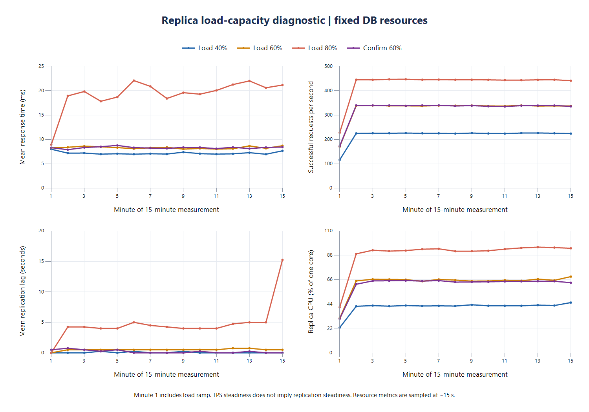

# Read Replica 부하 범위 진단

캠페인 `replica-20260908-capacity-01`. 2026-09-08 **16:23~18:28 KST 정상 완료**, 종료 코드 0. 원래 서비스 복구 및 18:32 KST 사후 감사 통과.

## 결과

**현재 고정 자원에서 확인된 최고 통과 수준은 60%(300 VUser), 약 337 TPS다.** 새로운 앱으로 다시 워밍업·안정화·측정한 재확인에서도 통과했다. 80%(400 VUser)는 TPS·JIT·요청 오류 검증을 통과했지만, 마지막 5분에 복제 지연이 커져 사전에 정한 복제 안정성 기준을 충족하지 못했다.

| 수준 | 판정 | tail TPS | tail 평균 | tail p95 | tail p99 | 마지막 5분 lag 범위 |
|---|---|---:|---:|---:|---:|---:|
| 40%, 200명 | 통과 | 224.63 | 7.31ms | 13ms | 28ms | 0초 |
| 60%, 300명 | 통과 | 337.33 | 8.44ms | 18ms | 45ms | 0~1초 |
| 80%, 400명 | **미통과** | 442.94 | 20.88ms | 68ms | 103ms | **0~31초** |
| 60%, 300명 재확인 | **통과** | 337.45 | 8.40ms | 19ms | 52ms | 0~1초 |

tail은 본 측정 마지막 120초 `[780,900)`다. 모든 본 측정은 900초 coverage, 전체 요청 오류 0건, JIT와 TPS STEADY를 통과했다. 워밍업은 각 수준 600초 1회로 완료돼 추가 워밍업은 사용하지 않았다. 40%가 통과해 20%는 실행하지 않았고, 80% 미통과 후 60%를 재확인했다. CPU 등 자원은 변경하지 않았다.

그래프의 지연은 **분별 표본 평균**이다. 개별 표본 최대값인 31초와 구분한다. 첫 1분에는 사용자 증가 구간이 포함된다. [전체 1분별 CSV](replica-capacity-20260908-minutes.csv)를 함께 보존했다.

### 복제 안정성과 자원 근거

| 항목 | 40% | 60% | 80% | 60% 재확인 |
|---|---:|---:|---:|---:|
| 마지막 5분 lag p95 | 0초 | 1초 | **20초** | 0초 |
| 마지막 lag 표본 | 0초 | 1초 | **31초** | 0초 |
| 마지막 5분 lag 기울기 | 0.000초/분 | +0.012초/분 | **+2.680초/분** | +0.003초/분 |
| 마지막/첫 1분 lag 평균 차이 | 0초 | 0초 | **+11.25초** | 0초 |
| Replica tail CPU | 43.91% | 67.04% | **94.69%** | 63.98% |
| Replica throttled period 비율 | 4.01% | 21.72% | **78.67%** | 20.00% |
| Primary tail CPU | 14.92% | 19.90% | 23.44% | 19.01% |
| Replica SELECT QPS | 419.40 | 622.72 | 807.62 | 628.05 |

각 판정 구간의 유효 lag 표본은 20개이며 직접 확인한 복제 IO/SQL 스레드는 ON, 오류 0이었다. 80%는 중간 구간에서 수초 수준의 지연을 보이다 마지막에 31초까지 증가했다. 100%의 이전 실험처럼 전 구간에서 크게 증가한 것과는 양상이 다르지만, 이번에 정한 낮은 지연 기준에는 미달했다. 전체 15분 lag 최댓값은 각각 1/1/31/2초다.

80%에서 CPU 사용과 throttling이 크게 늘어 CPU quota 경합과 부하 증가의 관련성을 뒷받침한다. 60%에서도 짧은 CPU 제한은 관측되므로 통과를 "throttling 없음"으로 해석하지 않는다. cgroup 자원 평균은 tail 중 약 111~115초의 실제 카운터 구간을 시간 가중한 값이며, throttled period 비율은 요청이 지연된 비율이 아니다. I/O 서비스 지연·복제 적용 순서 등과의 인과 분리는 이번에도 수행하지 않았다.

### GTID 대기와 복구

| 단계 | 40% | 60% | 80% | 60% 재확인 |
|---|---:|---:|---:|---:|
| 워밍업 후 GTID 확인 단계 대기 | 1.06초 | 1.12초 | 16.24초 | 1.02초 |
| 추가 안정화 | 152.77초 | 152.77초 | 137.62초 | 137.53초 |
| 본 측정 후 GTID 확인 단계 대기 | 1.31초 | 1.05초 | **61.83초** | 1.01초 |
| 마지막 응답부터 GTID 확인까지 | 6.59초 | 7.60초 | **69.71초** | 7.22초 |

대기 시간은 해당 확인 단계가 시작된 뒤의 시간이다. JMeter 종료 후 스냅샷·분석 시간은 포함하지 않으며 약 15초 단위 관측 지연도 있다. `Seconds_Behind_Source`와 GTID catch-up 소요 시간은 같은 값이 아니다.

- 본 측정 중 가용 물리 메모리 최솟값은 순서대로 약 3.60/3.75/4.01/4.16 GiB였고 안전 기준을 통과했다.
- 종료 시 양쪽 DB 행 수 일치: post **1,247,922**, comment **5,247,136**, likes **7,354,654**.
- 마지막 GTID gate에서 Primary executed set이 Replica executed set에 포함됨을 확인했다. 복제 ON, 오류 0. 전체 GTID 문자열 동일성 또는 전체 행 checksum을 새로 검증한 것은 아니다.
- 복구 journal의 원래 22개 컨테이너 ID·실행 상태·CPU/메모리·restart policy가 일치했다. 임시 측정 컨테이너는 모두 제거됐으며 FinBound 9개와 Grafana/Prometheus/renderer는 원래 중지 상태다.
- 18:32 KST 앱 2대 health `UP`, 입력 파일 hash 불변 확인. 사후 감사 원본은 `final-audit.json`이다.

### 해석 범위와 다음 실험

이번 탐색은 **60% 통과 재현 / 80% 미통과**라는 구간을 확인했다. 300~400 VUser 사이의 정확한 한계값이나 장시간 안정성을 확정한 것은 아니며, 약 337 TPS를 서비스의 보장 처리량으로 발표하지 않는다. VUser 비율과 실제 TPS 비율도 일치하지 않는다. Sticky Primary TTL과 별개로 측정 중 read-after-write 정합성을 검증한 실험은 아니다.

다음 인과 확인 후보는 **이번에 미통과한 80%에서 Replica CPU만 1→2로 변경**하고, 동일한 준비·지연 기준으로 1 CPU 기준과 비교하는 것이다. 메모리·pool·부하를 함께 바꾸지 않고, 가능하면 1 CPU 기준 재측정과 함께 순서 영향을 줄인다. 이 CPU 변경 실험은 이번 캠페인에서 실행하지 않았다.

결과 원본은 `.tmp/replica-capacity/campaigns/replica-20260908-capacity-01/`의 `campaign.json`, `capacity-analysis.json`, `minutes.csv`, `rig-state.json`, `final-audit.json`이다. 하네스·후처리 테스트는 총 **26개 통과**했다. 기존 안정화 진단과 `05`, 외부 하네스, README·애플리케이션 소스를 수정하거나 커밋하지 않았다.

## 목적과 고정 조건

추가 안정화 후에도 500 VUser에서 복제 지연이 증가한 [이전 진단](replica-stabilized-20260908.md)에 이어, **자원을 유지하면서 복제 지연이 낮게 유지되는 부하 범위**를 찾는다. 이번에는 B 구성(읽기는 Replica, 쓰기는 Primary)만 측정한다. CPU 변경은 후속 실험이다.

- App 2대 각각 2 CPU / 2 GiB, Primary/Replica 각각 1 CPU / 1 GiB.
- Hikari write/read 최대 20/30, minimum-idle 5/5, Sticky Primary 유지.
- 기존 고정 이미지 `sha256:ea9b900246917cc43df83c6c55ca4ff3064ae13b942b447adbb8f86761e0c9e3`, 소스·fixture 동일.
- DB 초기화 없이 쓰기는 누적된다. 측정별 앱은 새로 시작하고 워밍업 이후의 JVM은 유지한다.
- 호스트 물리 1 GiB / 커밋 2 GiB 안전 기준 유지. 최초 시작은 물리 4 GiB 이상 필요.

## 부하와 탐색 순서

기존 시나리오별 VUser는 `300/150/5/5/40`이다. 25/50/75%로 줄이면 일부 그룹이 소수가 되므로, **모든 시나리오의 사용자 비율을 정확히 보존하는 20%p 간격**으로 측정한다. 타이머, 요청 구조, assertion, fixture는 바꾸지 않는다. 비율은 VUser 기준이며 실제 TPS가 정확히 같은 비율로 변한다는 뜻은 아니다.

| 수준 | 그룹별 VUser | 합계 |
|---|---|---:|
| 20% | 60/30/1/1/8 | 100 |
| 40% | 120/60/2/2/16 | 200 |
| 60% | 180/90/3/3/24 | 300 |
| 80% | 240/120/4/4/32 | 400 |
| 100% | 300/150/5/5/40 | 500, 이전 진단 참고 |

40%부터 시작한다. 통과하면 60%, 다시 통과하면 80%를 측정한다. 40%에서 실패하면 20%를 확인한다. 지표가 불충분한 `INCONCLUSIVE`는 과부하로 단정하거나 통과로 취급하지 않고 탐색을 멈춘다. 최대 3개 수준을 탐색하고, 가장 높은 통과 수준을 새로운 앱/워밍업으로 한 번 더 확인한다. 최대 총 4회 본 측정이며 100%를 자동 반복하지 않는다.

## 각 수준의 절차와 판정

HTTP·JMeter 사전 검증 → 600초 워밍업 → 부하 중단 및 GTID catch-up → 120~600초 추가 자원 안정화 → GTID/health 재확인 → 900초 측정 → 부하 중단 후 GTID catch-up 및 시간 기록 순서다.

워밍업이 오류 없이 완료됐으나 JIT가 미안정이면 워밍업을 한 번만 더 허용한다. 본 측정은 재시도하지 않는다. 자원 안정화는 이전과 동일하게 마지막 60초의 DB CPU 평균 ≤10%, I/O 평균 ≤1 MiB/s, 앞뒤 30초 변화의 절댓값 CPU ≤5%p / I/O ≤0.25 MiB/s를 두 번 연속 통과해야 한다.

본 측정 전체 요청 오류 0, 입력/자원 일치, 900초 coverage, JIT·TPS STEADY 통과와 함께 **마지막 5분 `[600,900)`**에서 다음 조건을 모두 만족해야 해당 수준을 통과시킨다.

| 복제 지연 기준 | 값 |
|---|---:|
| 표본 p95 | 2초 이하 |
| 표본 최대 | 5초 이하 |
| 마지막 표본 | 2초 이하 |
| 시간에 대한 선형 기울기 절댓값 | 분당 0.2초 이하 |
| 마지막/첫 1분 평균 차이 절댓값 | 1초 이하 |
| 관측 유효성 | 최소 18개, 간격 ≤35초, 양 끝 30초 이내 |
| 복제 스레드 | 표본마다 IO/SQL ON, 오류 0 |

이 기준은 **진단을 위한 낮은 복제 지연 기준**이며 제품 freshness SLO나 read-after-write 보장이 아니다. 통과한 최대 VUser/TPS도 15분 관측과 1회 재확인의 범위 안에서 해석한다. 부하 수준 사이의 정확한 한계나 장시간 지속 가능성까지 확정하지 않는다.

## 수집과 근거

- 원본 JTL, 15개의 1분별 TPS·응답시간·분위수·오류.
- 15초 간격 DB cgroup CPU·throttling·I/O, Prometheus SELECT/복제 지연·InnoDB, 직접 Hikari active/pending/max, 직접 복제 스레드 health, 호스트 여유 메모리.
- 이전 100% 실험과 측정 시점·누적 데이터·캐시·일부 관측 방식이 다르므로 결과 비교 한계를 명시한다.
- 독립 하네스 `.tmp/replica-capacity/`, 상태/복구 journal은 `campaigns/replica-20260908-capacity-01/`, pass 원본은 `runs/`.
- 사전 검증: 비율·JMX 동일성, lag 판정·누락 거부, 탐색 경로, 자원 변경 거부, 기존 복구/JIT/분석 검증 **22개 통과**.
- finally에서 원래 서비스 상태를 복구하고 마지막에 행 수·GTID·앱 health를 확인한다.
