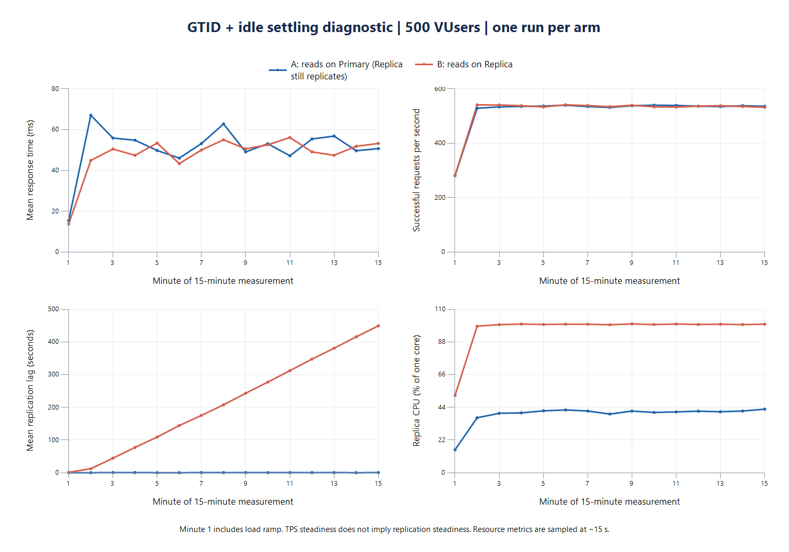

# GTID 동기화 후 추가 안정화 진단

캠페인: `replica-20260908-stabilized-01`. 2026-09-08 14:24~15:35 KST 실행 완료.
최종 상태: `DIAGNOSTIC_COMPLETED`, 종료 코드 0, 원래 서비스 복구 완료. 15:51 KST 독립 최종 검증도 통과했다.

## 진단 결론

**GTID 동기화와 추가 유휴 안정화를 모두 통과해도, 현재 500 VUser 부하에서 Replica 복제 지연이 다시 누적됐다.** 시작 직후 남아 있던 CPU·디스크 활동만으로 이전 지연을 설명하기는 어렵다. 읽기를 Replica로 옮기면서 Primary의 CPU 부하는 줄었지만 Replica가 1 CPU 한도에 도달했다.

두 arm 모두 오류 0건, JIT와 TPS STEADY를 통과했다. 응답시간의 차이는 이번 단회 진단에서 작았지만, B의 복제 지연은 본 측정 중 최대 460초까지 증가했다. 처리량 안정성과 복제 안정성은 분리해서 판단해야 한다.

그래프는 각 900초 본 측정을 시작부터 끝까지 1분 단위로 나타낸다. 첫 1분에는 사용자 증가 구간이 포함된다. 복제 지연 그래프는 **분별 표본 평균**이고, 아래 최대 460초는 개별 표본의 최댓값이다. [전체 1분별 CSV](replica-stabilized-20260908-minutes.csv)도 보존했다.

### 시작 조건과 회복 시간

| 항목 | A: Primary 읽기 | B: Replica 읽기 |
|---|---:|---:|
| 워밍업 후 GTID 확인 단계의 대기 | 1.19초 | 77.10초 |
| GTID 확인 후 추가 안정화 | 137.65초 | 137.61초 |
| 안정화 마지막 60초 Primary CPU | 1.03% | 1.07% |
| 안정화 마지막 60초 Replica CPU | 1.42% | 1.42% |
| 안정화 마지막 60초 Primary I/O | 약 132 KiB/s | 약 9.3 KiB/s |
| 안정화 마지막 60초 Replica I/O | 약 6.3 KiB/s | 약 7.5 KiB/s |
| 본 측정 직전 GTID·복제 health 재확인 | 통과 | 통과 |
| 본 측정 구간 KST, JTL 시작 기준 | 14:39:38~14:54:38 | 15:11:35~15:26:35 |
| 본 측정 후 GTID 확인 단계의 대기 | 1.24초 | 486.83초 |
| 마지막 응답부터 GTID 확인까지 경과 | 10.97초 | 495.82초 |

GTID 확인 단계의 대기 시간에는 JMeter 종료 후 스냅샷·분석을 수행한 시간이 포함되지 않는다. 부하 종료 후 전체 경과를 평가할 때는 마지막 응답부터 확인까지의 값도 함께 본다. GTID는 약 15초 간격으로 검사했으므로 실제 catch-up 순간보다 확인 시점이 늦을 수 있다. 워밍업 마지막 응답부터 동기화 확인까지는 A 8.57초, B 84.01초였다.

### 본 측정 결과

응답시간과 TPS는 마지막 120초 `[780,900)` 기준이다. A/B 각각 1회로, 반복 측정 중앙값이나 통계적 유의성을 뜻하지 않는다.

| 항목 | A | B |
|---|---:|---:|
| TPS | 537.01 | 533.71 |
| 평균 응답시간 | 50.18ms | 52.54ms |
| p50 | 37ms | 39ms |
| p95 | 143ms | 153ms |
| p99 | 252ms | 258ms |
| 본 측정 전체 오류 | 0 | 0 |
| JIT / TPS STEADY | 통과 / 통과 | 통과 / 통과 |
| tail 앞 60초 → 뒤 60초 평균 | 49.67 → 50.70ms | 51.84 → 53.24ms |
| 본 측정 전체 복제 지연 범위 | 0~1초 | 0~460초 |
| tail 복제 지연 범위 | 0~1초 | 404~460초 |
| 본 측정 마지막 복제 지연 표본 | 0초 | 455초 |

B의 tail TPS는 A 대비 0.61% 낮고 평균 응답시간은 4.70% 높았다. 마지막 두 60초 구간 평균 차이는 A +2.07%, B +2.70%로, 마지막까지 응답시간이 크게 낮아지는 흐름은 이번 관측에서 없었다. 다만 전체 15분의 분별 평균에는 변동이 남아 있다. 이전 `05`의 평균 응답시간 차이 +146.43%를 이번 결과로 대체하거나, 차이 축소를 추가 안정화만의 인과 효과로 단정하지 않는다. 실행 시점·누적 데이터·캐시 상태와 단회 AB 순서의 영향을 분리하지 않았다.

### CPU·읽기 이동·I/O 근거

| tail 자원 지표 | A Primary | A Replica | B Primary | B Replica |
|---|---:|---:|---:|---:|
| CPU 평균, 1코어 기준 | 100.10% | 42.16% | 28.92% | 99.93% |
| throttling 발생 CPU period 비율 | 100.00% | 0.43% | 0.00% | 99.48% |
| SELECT QPS | 1,019.60 | 0.64 | 58.75 | 969.38 |
| cgroup 디스크 read | 3.31 MiB/s | 0.008 MiB/s | 0.009 MiB/s | 3.40 MiB/s |
| cgroup 디스크 write | 9.75 MiB/s | 10.14 MiB/s | 12.40 MiB/s | 5.41 MiB/s |

CPU·I/O는 cgroup 누적 카운터 차이를 시간으로 나눈 값이다. 각 tail 120초 중 실제 카운터 구간 coverage는 약 114~115초이며 경계에서 겹치는 시간만 가중했다. throttling 비율은 구간별 `Δnr_throttled / Δnr_periods`의 시간 가중 평균이다. 이는 요청 지연의 비율이 아니다.

SELECT 지표는 읽기 대부분이 실제 Replica로 이동했음을 보여준다. B Replica의 CPU 사용량과 throttling은 CPU quota 경합의 직접 근거다. 반면 디스크 read/write 양만으로 장치 지연이나 I/O 병목의 기여도를 확정할 수는 없다. B 부하 중단 후에도 일부 회복 표본에서 Replica CPU 약 33%, 디스크 쓰기 약 9.4 MiB/s가 관측되며 GTID 대기가 지속됐다. 복제 적용 순서·동기화·I/O 영향은 남아 있다.

tail의 InnoDB buffer-pool read miss 비율은 A Primary 약 0.124%, B Replica 약 0.123%였다. 높은 hit rate만으로 물리 읽기나 I/O 영향을 배제하지 않는다. 디스크 서비스 지연과 I/O wait는 이번에 직접 측정하지 않았다.

Hikari read pool의 tail active 최대값은 A 앱별 15/17개, B 30/30개였다. tail pending 최대값은 A 0/0개, B 2/7개다. 전체 본 측정에서는 A 초반에도 active 30개 및 pending 최대 9개가 관측됐으므로, 연결 대기를 B에서만 발생한 현상이라고 표현하지 않는다. 각 앱의 write/read 최대값 20/30은 직접 수집한 지표로 확인했다.

### 복구와 후속 방향

- 두 본 측정에서 가용 물리 메모리 최솟값은 A 약 3.48 GiB / B 약 3.47 GiB로 안전 기준을 통과했다.
- 15:35 KST 종료 시 Primary/Replica 행 수는 post **1,239,474**, comment **5,238,702**, likes **7,354,682**로 같았다.
- 15:51 KST GTID executed set이 양쪽 모두 `fc785e72-5083-11f1-8ba1-7644177ff8d4:1-8838408`로 일치했다. 복제 ON, 오류 0, 앱 2대 health `UP`.
- 원래 22개 컨테이너의 ID·실행 상태·CPU/메모리·restart policy 일치. 임시 측정 컨테이너 없음. FinBound 9개와 Grafana/Prometheus/renderer는 원래 중지 상태다.
- 전체 행 내용 checksum과 측정 중 read-after-write 정합성 검증은 수행하지 않았다. Sticky Primary 3초 TTL은 복제 적용 확인을 보장하지 않는다.
- 이번에는 승인된 안정화 진단만 실행했다. 다음 단계는 같은 자원에서 부하를 낮추며 복제 지연이 계속 증가하지 않는 구간을 찾는 것이다. 25/50/75/100% 후보 중 순차적으로 범위를 좁히고, 그 이후 CPU를 한 변수로 바꾸는 실험을 검토한다. 부하 행렬·자원 변경은 아직 실행하지 않았다.

## 목적과 범위

`replica-20260908-05`에서는 본 측정 직전 GTID 동기화에 성공했지만 B 부하 중 복제 지연이 다시 늘었다. 이번에는 동기화 직후 남아 있는 CPU·디스크 활동을 추가로 기다려도 같은 현상이 나타나는지 확인한다. A/B 각 1회 진단이며 최종 성능 비교용 반복 실험이 아니다.

- A: HAProxy + App 2대, read/write 모두 Primary. Replica 복제는 계속 실행한다.
- B: 같은 구성에서 read pool만 Replica로 연결한다.
- App 각각 2 CPU / 2 GiB, Primary와 Replica 각각 1 CPU / 1 GiB.
- 각 앱의 Hikari write max 20 / read max 30, minimum-idle 각각 5. Sticky Primary 유지.
- 이미지: `sha256:ea9b900246917cc43df83c6c55ca4ff3064ae13b942b447adbb8f86761e0c9e3`.
- 기존 검증 fixture와 JMX 구성 유지. 500 VUser(300/150/5/5/40), 순서 AB, 재시도 없음.
- 데이터는 누적된다. DB 초기화와 자원 변경은 하지 않는다.

## 실행 순서와 사전 판정 기준

각 arm은 HTTP·JMeter 사전 검증 후 600초 워밍업을 실행한다. 부하를 중단하고 GTID catch-up을 기다린 뒤, 앱/JVM을 유지한 채 최소 120초 추가 안정화를 거친다. 복제 health와 GTID를 재확인한 후 900초 본 측정, 부하 중단 후 catch-up 시간 기록 순으로 진행한다.

안정화는 최대 600초까지 기다린다. 15초 간격으로 수집한 마지막 약 60초의 cgroup CPU·I/O 변화량이 **양쪽 DB 모두** 아래 조건을 만족해야 한다. 두 번 연속 통과하고 GTID catch-up·복제 health가 정상일 때 다음 단계로 간다.

| 항목 | 기준 |
|---|---|
| CPU 평균 | 1코어 기준 10% 이하 |
| 디스크 read + write 평균 | 1 MiB/s 이하 |
| 앞·뒤 30초 CPU 평균 차이의 절댓값 | 5%p 이하 |
| 앞·뒤 30초 I/O 평균 차이의 절댓값 | 0.25 MiB/s 이하 |
| 관측 간격 | 개별 간격 최대 35초, 마지막 4개 간격의 합 59~75초 |
| GTID 대기 | 단계당 최대 1,800초 |

이는 유휴 자원 활동에 대한 운영상 기준이다. 120초 경과만으로 통과시키지 않으며 캐시·JVM의 완전한 평형을 증명하는 기준도 아니다. 최대 대기 초과, 복제 health 오류, 워밍업 JIT 미통과, 요청 오류·coverage 부족이면 실패를 보존하고 자동 반복하지 않는다. 본 측정의 TPS STEADY 또는 JIT 미통과는 진단 결과로 기록한다.

호스트 안전 기준은 가용 물리 메모리 1 GiB / 커밋 여유 2 GiB이다. 시작 시 추가로 물리 4 GiB 이상을 요구했다. 이번 사전 검증에서는 물리 약 7.96 GiB / 커밋 약 7.94 GiB였고 IntelliJ는 종료된 상태였다.

## 수집과 해석

- 원본 JTL 전체를 보존한다. 리다이렉트 자식 행은 요청 수에서 제외하되 자식 오류는 검출한다.
- 900초를 15개의 1분 구간으로 나눠 TPS, 평균, p50/p95/p99, 오류를 계산한다.
- 참조 구간은 `[180,300)`, tail은 `[780,900)`, tail 앞·뒤 절반은 각각 60초다. 기존 600초 분석 기본값과 `05` 원본은 보존한다.
- 15초 간격으로 DB CPU·throttling·I/O 누적 카운터, 복제 지연, Hikari active/pending/max, JIT, 호스트 여유 메모리를 기록한다. Prometheus에서 제공되는 DB SELECT·InnoDB 지표도 보존한다.
- cgroup I/O는 컨테이너에 귀속된 블록 I/O이며 디스크 장치 지연 시간 자체가 아니다. throttled time은 요청 지연 시간으로 직접 환산하지 않는다.
- TPS STEADY와 응답시간·복제 지연의 안정성을 구분한다. 종료 후 GTID·행 수 일치는 측정 중 read-after-write 정합성 또는 전체 행 checksum 검증을 의미하지 않는다.
- 워밍업과 본 측정 사이의 부하 중단이 JVM·캐시 상태에 줄 수 있는 영향, AB 순서 및 누적 데이터의 영향을 해석에 남긴다.

## 근거 경로와 검증

별도 실행 하네스와 결과는 프로젝트 내부 `.tmp/replica-stabilized/`에 저장한다. 외부 `replica-rerun` 하네스 및 기존 결과를 수정하지 않는다.

- 계획·상태·복구 journal: `campaigns/replica-20260908-stabilized-01/`
- pass별 JTL, 분석, 시계열, JVM 지표: `runs/replica-20260908-stabilized-01-*`
- 실행 로그: `execution-01.log`
- 실행 전 검증: `python -m unittest test_stabilized test_resume -v` 15개 통과. 기존 600초 분석기 self-test 포함.
- 후처리 검증: `python -m unittest test_report -v` 4개 통과. 구간 경계·누락값·counter reset 처리 확인.
- 900초 JMX는 기존 검증 JMX의 다섯 duration 값만 변경했음을 테스트로 확인했다.
- 고정 이미지·소스 fingerprint·fixture hash 검증 통과. 종료 시 기존 22개 컨테이너의 ID와 실행 상태를 journal과 비교했고, `final-verification.json`에서 자원 설정 및 GTID·앱 health도 재확인했다.
- 집계 원본: `diagnostic-analysis.json`, `minutes.csv`. Hikari 직접 표본은 `hikari-direct.jsonl`, SELECT·복제 스레드 시계열은 `A/B-select-replication-range.json`이다. 원래 Prometheus 조회에서 일부 지표가 누락돼 직접 수집과 실제 지표명 `mysql_global_status_commands_total{command="select"}`의 보존 구간 조회로 보완했다.
