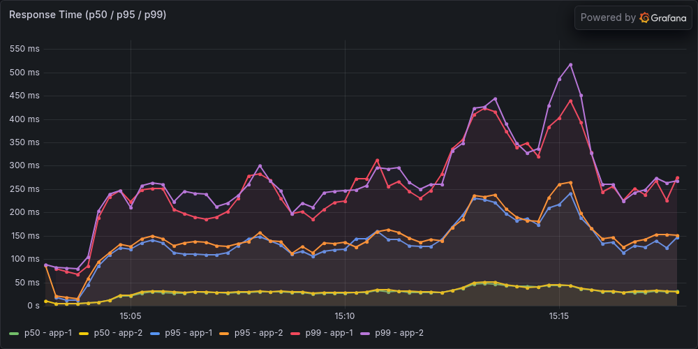
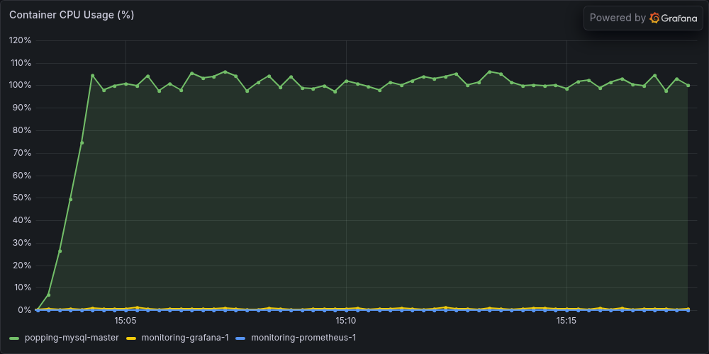
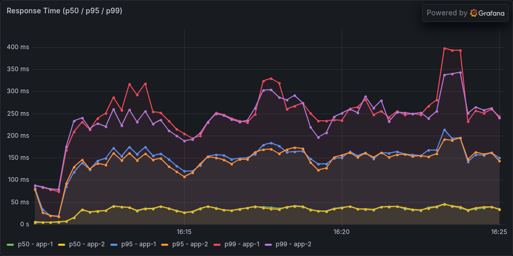
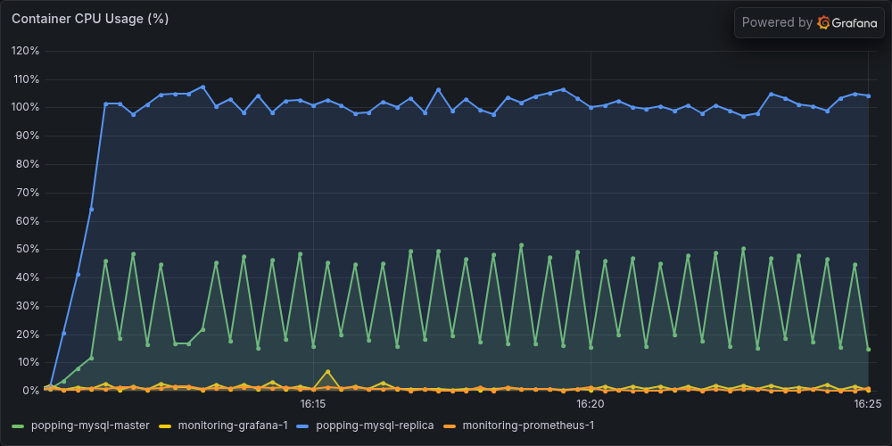
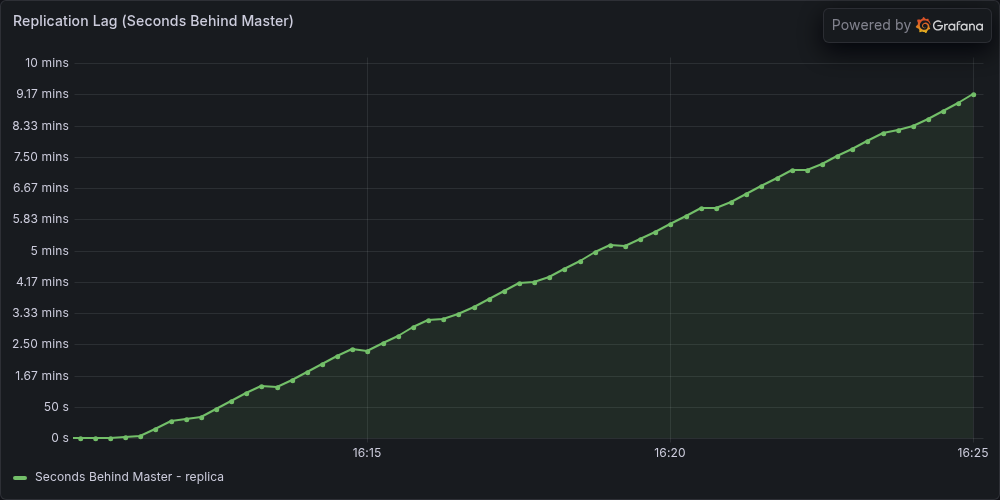

# 20분 워밍업 후 Read Replica 도입 재실험 — 2026-09-10

A·B 각 3회의 유효 본측정을 완료했다. Replica 구성의 TPS 중앙값은 **0.93% 감소**, 평균 응답시간 중앙값은 **6.85% 증가**했다. 초기 기록의 큰 응답시간 개선은 이번 조건에서 재현되지 않았다. 읽기 분산은 작동했지만 B 세 번 모두 복제 지연이 계속 증가했다.

캠페인 `replica-20260910-warm20-01`은 2026-09-10 **14:34:50~20:27:41 KST**에 실행·원복까지 완료했다. 최종 상태 `COMPLETED`, 비교 가능 `true`, 중단·재시도·제외된 본측정 없음. [사전 계획](replica-warm20-20260910-plan.md)을 따랐다.

## 1. 이번에 바꾼 조건

이전 낮 실험은 5A의 10분 워밍업에서 app-1 JIT 증가율 2.33486%가 기존 2%를 넘어 중단됐다. 이번에는 워밍업을 **연속 1200초로 고정**하고 1080·1200초에 앱 두 대 모두 기존 JIT 기준을 통과하도록 했다. 600·900초는 진단만 기록하며 일찍 통과해도 종료하지 않았다. 실패 기준을 완화하거나 성공할 때까지 재시도하지 않았다.

- A: Primary 1 CPU/1 GiB, Replica는 smoke·워밍업·본측정 중 OFF, 읽기·쓰기 풀 모두 Primary.
- B: Primary와 Replica 각각 1 CPU/1 GiB, 읽기는 Replica, 쓰기와 Sticky 요청은 Primary.
- 두 앱 각각 2 CPU/2 GiB, 실제 힙 240 MiB, 풀 write 20/read 30, HAProxy, Sticky 3초 ON, Redis 세션 OFF. Replica worker 2, commit order ON, 내구성 1/1 유지.
- 500 VUser(300/150/5/5/40), ramp 60초, ABBAAB. 매 슬롯 smoke → 워밍업 1200초 → GTID 동기화·유휴 확인 → 본측정 900초 → 소유 컨테이너 정리·동기화. 누적 데이터를 초기화하지 않았다.
- CPU 재배분·앱 코드·이미지는 변경하지 않았다. 이미지 `sha256:cb215e007e159b821a47a46d39214e721926288ed8828147444b08d2f8d769e9`, 소스 지문 `75ae84d62f475bc5db505126f28d86c5b06763abc8b96c89beaf53bfb226c75c`.

B는 DB 자원 1 CPU/1 GiB와 복제 작업·읽기 라우팅을 함께 추가한다. 동일 총자원에서의 효율이나 CPU 배분만의 효과를 분리한 실험이 아니다.

## 2. HTTP 결과

| 구성 | 유효 횟수 | TPS 중앙값 | 평균 응답시간 중앙값 | p95 중앙값 | p99 중앙값 | 전체 HTTP 오류 |
|---|---:|---:|---:|---:|---:|---:|
| A: 단일 Primary | 3 | 536.700 | 53.573ms | 157ms | 271ms | 0 |
| B: Primary + Replica | 3 | 531.683 | 57.244ms | 173ms | 297ms | 0 |

| 순서 | 본측정 시작 KST | TPS | 평균 ms | p95 ms | p99 ms | 전체 오류 |
|---|---|---:|---:|---:|---:|---:|
| 1A | 15:02:57 | 536.700 | 53.573 | 157 | 271 | 0 |
| 2B | 16:10:09 | 531.683 | 57.244 | 173 | 302 | 0 |
| 3B | 17:17:41 | 529.650 | 58.819 | 176 | 297 | 0 |
| 4A | 18:08:46 | 533.200 | 55.861 | 174 | 297 | 0 |
| 5A | 19:00:23 | 538.333 | 45.339 | 125 | 224 | 0 |
| 6B | 20:05:32 | 533.283 | 53.915 | 162 | 267 | 0 |

각 JTL 최초 요청 시작을 0초로 잡고 parent 요청만 집계했다. 표는 본측정 tail **[780,900)**, 분위수는 nearest-rank, TPS는 성공 요청/120초다. 중앙값은 각 실행 지표의 중앙값이며 JTL을 합쳐 계산한 분위수가 아니다. 모든 본측정의 전체 parent·redirect child 오류 0, 잘못된 행 0, coverage·TPS STEADY 통과를 원시 JTL로 독립 검산했다. 본측정 JIT는 저장된 판정의 통과·일관성을 확인했으며, JIT 원시 시계열을 별도 재계산한 범위는 아래 워밍업 6회다. A TPS 범위 533.200~538.333, B 529.650~533.283이다.

## 3. 읽기 분산과 복제 안정성

| 순서 | Primary CPU | Replica CPU | Primary SELECT/s | Replica SELECT/s |
|---|---:|---:|---:|---:|
| 1A | 100.07% | OFF | 1017.55 | N/A |
| 2B | 28.17% | 100.07% | 59.43 | 954.87 |
| 3B | 27.41% | 99.91% | 59.68 | 962.15 |
| 4A | 99.84% | OFF | 1014.17 | N/A |
| 5A | 99.98% | OFF | 1031.08 | N/A |
| 6B | 25.68% | 99.82% | 67.44 | 965.80 |

CPU는 cgroup usage 차분을 한 코어 100%로 환산했다. SELECT/s는 DB Com_select 차분이며 HTTP RPS가 아니다. 둘 다 tail 안에 들어오는 실제 관측점 사이의 약 105초 구간을 사용하고 커버리지·간격을 검사했다. Primary의 부하는 줄었지만 Replica는 약 한 코어를 소진한다. 현재 Replica 자원으로 읽기와 복제 적용을 함께 감당하는 데 병목이 있다는 해석을 뒷받침하며, 다른 병목이 없다는 증명은 아니다.

| B 순서 | 마지막 5분 min / p95 / max | 마지막 lag | 기울기 초/분 | 첫·마지막 1분 평균 차이 | 판정 |
|---|---:|---:|---:|---:|---|
| 2B | 368 / 550 / 553초 | 553초 | +40.657 | +164.75초 | UNSTABLE |
| 3B | 363 / 544 / 556초 | 556초 | +40.720 | +165.00초 | UNSTABLE |
| 6B | 299 / 451 / 463초 | 463초 | +33.750 | +135.00초 | UNSTABLE |

lag 안정성은 마지막 5분 [600,900)의 20개 표본으로 판정했다. 기준은 p95≤2초·max≤5초·last≤2초·기울기 절댓값≤0.2초/분·첫/마지막 1분 평균 차이 절댓값≤1초다. 실험용 진단 기준이며 제품 SLO가 아니다. B 전체 900초에서도 마지막 값이 최대값이었다. HTTP 측정 유효성과 복제 안정성은 별도 판정이므로 UNSTABLE을 이유로 B를 빼지 않았다. 부하 종료 후 GTID 동기화가 끝난 사실이 부하 중 최신 읽기나 read-your-writes를 보장하지 않는다.

## 4. 워밍업 확인

아래는 각 시점의 앱 두 대 중 더 큰 JIT 증가율이다. 각 앱을 따로 계산한 원시 값은 별도 감사 JSON에 보존했다.

| 순서 | 10분 진단 | 15분 진단 | 18분 필수 | 20분 필수 |
|---|---:|---:|---:|---:|
| 1A | 0.7670% | 0.8192% | 0.4644% | 0.3686% |
| 2B | 0.7447% | 0.9731% | 0.6672% | 0.6240% |
| 3B | 1.0739% | 1.0164% | 0.8717% | 0.3606% |
| 4A | 0.9852% | 0.8333% | 0.3621% | 0.8656% |
| 5A | 0.5191% | 0.9734% | 0.3296% | 0.5466% |
| 6B | 0.5991% | 1.2084% | 0.3940% | 0.7413% |

18·20분 × 앱 2대 × 6슬롯의 **24개 필수 확인이 모두 통과**했다. 비율은 기존 정의 `(마지막 누적 컴파일 시간 − 약 120초 전 값) / 마지막 누적값`으로 CPU 사용률이 아니다. 관측 누락·간격·카운터 reset 검사도 유지했다. 이번 실행에서는 10분 진단 역시 모두 2% 이하였다. 따라서 이번 성공만으로 10분은 항상 부족하다거나 20분 연장이 성공의 유일한 원인이라고 결론 내리지 않는다. 워밍업 분석은 저장 JTL hash·기존 HTTP/coverage 결과와 JIT 원시 값 재계산을 검증했고, 워밍업 JTL 전체 CSV를 두 번째로 재파싱한 것은 아니다.

## 5. 초기 기록 및 낮 재실험과 비교

| 비교 기록 | 반복수 A/B | A → B 평균 응답시간 | A → B TPS | 해석 |
|---|---:|---:|---:|---|
| 초기 발표 | 1 / 1 | 약 42 → 11ms | 546.5 → 563.9 | 당시 발표 집계 |
| 초기 원본을 parent 기준 재계산 | 1 / 1 | 41.613 → 10.776ms | 541.908 → 559.000 | tail [480,600), 중복 제거 후에도 개선은 남음 |
| 9월 10일 낮, 워밍업 10분 | 2 / 2 | 55.362 → 55.506ms | 532.004 → 532.683 | 5A 워밍업 JIT 실패로 중단한 부분 중앙값 |
| 이번 워밍업 20분 | 3 / 3 | 53.573 → 57.244ms | 536.700 → 531.683 | 사전 반복수 충족, 관측 중앙값 |

초기 실험은 풀 50/80·600초·각 1회였고 독립 워밍업/JIT 근거가 부족하다. 현재는 풀 20/30·900초·데드락 수정 코드·누적 데이터·실행 시점이 다르다. 따라서 측정 방법만 바꿔서 개선이 사라졌다고 해석할 수 없다. 이전 낮 결과를 이번 반복수에 합치지 않았다. 각 3회의 작은 표본으로 통계적 유의성이나 동등성을 입증한 것도 아니다.

초기 원본 두 파일의 현재 parent 집계 재계산은 [낮 실험의 원본 검산](../../.tmp/replica-adoption-20260910-analysis/reports/historical-originals-recomputed.json)에 보존했다. [낮 부분 결과](replica-adoption-rerun-20260910.md)와 [전날 중단 이력](replica-adoption-fixed-20260910.md)도 그대로 남겼다.

## 6. 실제 Grafana 캡처

대표는 사전에 정한 TPS 중앙값 최근접 규칙으로 A=1A, B=2B를 골랐다. A 15:02:57.504~15:17:57.504, B 16:10:09.450~16:25:09.450 KST의 전체 900초다. 표는 마지막 120초이며 별도 워밍업은 포함하지 않는다.

기존 Grafana 대시보드와 다크 1000×500 패널을 그대로 캡처했다. 응답 축은 A 약 550ms, B 약 400ms로 다르므로 선 높이를 직접 비교하면 안 된다. 서버의 1분 히스토그램 추정 분위수는 JMeter parent 응답시간과 집계 대상·구간이 다르며 actuator도 제외하지 않는다. CPU 패널은 앱 CPU를 포함하지 않는 기존 DB/모니터링 패널이고 docker-stats 기반 값은 아래 원시 cgroup 차분과 다를 수 있다. B lag 축은 분 단위이며 마지막 553초는 약 9.22분이다. A는 Replica OFF이므로 lag가 0이 아니라 N/A다.

## 7. 원복과 검증 범위

원래 25개 컨테이너의 ID·실행 상태·CPU·메모리·이미지·restart policy가 일치하고 앱 8081/8082가 UP이다. 복제 연결·적용 ON, 오류 0, GTID 동기화 완료를 별도 읽기 전용 검사로 확인했다. 양 DB 행 수는 post **1,338,899**, comment **5,337,963**, likes **7,354,567**로 일치했다. 행 수·GTID 확인은 전체 데이터 checksum 검증이 아니다. 캡처 후 모니터링도 원래 상태로 복구했고 차이가 없다.

6개 본측정 원시 감사, 6개 워밍업 확인, 18개 완료 단계의 앱 로그·실패 XML 감사가 통과했다. 보존된 앱 로그에서 데드락 패턴 및 실패 XML 표본은 0건이었다. 이번 성공 캠페인의 전후 DB 누적 deadlock counter 차분은 별도 수집하지 않았으므로 DB 내부 데드락이 전혀 없었다고 단정하지 않는다. 이전 낮 캠페인의 counter 결과와 혼동하지 않는다.

동결 입력 32개·부모 하네스 31개·원래 하네스 20개 hash를 보존했다. 실행 전 새 워밍업 확인과 기존 회귀 테스트 51개가 통과했고 실행 후 동결 입력은 바꾸지 않았다. 이번 변경은 별도 실험 하네스와 문서·이미지이며 생산 코드 수정·커밋·푸시는 하지 않았다.

- [캠페인 상태·원복 기록](../../.tmp/replica-adoption-warm20/campaigns/replica-20260910-warm20-01/campaign.json), [최종 요약](../../.tmp/replica-adoption-warm20/campaigns/replica-20260910-warm20-01/summary.json)
- [6개 본측정 독립 감사](../../.tmp/replica-adoption-warm20-analysis/reports/replica-20260910-warm20-01-independent-audit.json), [워밍업 독립 감사](../../.tmp/replica-adoption-warm20-analysis/reports/warmup-confirmation-audit.json)
- [원복 독립 확인](../../.tmp/replica-adoption-warm20-output/verification/20260910T115619367190Z/verification.json), [로그 감사](../../.tmp/replica-adoption-warm20-output/log-audit/20260910T113233350195Z/audit.json)
- [캡처 manifest](../../.tmp/replica-adoption-warm20-output/captures/capture-manifest.json), [캡처 후 상태](../../.tmp/replica-adoption-warm20-output/captures/monitoring-state.json)

현재 조건에서 초기의 큰 개선을 재현하지 못했고 복제 안정성도 확보하지 못했다는 판단으로 이번 재실험을 마친다. 자원 재배분이나 복제 적용 처리량 개선을 검토한다면 별도 가설과 조건을 정한 다음 실험으로 다뤄야 한다.
