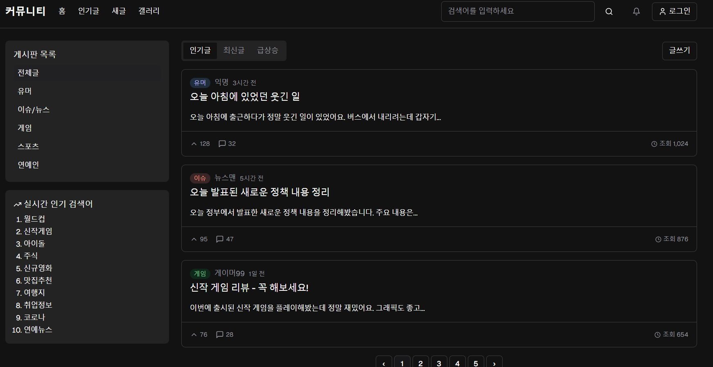
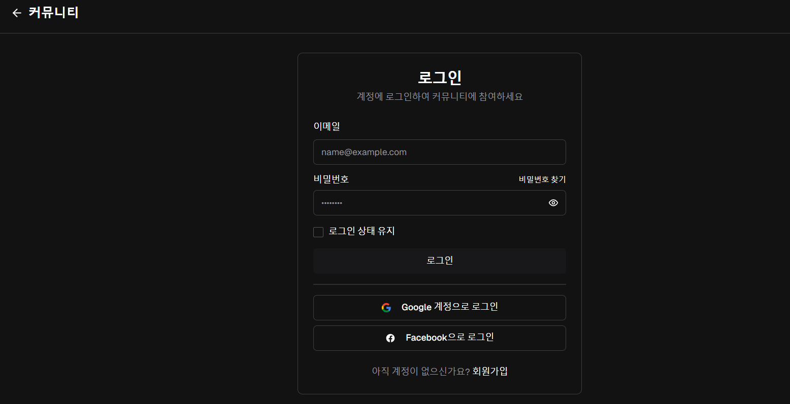
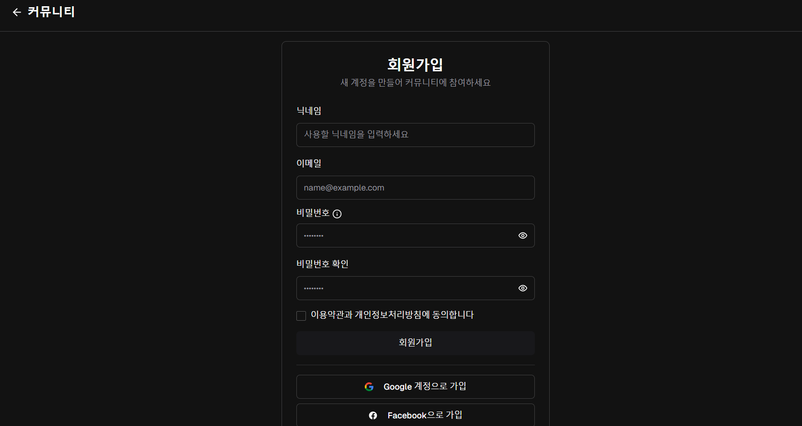
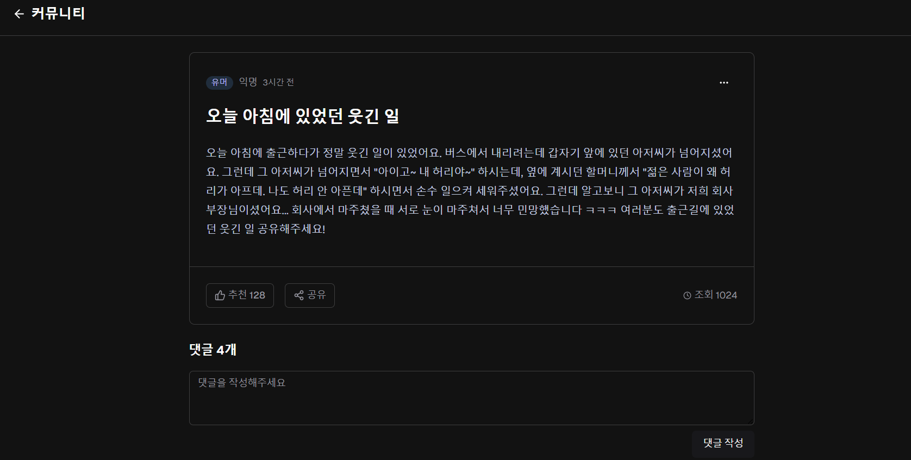
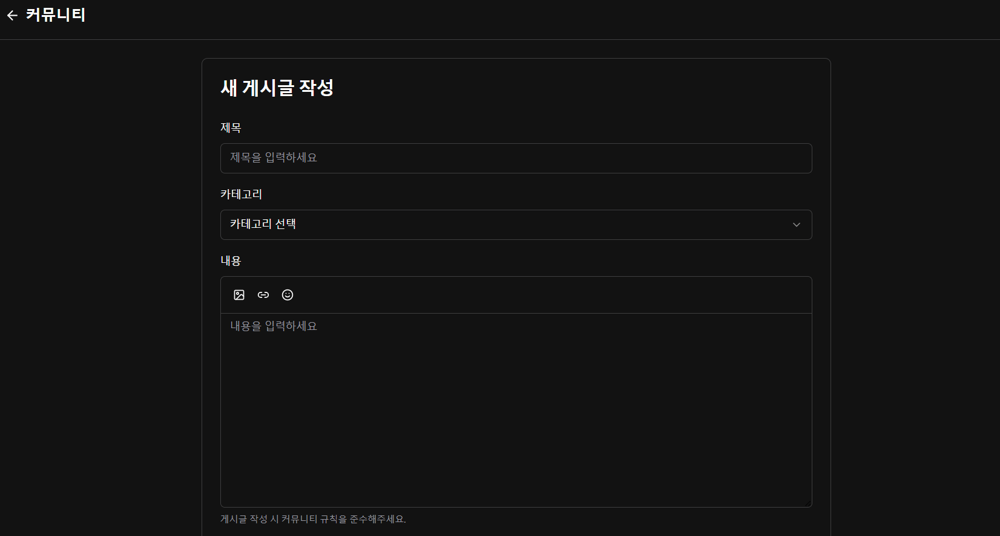
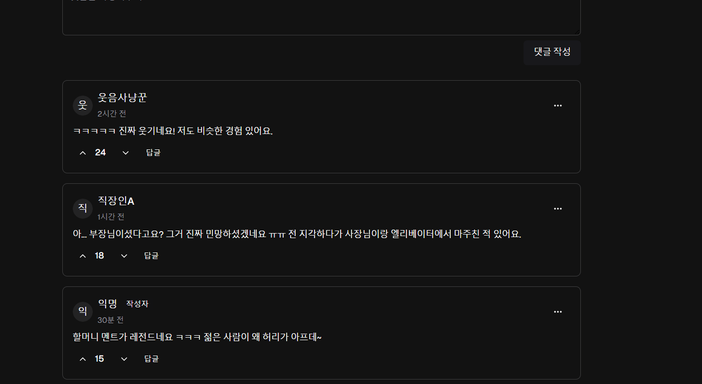

## 프로젝트 일정

--------------------------

3월24일: 과제 기획서 작성

3월31일: 메뉴와 화면 기획, 웹 페이지 배포

- aws 사용

4월7일: 로그인 기능을 개발

- google 로그인과 일반 로그인 구현

4월14일: 유저, 게시판, 게시글 기능을 개발

- 유저의 닉네임 중복 불가

4월21일: 게시글 작성 구현

- 이미지 첨부가능
- 본인만 수정, 삭제 가능
- 게시글은 모두가 작성할 수 있으며, 특히 회원가입으로 등록한 유저가 아니더라도 본인이 닉네임을 지정하여 게시글을 작성할 수 있음. (이 경우, 닉네임 중복 체크를 하지 않음.)
- 본인이 닉네임을 지정하여 비회원으로 게시글을 작성한 경우 게시글 작성시 사용한 비밀번호를 올바르게 입력한 경우에만 가능.

5월5일: 댓글 기능 구현

- 댓글은 모든 게시물에 작성 가능하며, 답글은 특정 댓글에 대한 답글과 댓글에만 작성할 수 있음.
- 게시글 조회 시, 댓글/답글을 합쳐 최대 100개만 화면에 노출
- 답글이 많아 노출 대상에서 잘리면, 그 다음페이지의 시작에는 답글이 이어서 나와야 함.

5월19일: 1차 개발 완료, 게시판 기능 수정

- 게시판의 기능을 강화
- 유저가 게시판을 만들 수 있게 수정
- 생성된 게시판을 만든 유저는 게시판의 메타데이터 수정, 게시글 강제 삭제 등의 기능을 가짐.
- 게시판에는 공지사항이 추가되며, 해당 공지사항은 게시판의 최상단에 출력됨. (단, 각 게시판 마다 최대 3개까지만 허용되며, 공지사항은 게시판을 만든 유저가 설정할 수 있음)

5월26일: 좋아요/싫어요 기능 개발

- 게시글 및 댓글/답글에 달 수 있으며, 최대 1회만 가능
- 비회원도 좋아요/싫어요를 달 수 있으나, 이 또한 최대 1회만 가능
- 좋아요/싫어요 취소 가능

6월2일: 어드민용 API 개발

- 특정 유저가 작성한 게시글, 댓글을 조회할 수 있어야 함.
- 게시글 삭제 기능 추가

6월16일: 성능 테스트

- 성능 테스트 nGrinder사용

6월23일: 최종 개발 완료

-----------------------

## 주요 화면 기획

----------------------

- 메인페이지

- 로그인페이지

- 회원가입 페이지

- 게시글 세부사항 페이지

- 게시글 작성 페이지

- 댓글 페이지

